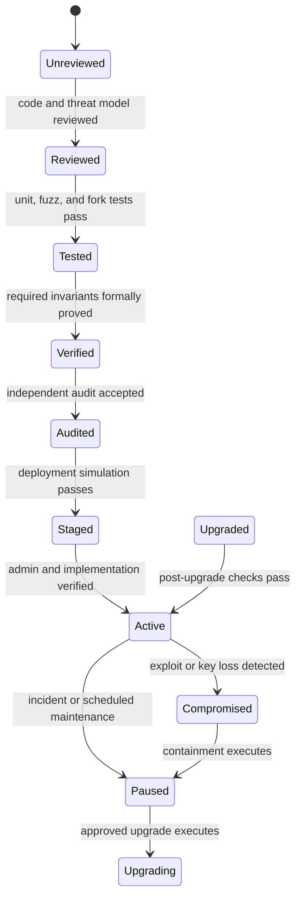

## What it is

Smart contract security is the combined practice of deterministic code review, adversarial testing, invariant reasoning, formal verification, independent audits, conservative deployment, and controlled upgrades. A contract is exposed state-transition logic: a flaw can become irreversible, publicly amplifiable, and difficult to pause without creating another governance risk.

## How it works

Secure engineering turns the implementation into a state machine with explicit roles, invariants, and transition gates. A release passes static analysis, unit and fuzz tests, fork simulation, invariant tests, review, deployment checks, and post-deployment monitoring. Formal verification and audits examine different claims: verification establishes properties for a specified model, while an audit inspects design and implementation against a threat model.



Reentrancy occurs when an external call gives another contract control before the caller has finished updating the state that authorized it. Checks-effects-interactions and a reentrancy guard reduce the class, but access control and arithmetic checks remain necessary. The following illustrative contract fragment updates state before transferring value:

```text
function withdraw(uint256 amount) external nonReentrant {
    require(msg.sender == owner);
    uint256 balance = balances[msg.sender];
    require(amount <= balance);
    balances[msg.sender] = balance - amount;
    (bool sent, ) = msg.sender.call{value: amount}("");
    require(sent);
    emit Withdrawn(msg.sender, amount);
}
```

The pattern prevents an obvious withdrawal reentry, but a malicious token contract can violate transfer assumptions, return false instead of reverting, or call a different entry point. Define the exact asset behavior, separate native-asset and token-asset paths where necessary, and test callbacks and failure modes. A single `nonReentrant` modifier shared across unrelated functions can also create denial-of-service interactions.

A **proxy contract** delegates calls to an implementation contract so its address and storage can remain stable. The proxy's admin can select new logic, which preserves functionality but leaves implementation, initialization, and upgrade authority as critical security. A transparent proxy separates user and admin calls; UUPS places upgrade logic in the implementation, often behind a separate governance authority. Both require a review of EIP-1967 storage slots, collision resistance, `initialize` execution, admin transfer, timelock controls, and the bytecode linked by the proxy.

A production upgrade is a multi-system transaction:

```yaml
upgrade:
  contract: SettlementVault
  proposed_implementation: "0x3333333333333333333333333333333333333333"
  storage_layout_hash_before: "sha256:9f2c"
  storage_layout_hash_after: "sha256:9f2c"
  current_version: 4
  target_version: 5
  governance_approval: "0x4444444444444444444444444444444444444444"
  timelock_delay_seconds: 172800
  preconditions:
    bytecode_matches_approved_artifact: true
    storage_layout_compatible: true
    admin_matches_expected_governor: true
    initializer_reentrancy_protected: true
    implementation_not_destroyed: true
  postconditions:
    version_returns_5: true
    accounting_invariants_hold: true
    total_assets_equal_internal_sum: true
    pause_and_admin_state_expected: true
  rollback:
    old_implementation_immutable: false
    recovery_exercised: true
```

Formal verification can prove reachability, authorization, conservation, or no-reentrancy properties for all explored states within the model. A model can omit upgrade paths, delegate calls, token behavior, block timing, or multi-step governance, so a proved property is bounded by its assumptions. Use multiple techniques: static analysis and fuzzing explore broad inputs quickly; formal methods target selected invariants; human review identifies missing assumptions and unsafe interfaces.

Audits reduce risk but are point-in-time assurance, not a guarantee after deployment. Competing audit firms, an independent review, transparent scope, reproducible findings, and remediation tracking increase coverage. Monitor upgrades, proxy admins, ownership changes, oracle changes, pause events, anomalous balance deltas, failed transactions, and privileged-role actions. An emergency pause is useful only when its authority, trigger, blast radius, and recovery process are tested.

## Tradeoffs

| Decision | Gain | Cost |
| --- | --- | --- |
| Checks-effects-interactions | Reduces common reentrancy paths | Must be applied consistently across entry points and asset types |
| Reentrancy guard | Explicitly blocks nested guarded calls | Shared mutable lock state can permit denial of service if scoped too broadly |
| Immutable implementation | Removes upgrade risk | Fixes defects and blocks legitimate migrations or protocol changes |
| Transparent proxy | Clean separation of user and admin dispatch | More proxies, administration, and storage-layout constraints |
| UUPS proxy | Lower deployment footprint and implementation-owned upgrade path | Implementation can become an uninitialized or malicious upgrade authority |
| Formal verification | Exhaustive evidence for a bounded model | Modeling effort and incompleteness remain |
| Independent audits | Broad threat-oriented review and external accountability | Time, cost, scope limits, and dependence on auditor independence |

## When to use

- A contract moves value, mints authority, controls upgrades, or holds user assets.
- External calls, callbacks, tokens, or delegatecall participate in state transitions.
- An implementation must be replaced after deployment.
- Multi-tenant accounting requires global and tenant-specific invariants across batches, fees, and withdrawals.
- You need evidence that privileged roles, pause controls, and recovery procedures work under adverse conditions.

## Alternatives

- **Formal-methods-first development** — gives strong evidence for specified properties, but it can miss interface and economic assumptions outside the model.
- **Audit-first development** — provides practical threat discovery, but it remains bounded by scope, timing, and auditor judgment.
- **Immutable contracts with off-chain governance boundaries** — reduces upgrade risk, but it moves authority outward and may leave deployed defects uncorrectable.
- **Module-based or diamond contracts** — can isolate functions and upgrade modules, but shared storage, delegatecall, and routing expand the trusted computing base.
- **Replaceable application versions** — can migrate state or accounts, but migration logic, user consent, and rollback introduce new correctness risks.

## Related

- [Chapter 22 overview](_index.md)
- [22.2 Zero-Knowledge Proofs & Privacy Computation: zk-SNARKs/STARKs, ZK-Rollups, Privacy-Preserving KYC, Private Set Intersection (PSI), and Garbled Circuits](02-zero-knowledge-proofs-privacy-computation.md)
- [22.4 Cross-Chain Infrastructure: Bridges, Oracle Networks, Interoperability Protocols](04-cross-chain-infrastructure.md)
- [19.3 On-Chain Proposal/Execution Pipelines (Governor Contracts, Timelocks)](../../07-part-vii/04-dao-governance/03-proposal-execution-pipelines.md)
