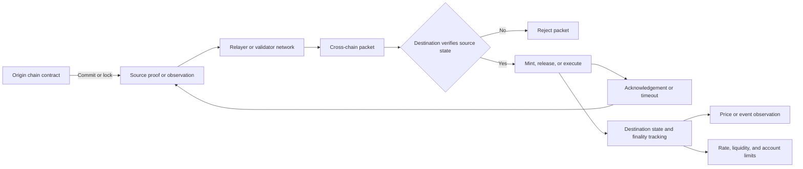

## What it is

Cross-chain infrastructure transfers messages, assets, and data between systems with different consensus, finality, security, and execution models. A **bridge** is one cross-chain mechanism, an **oracle network** supplies off-chain observations to on-chain contracts, and an **interoperability protocol** defines authenticated packet commitments, verification, acknowledgement, ordering, and fault handling between domains.

## How it works

A cross-chain design first defines what authenticates a message and what makes it final. The sender commits to a message or locks value, relayers or validators carry evidence, and the destination verifies the source before minting, releasing, or executing. A correct packet proves authenticity and ordering; it does not prove that an oracle observation is true, that a token is economically valid, or that two networks share the same security assumptions.



Lock-and-mint bridges custody or burn backing assets and issue representation assets on the destination. They can expose deployed contracts to both the bridge's validation logic and the representation asset's issuer controls. A bridge administrator can sometimes mint without burning, pause deposits, upgrade implementations, or alter message processing. Those roles are economic security and belong in the same threat model as contract code.

Optimistic bridges submit a claim and allow a challenge period. ZK bridges submit a proof that the source event occurred. Light-client or consensus-based bridges verify source signatures, roots, or light-client headers inside destination contracts. Liquidity networks rebalance inventory instead of minting a representation. General message protocols such as IBC can carry arbitrary packets over a common transport and client abstraction, but applications still define acknowledgement, timeout, ordering, and upgrade semantics.

Oracles have a different job. An oracle network obtains a value outside the contract, aggregates observations, and publishes data with freshness and authenticity guarantees. Centralized feeds create provider and key risk; decentralized feeds create economic, manipulation, and threshold-design risk. Use a median or weighted aggregate only when the data sources, market selection, update cadence, deviation threshold, and stale-data behavior match the asset. A verified answer proves what providers signed, not that the underlying market was accurate.

A cross-chain operation policy should identify every trust assumption and degrade safely:

```yaml
route_policy:
  route_id: usdc-ethereum-to-base
  source_domain: ethereum
  destination_domain: base
  message_transport: verified-light-client
  asset_model: native-burn-and-mint
  source_finality_model: source-consensus
  destination_finality_model: destination-consensus
  limits:
    max_atomic_per_message: 1000000000
    max_atomic_per_hour: 5000000000
    max_open_messages: 20
  controls:
    require_destination_and_asset_allowlist: true
    verify_domain_separation: true
    reject_replayed_packet: true
    reject_expired_proof: true
    pause_on_source_reorg: true
    require_two_person_limit_change: true
  observability:
    compare_source_burn_and_destination_supply: true
    alert_on_implementation_change: true
    alert_on_validator_set_change: true
    alert_on_backlog_age: true
  degraded_mode:
    settlement: hold
    display_state: unavailable
    user_action: retry-after-finality
```

Domain separation must bind every message to its source, destination, sender, contract, channel, sequence, version, and commitment. A proof accepted on the wrong chain, for the wrong token, or after replay can create loss even when the underlying signature is valid. Cross-chain replay protection also requires attention to chain reorganization, rollback, and finality reversion in systems that do not provide absolute finality.

Interoperability reduces user and application fragmentation but can merge failure domains. A bridge compromise can affect every connected application and representation asset. Limit bridge exposure, use allowlists and per-route limits, monitor validator or proof-system changes, reconcile backing and supply, and rehearse containment. Do not treat transaction inclusion on the destination as proof of economic settlement on the source.

## Tradeoffs

| Decision | Gain | Cost |
| --- | --- | --- |
| External validation or multisig bridge | Broad asset compatibility and fast iteration | Trust concentrates in validators, keys, software, and governance |
| Optimistic bridge | Lower source-state proof cost | Delayed finality and challenge-system exposure |
| ZK bridge | Compact source proof and faster verification | Proving cost, circuit risk, and upgrade complexity |
| Light-client interoperability | Reduces validator trust by verifying source state | Complex consensus engineering and destination gas cost |
| Burn-and-mint representation | High destination liquidity and simple user experience | Issuer controls, backing risk, and cross-chain supply invariants |
| Canonical native interoperability | Strong source-destination representation | Lower liquidity and more difficult asset deployment |
| Centralized oracle | Clear feed semantics and fast updates | Provider outage, key compromise, and manipulation risk |
| Decentralized oracle | Broader observation sources | Capital, stake, aggregation, and market-manipulation assumptions |

## When to use

- You need to move assets or application state between networks with different execution models.
- A contract must consume an external price, event, proof, or signed statement.
- A payment or account-abstraction application must preserve identity and finality across domains.
- You can define canonical representations, per-route limits, replay protection, and degraded behavior.
- You can monitor bridge contracts, validator sets, proof systems, and backing invariants as one operational boundary.

## Alternatives

- **Canonical-only liquidity model** — reduces representation-asset trust, but availability depends on liquidity at each venue and the design is harder for new assets.
- **Native interoperability standard** — improves shared transport and client semantics, but still requires application-level packet and upgrade governance.
- **Intent-based solver networks** — improve user experience and route selection, but solver, auction, quote, and settlement policies add new trust and latency assumptions.
- **Oracle-only integration** — connects a destination contract to off-chain facts, but does not transfer assets or prove general source-chain execution.
- **No cross-chain path** — keeps assets and state on one security domain, but accepts lower liquidity, fragmentation, and availability costs.

## Related

- [Chapter 22 overview](_index.md)
- [22.3 Smart Contract Security: Reentrancy, Formal Verification, Audits, Proxy/Upgrade Patterns](03-smart-contract-security.md)
- [16.4 Payment Processing Architecture](../../07-part-vii/01-banking-payments/04-payment-processing-architecture.md)
- [9.1 The CAP Theorem, PACELC, and Architectural Trade-offs](../../04-distributed-systems/01-consensus/01-cap-pacelc.md)
