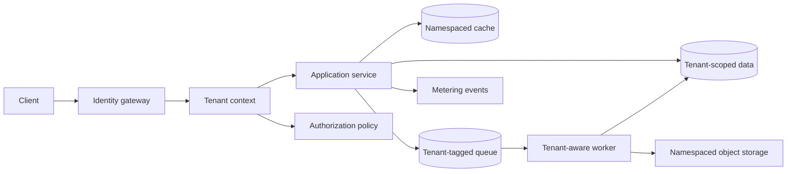

## What it is

**Multi-tenant architecture** is a software design in which one service, deployment, or platform safely serves multiple customers whose data, configuration, capacity, and failures must remain separate. Its mental model is a controlled path from an authenticated principal to a tenant context, from that context to isolated resources, and from resource use to tenant-level capacity controls.

## How it works

A request first establishes tenant identity, then acquires a tenant-scoped data and resource context, performs work, and records the work against that tenant. The tenant context must be derived from verified identity rather than accepted as a free-form request field.

The three common models divide the isolation boundary differently:

| Model | Isolation boundary | Main operational property | Common failure mode |
| --- | --- | --- | --- |
| Silo | Dedicated stack or data store per tenant | Strong control and customization | High cost as tenant count grows |
| Pool | Shared runtime and data store with tenant-scoped rows and policies | Efficient use of common resources | Missing isolation predicate or policy |
| Bridge | Shared internal services with tenant-specific adapters or gateways | Central control with selective customization | Tenant context loss at a bridge |

A component view shows where tenant context must survive every dependency:



A shared database can make the shared-state policy explicit. Application code sets the tenant context, and the database applies the isolation policy to every relevant relation:

```sql
ALTER TABLE accounts ENABLE ROW LEVEL SECURITY;

CREATE POLICY tenant_isolation ON accounts
USING (tenant_id = current_setting('app.tenant_id')::uuid)
WITH CHECK (tenant_id = current_setting('app.tenant_id')::uuid);

SELECT set_config('app.tenant_id', '4f5f3f5b-8108-4fa2-a7d8-1ec7c00f0c8f', false);
```

Isolation remains incomplete if only the primary database is protected. Keep these tenant boundaries consistent:

- **Authorization** — derive the permitted tenant set from the authenticated subject and check resource access inside the service, not only at the gateway.
- **Caches and objects** — include the tenant identifier in cache keys, object paths, indexes, and encryption metadata; never rely on process memory for tenant separation.
- **Queues and jobs** — carry the tenant identifier in immutable event metadata, validate it at consumption, and prevent workers from changing context midway through a job.
- **Data integrity** — make tenant-scoped uniqueness include `tenant_id`; globally unique customer keys can leak existence or cause cross-tenant collisions.
- **Operations** — partition logs, metrics, backups, exports, and support tools by tenant while still enforcing access to those operational artifacts.

Noisy-neighbor mitigation applies controls at several layers. Admission control rejects work before saturation, concurrency limits bound fan-out, per-tenant queues and deadlines bound latency, and autoscaling expands shared capacity. A dedicated pool or silo is the escalation path when a regulated tenant requires a stronger operational boundary.

Tenant onboarding and offboarding need explicit resource-lifecycle rules. A new tenant receives isolated namespaces, identity mappings, encryption context, and metering subjects. Offboarding first blocks new work, drains accepted work, exports or retains data under policy, revokes credentials, and only then deallocates resources. Tenant deletion is not a database-row delete.

## Tradeoffs

| Option | Gain | Cost |
| --- | --- | --- |
| **Silo** | Strong physical or stack-level boundary and flexible tenant configuration | Provisioning, upgrades, monitoring, and cost scale with tenants |
| **Pool** | Efficient utilization and simpler fleet operations | Isolation depends on every identity, query, cache, and worker path |
| **Bridge** | Selective customization while core services remain shared | Additional context propagation and adapter failure modes |
| **Hybrid** | Workloads move between tiers as requirements change | Migration, dual-path testing, and entitlement mapping become mandatory |

## When to use

- You need one product to serve customers with independently owned data and configuration.
- You can attach a verified tenant identifier to every request, event, job, and storage object.
- You must demonstrate isolation across databases, caches, queues, logs, and support tools.
- You need per-tenant quotas, fairness controls, or dedicated capacity for demanding customers.
- You can test cross-tenant denial and noisy-neighbor scenarios in an automated release gate.

## Alternatives

- **Single-tenant deployment** — strongest operational separation for regulated or high-value customers, with higher provisioning and maintenance overhead.
- **Cell-based architecture** — runs several independent stacks behind one control plane when pooled isolation is insufficient but full silos are too expensive.
- **Confined virtual private cloud** — gives a customer a dedicated network environment when connectivity or network policy is the primary boundary.
- **Serverless isolation** — reduces fleet management for variable workloads, while application-level tenant checks and platform limits still remain necessary.

## Related

- [23.2 Billing & Metering: Usage-Based Billing, Invoicing, Dunning, Subscription Lifecycle](02-billing-metering.md)
- [23.3 Licensing & Entitlements: JWT License Validation, Feature Gating, Entitlement Management](03-licensing-entitlements.md)
- [Chapter 23 references](04-references.md)
