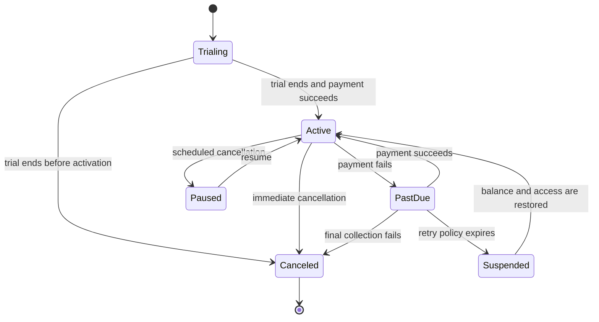

## What it is

**Usage-based billing** converts measured product activity into rated charges, then produces an invoice, payment, and collection outcome for a tenant. Its mental model is an append-only event pipeline: accepted usage becomes an immutable record, rating applies contract rules, invoicing closes a billing period, and collection advances the subscription according to policy.

## How it works

A usage event crosses a trust boundary only after the producer and tenant have been authenticated. The event records what happened, when it happened, which subject incurred the cost, and an idempotency identity. Rating then applies price books, units, tiers, credits, minimums, and currency rules from the subscription version that was effective at the event time.

The subscription lifecycle is a state machine, not a single active flag. A terminal failure, recovery, refund, or manual suspension must preserve both the prior state and the authorized transition:



The metering record must remain attributable even when the product later retries or replays an operation:

```json
{
  "event_id": "evt_01J8Z7R2Q5T9Y3K4M6N8P1V0BC",
  "tenant_id": "tenant_428",
  "meter": "api_requests",
  "subject_id": "service_account_91",
  "occurred_at": "2026-09-24T10:15:30Z",
  "ingested_at": "2026-09-24T10:15:31Z",
  "quantity": 250,
  "unit": "request",
  "source": "gateway",
  "schema_version": 1
}
```

The billing pipeline executes in this order:

1. **Ingest** — authenticate the producer, validate the schema, and deduplicate by a globally unique event identity scoped to the billing account.
2. **Normalize** — resolve units, dimensions, and valid event time; quarantine malformed or late events instead of guessing.
3. **Rate** — select the effective price version, apply tier boundaries and contract terms, and preserve the calculation inputs.
4. **Aggregate** — combine rated records for display, but retain enough lineage to reproduce the invoice.
5. **Invoice** — freeze line items, taxes, credits, currency, and total for a closed period.
6. **Collect** — submit payment, apply the dunning policy, and emit an authorization decision for paid or restricted service.
7. **Reconcile** — compare usage exports, ledger balances, payment records, and invoice totals before final settlement.

Dunning is a controlled sequence of reminders, retries, restrictions, and recovery. Every retry needs an idempotency key, a schedule chosen from the tenant's contract, and a clear terminal outcome. A provider timeout is not proof of nonpayment: reconcile the provider before marking a final attempt.

Billing and tenant isolation share the same caveats. Meter keys, credits, invoices, payment methods, tax records, and exports are tenant-owned. Support and finance tools require explicit tenant scope, and aggregate reporting must not become a path to unrestricted object access. Idempotency, event ordering, schema evolution, clock handling, and exact decimal arithmetic are correctness concerns; floating-point totals and wall-clock-only ordering are unsafe assumptions.

## Tradeoffs

| Option | Gain | Cost |
| --- | --- | --- |
| **Event-based rating** | Replays and audits rated usage from source records | Requires durable ingestion, versioning, and reconciliation |
| **Incremental aggregation** | Keeps dashboards responsive as event volume grows | Compaction and correction paths become necessary |
| **Online payment** | Fast collection and automated recovery | Introduces provider dependency, webhook security, and chargeback handling |
| **Offline invoice workflow** | Supports negotiated terms and enterprise procurement | Extends the revenue-recognition and dispute process |

## When to use

- You need to charge for metered requests, transactions, storage, seats, or computed work.
- A tenant can retry events without causing duplicate charges.
- Contract pricing changes must be reproducible for historical usage.
- You need controlled retries, grace periods, suspension, and payment recovery.
- Finance and product teams require traceable usage from source event to invoice line.

## Alternatives

- **Flat subscription pricing** — simplifies invoicing when predictable seats or usage replace variable charges.
- **Prepaid credits** — bounds service obligations and revenue timing, while requiring ledger and exhaustion policy.
- **Hybrid subscription and usage** — combines predictable base revenue with rated overages, at the cost of more contract and reconciliation rules.
- **Direct merchant billing** — removes some intermediary effects, but adds payment-risk, tax, and compliance obligations.

## Related

- [23.1 Multi-Tenant Architecture: Silo/Pool/Bridge Models, Tenant Isolation, Noisy-Neighbor Mitigation](01-multitenant-architecture.md)
- [23.3 Licensing & Entitlements: JWT License Validation, Feature Gating, Entitlement Management](03-licensing-entitlements.md)
- [Chapter 23 references](04-references.md)
