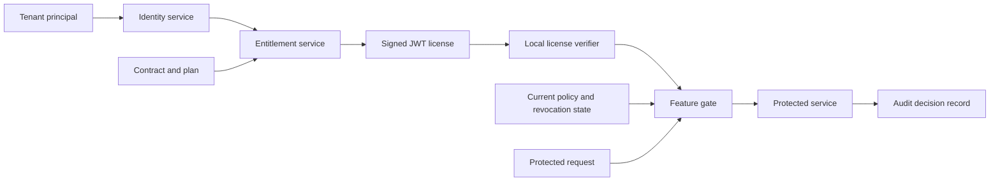

## What it is

**Entitlement management** is the policy layer that decides whether a verified tenant, user, account, or device may use a licensed capability under an active contract. A signed **JWT license** can transport that decision to offline or edge services, but the grant remains valid only when signature, issuer, audience, time, tenant, and revocation rules all pass.

## How it works

A client first authenticates to the licensing service, which resolves the customer, contract, plan, and current grants. The service issues a short-lived signed license whose claims carry only the context needed at the point of use. A verifier validates cryptography and claims, then the protected service evaluates a policy using its own current context.

The data flow separates issuance, local validation, and authoritative enforcement:



A license is a compact assertion, not an invitation to trust arbitrary claims. This payload still requires signature and registered-claim validation:

```json
{
  "iss": "https://licenses.example.com",
  "sub": "tenant_428",
  "aud": ["inventory-api", "edge-gate"],
  "jti": "lic_01J8Z7R2Q5T9Y3K4M6N8P1V0BC",
  "iat": 1789632000,
  "nbf": 1789632000,
  "exp": 1789632600,
  "tenant_id": "tenant_428",
  "plan": "business",
  "features": ["bulk-import", "audit-export"],
  "limits": {
    "api_requests_per_minute": 6000
  }
}
```

Validation executes in a fixed order:

1. Parse a size-limited token and select a key by `kid` from trusted issuer metadata.
2. Verify the allowed algorithm and cryptographic signature with managed key material.
3. Validate `iss`, `aud`, `exp`, `nbf`, token identity, and the local clock.
4. Confirm the subject and `tenant_id` match the authenticated service context; reject disagreement instead of choosing one.
5. Check license revocation and contract status when online or through a bounded, authenticated freshness mechanism.
6. Evaluate the requested feature, resource ownership, and numeric limit with default-deny semantics.
7. Emit a decision identifier with policy version, grant, and reason for audit without recording secrets.

The licensing service is authoritative for contract state, while the protected service remains responsible for enforcement. UI gating only improves usability; it cannot authorize an API call. Long-lived offline licenses increase exposure to clock tampering, key compromise, revocation delay, and copied tokens, so they need narrow features, short validity, device binding where appropriate, and a documented renewal path.

Feature flags and licenses differ. A feature flag controls operational rollout, audience targeting, or experimentation; a license controls a contractual grant. A rollout flag must not silently substitute for a paid entitlement, and a valid license must not bypass a safety-critical operational disablement.

Tenant-specific grants can be expressed as deny-overrides policy. Every request carries a verified tenant and subject, while the policy combines contract grants with revocation and operational constraints:

```hcl
decision "feature" {
  input "request" {
    tenant_id = string
    subject_id = string
    feature    = string
  }

  default = false

  rule {
    condition = input.request.feature == data.entitlement.features[input.request.feature]
    allow = data.entitlement.active
  }

  rule {
    condition = data.revocation.contains(input.request.tenant_id)
    deny = true
  }
}
```

## Tradeoffs

| Option | Gain | Cost |
| --- | --- | --- |
| **Signed JWT** | Offline verification with a compact, standard assertion | Revocation and contract changes are visible only after token refresh |
| **Online entitlement lookup** | Current state and immediate policy evaluation | Adds latency, availability coupling, and a trusted network dependency |
| **Hybrid validation** | Fast local checks with bounded freshness and online refresh | Requires explicit cache, clock, key, and outage behavior |
| **Policy-as-code** | Testable, reviewable grants and denials | Policy versioning and evaluation correctness become operational concerns |

## When to use

- You need contract-driven access to paid features, limits, seats, or environments.
- Clients, devices, or edge services must validate grants without a request to a control plane.
- Policy changes require an auditable reason and a reproducible decision.
- Offline operation is allowed only within explicit license and clock-skew bounds.
- Feature rollout controls and contractual entitlements need separate lifecycles.

## Alternatives

- **Central authorization service** — gives immediate, current decisions when every request can depend on an online policy service.
- **Opaque capability tokens** — avoid readable claims while retaining signed bearer semantics, but require secure token storage and revocation handling.
- **Database-backed permissions** — fit locally administered RBAC or ABAC and simplify immediate revocation, at the cost of request-time database access or cache design.
- **Signed license files** — support air-gapped products and long-lived installation verification, but require strong tamper resistance and a cautious renewal model.

## Related

- [23.1 Multi-Tenant Architecture: Silo/Pool/Bridge Models, Tenant Isolation, Noisy-Neighbor Mitigation](01-multitenant-architecture.md)
- [23.2 Billing & Metering: Usage-Based Billing, Invoicing, Dunning, Subscription Lifecycle](02-billing-metering.md)
- [Chapter 23 references](04-references.md)
