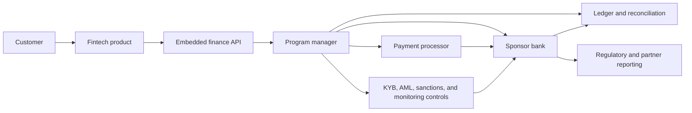

## What it is

**Banking-as-a-Service (BaaS)** is a model in which a fintech embeds accounts, cards, payments, or credit products while a licensed bank or institution retains the regulated banking relationship and balance-sheet obligations. A **sponsor bank** is the regulated partner; a **program manager** is the operating layer that integrates the fintech, bank, processors, compliance controls, and incident processes into a controlled program.

## How it works

A sponsor-bank program separates the customer interface from regulated operations. The fintech owns the product experience and often the first-line support relationship. The bank owns decisions that cannot be delegated casually, including account opening policy, safeguarding, ledger posting, credit approval, and regulatory reporting. The program manager coordinates the contract, integration, control testing, exception handling, and service-level obligations between the parties.



The bank and program manager should agree on the operating model before the product ships. A contract artifact can identify the regulated party, system boundaries, data responsibilities, and incident ownership without replacing the legal agreements:

```yaml
program: merchant_card_issuing
version: 1
regulated_entities:
  sponsor_bank: north_bank_na
  program_manager: embedded_finance_ops
roles:
  customer_interface: fintech
  account_ownership: sponsor_bank
  payment_processing: processor
  compliance_decisions: sponsor_bank
  platform_operations: program_manager
controls:
  kyb_refresh_days: 365
  sanctions_screening: before_onboarding_and_on_payment_events
  ledger_reconciliation: daily
  incident_notice_hours: 4
data:
  customer_identifier: tokenized
  ledger_access: read_only_for_program_manager
  retention_policy: contract_and_regulatory_schedule
```

The typical request path is deliberately conservative. The fintech sends an idempotent request with customer, product, and consent context. The program manager authenticates the caller, applies policy and entitlement checks, and submits the instruction to the bank. The bank creates or updates the regulated record and returns a stable business identifier. A status service publishes subsequent events, while reconciliation compares ledger, processor, and bank records.

A program manager must also operate the joint control environment. It monitors API availability, authentication failures, webhook delivery, exception queues, data-quality checks, reconciliation breaks, and customer complaints. The bank retains authority over regulated decisions and must be able to exercise it during a vendor outage, personnel change, or product change. Contracts should define service credits, recovery objectives, data portability, audit rights, and termination steps without pretending that a service-level agreement transfers legal responsibility.

Regulatory and operational boundaries are decisive. KYC, KYB, beneficial ownership, sanctions screening, anti-money-laundering monitoring, consumer protection, privacy, and record retention remain jurisdiction-specific obligations. The program manager cannot solve them with a dashboard alone. A launch program needs independent control testing, model and vendor risk review, incident playbooks, complaint escalation, and an exit plan that preserves customer access to records and funds.

## Tradeoffs

- **Sponsor-bank model** — gives a fintech access to regulated capabilities quickly, but the program depends on the bank’s approvals, capacity, pricing, and risk appetite.
- **Program-manager service** — centralizes operational coordination, but adds a vendor, shared controls, and another failure domain.
- **Single integrated provider** — reduces integration work, but concentrates vendor, data, and outage risk.
- **Direct bank integration** — preserves more control over the relationship, but requires more engineering, compliance, and operational capability.
- **Real-time product APIs** — improve customer experience, but increase the cost of authentication, availability, observability, and incident response.

## When to use

- You need deposit, card, payment, or credit capabilities without building a bank from scratch.
- You can name the regulated entity, legal entity boundaries, and accountable control owners.
- You can provide bank-grade identity, consent, ledger, and incident data.
- You need ongoing reconciliation, monitoring, complaint handling, and regulatory evidence.
- You can support a tested exit or migration path that preserves customer records and funds.

## Alternatives

- **Direct bank relationship** — wins when the product is bank-centered and the organization can operate the compliance and banking stack; it costs more time and fixed investment.
- **Payments processor plus licensed partners** — wins for merchant acceptance and lower integration complexity; it does not by itself provide deposit accounts or credit underwriting.
- **Fintech-chartered institution** — provides more control over the product and balance sheet; it costs substantial capital, licensing, governance, and compliance work.
- **Build-versus-partner hybrid** — keeps differentiating product logic in-house and regulated operations with partners; it requires precise contract and data-boundary design.

## Related

- [24.2 Credit & Lending: Underwriting Engines, Credit Scoring, Loan Origination](02-credit-lending-underwriting-engines-credit-scoring-loan-origination.md)
- [24.3 Cross-Border: Correspondent Banking, FX Conversion, Remittances](03-cross-border-correspondent-banking-fx-conversion-remittances.md)
- [24.4 Chargebacks & Dispute Management](04-chargebacks-dispute-management.md)
- [Chapter 24 References](05-references.md)
