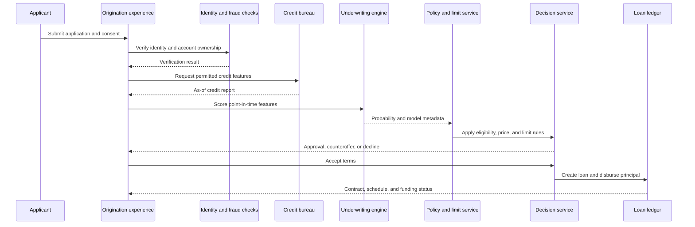

## What it is

**Underwriting** is the decision process that estimates repayment ability and risk, sets terms, and authorizes a loan. A **credit scoring model** converts information about an applicant, account, or exposure into a decision aid, while **loan origination** creates the contract, disclosures, funding, and servicing record needed to make and manage the loan.

## How it works

A production lending decision separates data collection, identity and eligibility checks, model evaluation, policy application, disclosure, acceptance, funding, and servicing. The applicant should know when data is missing or stale, and the lender should be able to reconstruct the exact inputs and policy version used for a decision.



An underwriting engine should preserve **point-in-time correctness**: every feature must reflect only information available at the decision time, with an `as_of` timestamp and source. A score is not a universal measure of a person; it is a model output for a defined population, feature set, horizon, and use. The lender needs policy and model governance, drift monitoring, adverse-action reasons where required, and an independent validation path.

A decision record can be compact and reproducible:

```json
{
  "decision_id": "dec_01J4R7Y9K2M8N6P4Q1S0T3V5W6",
  "application_id": "app_01J4R7X3D8F2A1C0N9P5Q7S8T9",
  "decision_time": "2026-09-24T14:35:12Z",
  "model_version": "consumer_underwriting_v7",
  "policy_version": "policy_2026_09",
  "features_as_of": "2026-09-24T14:34:58Z",
  "outputs": {
    "probability_of_default": 0.031,
    "requested_limit": 8000,
    "approved_limit": 6000,
    "rate_band": "5.99"
  },
  "reason_codes": ["LIMITED_REPAYMENT_HISTORY", "HIGH_UTILIZATION"],
  "human_review": false
}
```

Origination then creates a legally reviewable contract. The application, consent, disclosures, acceptance, cancellation rights where applicable, funds flow, and payment schedule are versioned together. A signed agreement should not be inferred from a button click alone; the required identity, consent, signature, and disclosure process depends on the jurisdiction and product. Servicing then needs due dates, reminders, payment allocation, collections, hardship, and closure records.

Regulatory and operational caveats are part of the algorithm. Fair-lending, privacy, consumer-credit, disclosure, collections, and automated-decision rules vary by jurisdiction. A model can be mathematically accurate and still be unsuitable if it uses protected characteristics improperly, has poor subgroup performance, cannot explain a decline, or uses data without the required permission. Underwriting should include override rules, stale-data detection, model rollback, adverse-action support, fair-lending monitoring, and a safe path for applicants when the decision service is unavailable.

## Tradeoffs

- **Rules-only underwriting** — is transparent and easy to operate, but it can miss nonlinear relationships and become difficult to maintain.
- **Statistical scorecard** — is explainable and stable, but it may lose predictive signal when behavior changes.
- **Machine-learning model** — can capture complex patterns, but it increases validation, explanation, fairness, and drift-management obligations.
- **Thin-file scoring** — expands access when alternative data is permitted and reliable, but raises consent, data quality, and model-risk concerns.
- **Fully automated origination** — reduces manual handling time, but requires strong controls for fraud, disputes, vulnerable customers, and operational exceptions.
- **Manual escalation** — adds human judgment for edge cases, but it creates capacity limits and can introduce inconsistent treatment.

## When to use

- You need a repeatable approval, pricing, or limit decision with point-in-time evidence.
- You can define the target product, borrower population, horizon, and intended use of the score.
- You can detect stale, missing, duplicated, or incorrectly permissioned data.
- You need disclosures, adverse-action support, human review, and fair-lending monitoring.
- You can operate funding, servicing, collections, and complaint processes beyond the decision itself.

## Alternatives

- **Thin-file or alternative-data underwriting** — helps applicants with limited bureau history, but requires lawful collection, meaningful consent, quality controls, and careful review of disparate outcomes.
- **Manual underwriting** — handles unusual or high-risk cases well, but is slower, costly, and harder to standardize.
- **Transact or purchase credit** — provides a fast decision path, but depends on vendor models and may limit explainability and portability.
- **Rule-based policy around a score** — keeps hard eligibility constraints explicit, but requires careful versioning so old rules do not silently override a new model.
- **Co-signed or guaranteed lending** — reduces some risk for a borrower or lender, but shifts economics, fraud exposure, and obligations to another party.

## Related

- [24.1 Banking-as-a-Service: Sponsor Bank Models, Program Management](01-banking-as-a-service-sponsor-bank-models-program-management.md)
- [24.3 Cross-Border: Correspondent Banking, FX Conversion, Remittances](03-cross-border-correspondent-banking-fx-conversion-remittances.md)
- [24.4 Chargebacks & Dispute Management](04-chargebacks-dispute-management.md)
- [Chapter 24 References](05-references.md)
