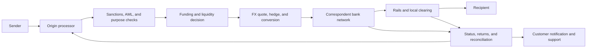

## What it is

**Correspondent banking** is a relationship in which one bank provides account and payment services to another bank in another jurisdiction. **FX conversion** exchanges value between currencies, while **remittances** move money from a sender to a recipient, often through one or more regulated intermediaries and local payment rails.

## How it works

A cross-border payment begins with an origin instruction, passes through screening and compliance controls, crosses a correspondent or other settlement network, and ends with a local payout. The data model must keep the customer order, the bank obligation, the FX quote, the intermediary instruction, and the final payout traceable as separate records.



A remittance instruction should not treat conversion and settlement as one atomic step. The system records the customer’s source amount, destination amount, currency pair, rate, fee schedule, cut-off time, payment purpose, consent, and delivery expectation. Treasury or a liquidity service decides whether to use an internal book, a correspondent, a payment service provider, or a local payout partner. Each leg has its own status because a sender’s order can be accepted before the beneficiary is paid.

An instruction artifact can make those boundaries explicit:

```json
{
  "remittance_id": "rem_01J4S2A7D9F3K5M6P8Q0R1T2V3",
  "origin_country": "US",
  "destination_country": "PH",
  "send_amount_minor": 25000,
  "send_currency": "USD",
  "receive_amount_minor": 141000,
  "receive_currency": "PHP",
  "fx_quote_id": "fx_01J4S2A4",
  "payment_purpose": "family_support",
  "rail": "local_payout",
  "status": "accepted",
  "consent_reference": "consent_01J4S29"
}
```

The customer-facing promise should distinguish maximum delivery time from a guaranteed receipt time. Correspondent cutoffs, local holidays, liquidity, sanctions screening, recipient-bank maintenance, payout limits, and return messages can all change the outcome. A robust design publishes events for screening, funding, conversion, handoff, payout, return, refund, and reconciliation. It keeps the original customer instruction immutable while allowing the operational state to move forward.

Regulatory and operational caveats are substantial. The sending and receiving institutions may have different licensing, sanctions, AML, data-localization, consumer-protection, and record-retention duties. The payment purpose and parties may need screening, and regulated information may need to travel with the payment under applicable wire rules. FX quotes expire, spreads vary, and a recipient may receive less than the displayed amount if intermediary or payout fees apply. Operations therefore need liquidity thresholds, escalation paths, return handling, fraud controls, complaint ownership, and a reconciliation process that can explain every minor-unit difference.

## Tradeoffs

- **Correspondent network** — provides broad reach and institutional controls, but adds intermediaries, cutoffs, fees, and counterparty exposure.
- **Direct local payout partner** — can improve speed and local coverage, but adds vendor, licensing, liquidity, and sanctions dependencies.
- **Internal FX book** — can improve pricing and treasury control, but creates market, liquidity, and hedging exposure.
- **Third-party payment orchestrator** — reduces integration work, but adds a critical vendor and may limit control over final status and customer support.
- **Single quoted receive amount** — makes the customer promise simple, but requires careful disclosure of rate, fees, and delivery uncertainty.
- **Real-time status** — improves support and transparency, but can expose intermediate uncertainty and requires accurate event mapping across providers.

## When to use

- You need to move funds between currencies, countries, or regulated banking partners.
- You can identify the sender, recipient, purpose, origin, destination, and applicable compliance controls.
- You can present a rate, fee, cutoff, and delivery expectation without implying certainty you cannot provide.
- You need separate records for customer instructions, correspondent legs, FX, local payout, and returns.
- You have liquidity, sanctions, fraud, reconciliation, and customer-support procedures for remote operations.

## Alternatives

- **Digital wallet or account-to-account rail** — works well inside supported corridors, but may not cover the needed destination or regulated intermediary requirements.
- **Money-transfer operator** — offers consumer remittance specialization, but adds provider dependence and may constrain product integration.
- **Direct correspondent account** — can improve control and economics at volume, but requires liquidity, compliance, and operations capabilities.
- **Settlement in the sender’s currency** — avoids a customer-facing FX promise, but transfers currency risk and value to the recipient or another party.
- **Batch or delayed payout** — reduces operating cost, but worsens delivery speed and increases exception volume.

## Related

- [24.1 Banking-as-a-Service: Sponsor Bank Models, Program Management](01-banking-as-a-service-sponsor-bank-models-program-management.md)
- [24.2 Credit & Lending: Underwriting Engines, Credit Scoring, Loan Origination](02-credit-lending-underwriting-engines-credit-scoring-loan-origination.md)
- [24.4 Chargebacks & Dispute Management](04-chargebacks-dispute-management.md)
- [Chapter 24 References](05-references.md)
