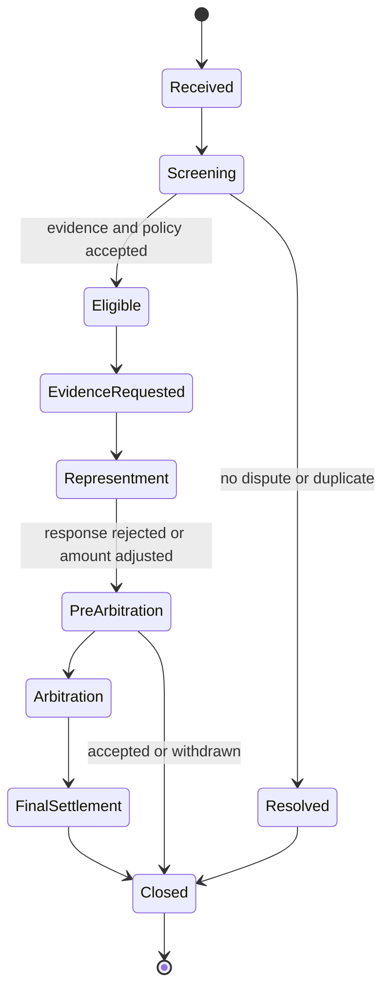

## What it is

**Chargeback management** is the operational process for reversing or adjusting a card or account payment through the rules of a payment network or rail. **Dispute management** is the broader customer-facing process for investigating an error, unauthorized transaction, service failure, refund request, or complaint and resolving it within the applicable policy and law.

## How it works

A dispute begins with a customer claim, but the operational path depends on the rail, card network, acquirer, issuer, merchant, and jurisdiction. The system first preserves the transaction, customer statement, authorization, capture, settlement, correspondence, and evidence. It then classifies the claim, assigns a response deadline, requests evidence, submits the response, and tracks the final financial and customer outcome.



The state machine should distinguish a customer claim from a network chargeback. A customer can receive a provisional credit while evidence is collected, but a provisional credit is not necessarily the final outcome. A representment includes evidence selected for the specific reason code, while pre-arbitration and arbitration can create additional fees or adjust the amount. A merchant-facing dispute is not identical to a consumer complaint, and a regulatory complaint can run alongside the payment-rail process.

A case record needs stable identity and evidence lineage:

```json
{
  "case_id": "dsp_01J4T7C2M9Q1K8N5P6R0S3V4W5",
  "transaction_id": "txn_01J4T6Y8",
  "customer_id": "cus_01J3A4B5C6",
  "rail": "card",
  "reason_code": "unauthorized_transaction",
  "received_at": "2026-09-24T16:05:00Z",
  "response_due_at": "2026-10-01T16:05:00Z",
  "provisional_credit_minor": 1299,
  "currency": "USD",
  "evidence_ids": [
    "ev_authentication_01",
    "ev_statement_01",
    "ev_customer_notice_01"
  ],
  "case_state": "evidence_requested"
}
```

Evidence collection is a workflow with data minimization. Store only records relevant to the claim, protect sensitive payment data, and record who accessed or changed the case. A strong system links the network case, merchant response, customer communication, ledger adjustment, refund, and final reason. It also supports retries, duplicate network messages, late evidence, partial settlement, chargeback cycles, and closed-won or closed-lost reporting without double-posting a financial adjustment.

Regulatory and operational caveats depend on jurisdiction and rail. Consumer statutes may provide rights beyond network rules, and network deadlines can be shorter than internal service targets. Fraud claims, unauthorized electronic transfers, credit-card billing disputes, merchant disputes, and accessibility or conduct complaints can have different evidence and escalation paths. Never close a case only because a network deadline passed; route unresolved conduct, vulnerable-customer, or systemic-pattern signals to the appropriate control owner. Monitor dispute rates by reason, merchant, device, cohort, and amount, and investigate spikes before they become financial or regulatory events.

## Tradeoffs

- **Provisional credit first** — improves customer protection and trust, but creates temporary ledger exposure and requires recovery controls.
- **Manual evidence review** — handles nuanced cases well, but costs more and can miss response windows without staffing and prioritization.
- **Rules and automation** — provides consistent triage and fast response, but can misclassify unusual evidence or propagate a defective reason-code rule.
- **Direct merchant evidence integration** — reduces attachment handling, but creates privacy, access, and partner-availability dependencies.
- **Case-level optimization** — focuses effort on a single outcome, but can hide patterns that require merchant or product-level remediation.
- **Network representment only** — follows the rail’s process, but may not satisfy a consumer complaint, conduct, or accessibility obligation.

## When to use

- You issue, acquire, process, or accept card or account payments.
- Customers can dispute a transaction or request a refund.
- You need a deadline-aware evidence and representment workflow.
- You must post provisional credits, reversals, fees, and final settlements exactly once.
- You need to identify recurring merchant, device, fraud, or product patterns behind disputes.

## Alternatives

- **Direct customer refund without a network case** — resolves many service issues quickly, but may not satisfy formal dispute, evidence, or recordkeeping requirements.
- **Fraud screening and prevention** — reduces unauthorized activity before a dispute, but cannot eliminate disputes and may create false positives.
- **Alternative dispute resolution** — can settle certain consumer disputes efficiently, but is subject to eligibility, consent, disclosure, and legal limits.
- **Merchant self-service evidence** — reduces support load, but requires strong access control and an escalation path for merchants that cannot use it.
- **Pre-chargeback analytics** — targets transactions likely to become disputes, but must not be used to block legitimate purchases without a valid, disclosed, and reviewable policy.

## Related

- [24.1 Banking-as-a-Service: Sponsor Bank Models, Program Management](01-banking-as-a-service-sponsor-bank-models-program-management.md)
- [24.2 Credit & Lending: Underwriting Engines, Credit Scoring, Loan Origination](02-credit-lending-underwriting-engines-credit-scoring-loan-origination.md)
- [24.3 Cross-Border: Correspondent Banking, FX Conversion, Remittances](03-cross-border-correspondent-banking-fx-conversion-remittances.md)
- [Chapter 24 References](05-references.md)
