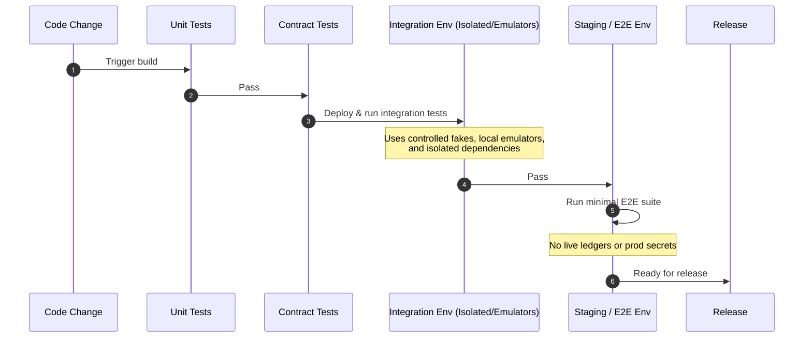
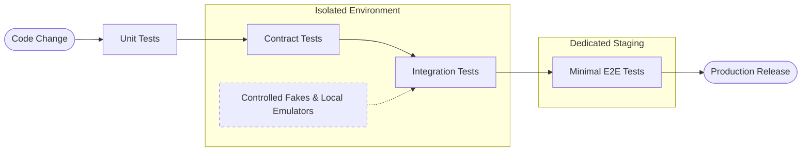

## What it is

A **testing strategy** is the layered set of evidence used to show that a system behaves correctly at each boundary, from one function to a production-like dependency. **Chaos engineering** tests resilience by injecting controlled faults and observing whether the system's safety mechanisms work as designed.

## How it works

Testing proceeds from narrow, fast checks to broad, expensive checks. Unit tests isolate domain rules. Integration tests exercise real serialization, storage, queues, and network boundaries. Contract tests verify the promises between independently deployed services. End-to-end tests validate a user or machine-visible workflow across the complete path.

A practical pipeline runs unit and contract tests on every change, integration tests against isolated dependencies, and a smaller set of end-to-end tests before release. Tests that depend on external networks, live ledgers, or production secrets are not deterministic acceptance tests; use controlled fakes, local emulators, or dedicated staging environments.





Litmus and Chaos Mesh provide different operational models. Litmus uses Kubernetes resources to express faults such as pod deletion, latency, and network loss. Chaos Mesh schedules experiments across selected workloads. Both should use an explicit target allowlist, blast-radius limits, steady-state assertions, automatic abort conditions, and an operator approval path outside production.

A Litmus experiment can be represented as a Kubernetes resource, while the experiment record should remain outside the workload namespace:

```yaml
apiVersion: litmuschaos.io/v1beta1
kind: ChaosExperiment
metadata:
  name: payment-api-node-loss
  namespace: resilience
spec:
  appinfo:
    appns: payments
    applabel: "app=payment-api"
    appkind: deployment
  chaosServiceAccount:
    name: chaos-runner
  experiments:
    - name: node-network-delay
      spec:
        components:
          env:
            - name: TOTAL_CHAOS_DURATION
              value: "30"
            - name: LATENCY
              value: "500"
            - name: JITTER
              value: "100"
```

The experiment pipeline is evidence-driven:

1. Define the steady-state indicator, such as successful authorization within the latency SLO.
2. Start with one non-critical service and a narrow namespace and time window.
3. Inject one fault at a time; record the expected and observed behavior.
4. Abort automatically when the indicator, safety limit, or operator signal fails.
5. Attach logs, traces, metrics, and the resulting change to the experiment record.

## Tradeoffs

- **Layered automated tests** — catches failures close to their cause, but costs more CI time and maintenance than a single end-to-end suite.
- **Provider-specific chaos tooling** — integrates with Kubernetes and runtime metadata, but reduces portability and can create a new control-plane dependency.
- **Synthetic production-like dependencies** — improves realism, but introduces emulator drift, fixture staleness, and state cleanup work.
- **Broad end-to-end coverage** — exercises the complete user journey, but is slow and often cannot isolate the layer that regressed.

## When to use

- You need a release gate that detects defects in both local logic and service boundaries.
- Your system depends on network partitions, delayed messages, node loss, or dependency throttling.
- You need repeatable evidence that redundancy and recovery controls work.
- A failure mode is too rare or destructive to validate safely in production-like conditions.
- You operate a regulated service where change evidence and rollback criteria must be auditable.

## Alternatives

- **Manual exploratory testing** — finds unexpected user-visible problems, but it is slower and does not provide consistent regression evidence.
- **Load and soak testing** — characterizes capacity and degradation, but does not by itself verify recovery from infrastructure faults.
- **Fault injection with a service mesh** — gives precise traffic-level control when the mesh is already deployed; the cost is platform-specific configuration.
- **Static analysis and policy checks** — catch many classes of defects early, but cannot prove runtime behavior under dependency failure.

## Related

- [25.2 Feature Flags & Experimentation Infrastructure (A/B Test Deployment)](02-feature-flags-experimentation-infrastructure.md)
- [25.3 Privacy Tech & Privacy-Preserving ML: Differential Privacy, Federated Learning, Homomorphic Encryption](03-privacy-tech-privacy-preserving-ml.md)
- [25.4 SRE Practices & Incident Engineering: Runbooks, Post-Mortems, SLA/SLO/SLI Error Budgets, Incident Response, Multi-Region Disaster Recovery & Active-Active Failover](04-sre-practices-incident-engineering.md)
