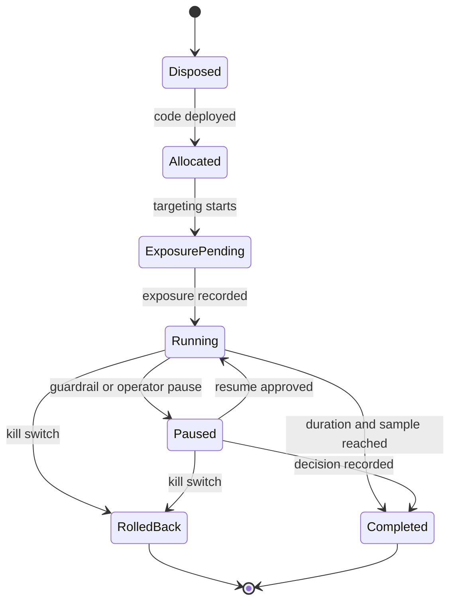

## What it is

**Feature flags** are runtime switches that separate code deployment from feature exposure. An **experimentation platform** adds assignment, exposure logging, metric analysis, guardrails, and rollback to that switch so teams can compare variants without exposing all users at once.

## How it works

A feature flag has a versioned configuration, a targeting rule, an owner, an expiration date, and a kill switch. A deployment promotes the code first; the flag then controls whether a request reaches the new path. The evaluation service assigns a stable variant for a defined unit, such as a user, wallet, merchant, or device, and emits an exposure event before evaluation. The analysis service compares outcomes only for eligible units and reports uncertainty, guardrail breaches, and data-quality failures.



A/B deployment should use mutually exclusive variants, a predeclared primary metric, a minimum sample or duration, and a decision owner. Never interpret a short-lived difference as causal without checking assignment quality, novelty effects, seasonality, and exposure leakage. Feature flags also affect security: a flag is not an authorization boundary, and a flag service outage must fail in the documented safe mode.

```yaml
apiVersion: platform.example/v1
kind: Experiment
metadata:
  name: settlement-routing-v2
  owner: payments-platform
  expiresAt: "2026-10-31T00:00:00Z"
spec:
  flag: settlement-routing-v2
  unit: wallet_id
  variants:
    - name: control
      weight: 50
    - name: treatment
      weight: 50
  primaryMetric: settlement_success_rate
  guardrails:
    - metric: settlement_p99_latency_ms
      maximum: 850
    - metric: duplicate_settlement_rate
      maximum: 0.001
  rollout:
    stages: [1, 10, 50, 100]
    holdEachStageHours: 24
  rollback: automatic
```

A safe rollout records the assignment, flag version, deployment version, metric windows, and rollback decision. The experiment controller advances stages only when guardrails pass, the data pipeline is healthy, and the exposure count is sufficient for the declared decision. A flag left on indefinitely becomes an untested branch and should have an owner and removal date.

## Tradeoffs

- **Percentage rollout** — limits initial exposure, but increases time to reach a statistically useful sample.
- **Targeted rollout by cohort** — reduces blast radius and supports operational diagnosis, but can introduce selection bias and complex targeting rules.
- **Remote flag service** — allows immediate control across deployments, but creates a runtime dependency, vendor cost, and stale-configuration risk.
- **Compile-time branching** — is simple and fast, but requires a new deployment and cannot safely change exposure independently.

## When to use

- You need to decouple deployment cadence from feature exposure.
- A change is risky, difficult to reverse, or depends on a partner integration.
- You need a controlled comparison of product or payment-flow variants.
- You need a kill switch with an owner, expiry, and auditable decision trail.
- You operate in multiple regions and need consistent targeting rules across deployments.

## Alternatives

- **Blue-green deployment** — gives a fast infrastructure rollback, but changes traffic for all eligible users unless another control exists.
- **Canary deployment** — limits release risk through traffic shifting, but focuses on operational health rather than a product experiment.
- **Dark launch** — exercises code without customer exposure, but produces no customer outcome data.
- **Build-time configuration** — reduces runtime complexity, but cannot provide rapid exposure or experiment adjustments.

## Related

- [25.1 Testing Strategy: Unit/Integration/Contract/E2E, Chaos Engineering (Litmus, Chaos Mesh)](01-testing-strategy-chaos-engineering.md)
- [25.3 Privacy Tech & Privacy-Preserving ML: Differential Privacy, Federated Learning, Homomorphic Encryption](03-privacy-tech-privacy-preserving-ml.md)
- [25.4 SRE Practices & Incident Engineering: Runbooks, Post-Mortems, SLA/SLO/SLI Error Budgets, Incident Response, Multi-Region Disaster Recovery & Active-Active Failover](04-sre-practices-incident-engineering.md)
