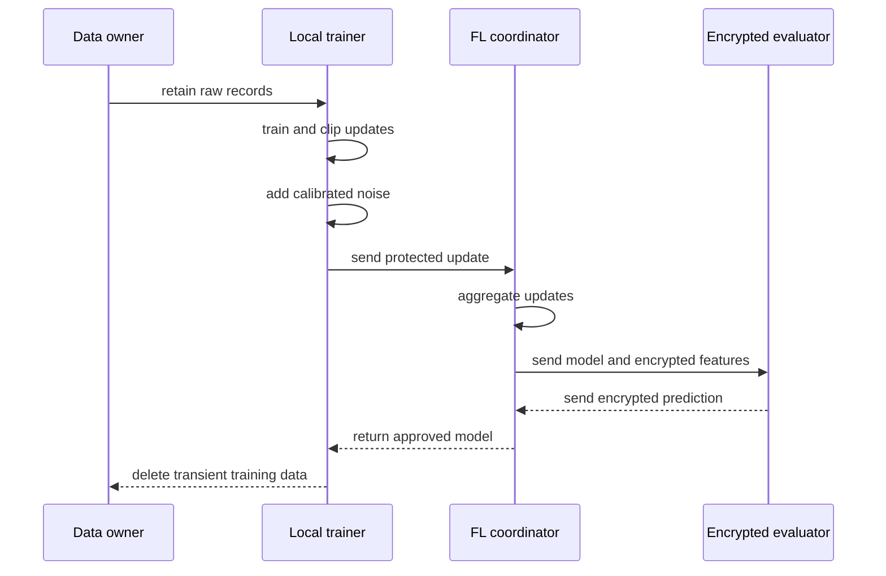

## What it is

**Privacy-preserving machine learning** allows a model or analysis to learn from data while limiting exposure of individual records. Differential privacy bounds the statistical influence of one record, federated learning keeps raw data near its owner, and homomorphic encryption computes on ciphertext so a service can process protected values without reading plaintext.

## How it works

The privacy method must match the threat model. Differential privacy adds calibrated noise to a statistic or to model updates, with a declared privacy budget, sampling unit, neighboring relation, and composition rule. Federated learning sends model updates to a coordinating service and keeps records in local or tenant-controlled storage. Homomorphic encryption protects computation in transit and at the evaluator, but it does not hide metadata, access patterns, or an insecure client.



A federated training service should authenticate participants, reject stale or duplicated updates, and publish aggregation and privacy parameters. A production deployment must decide whether updates or predictions are the protected object, and it must test poisoning, membership inference, gradient leakage, and metadata leakage rather than assuming encryption solves every risk.

The policy artifact records the privacy budget and data boundaries:

```yaml
apiVersion: privacy.example/v1
kind: TrainingPolicy
metadata:
  name: wallet-fraud-model
  owner: fraud-platform
spec:
  method: federated_learning
  dataResidency: tenant
  updateProtection: differential_privacy
  clipNorm: 1.0
  noiseMultiplier: 1.2
  samplingRate: 0.01
  maxTrainingRounds: 200
  totalPrivacyBudget:
    delta: 0.000001
  deletion:
    transientUpdatesHours: 24
    secureDeletion: required
```

For homomorphic encryption, select a scheme and parameter set from the computation, not from a generic benchmark. Key ownership, rotation, ciphertext size, supported operations, and decryption quorum are operational dependencies. Differential privacy also has a utility cost: increasing privacy protection generally reduces statistical signal, so evaluate fairness, calibration, and rare-event detection before release.

## Tradeoffs

- **Differential privacy** — provides a formal participation bound, but reduces utility and requires careful accounting across queries and training rounds.
- **Federated learning** — keeps raw records in their original environment, but exposes update leakage, client availability, and aggregation complexity.
- **Homomorphic encryption** — limits plaintext exposure during computation, but adds substantial computation, memory, and key-management costs.
- **On-device learning** — reduces data transfer, but device heterogeneity, battery limits, and model distribution complicate operations.

## When to use

- You must provide a defensible bound on the influence of an individual's contribution.
- Raw records cannot be centralized because of consent, residency, contractual, or operational constraints.
- A trusted compute environment is unavailable and the evaluator must remain isolated from plaintext.
- The model handles sensitive identity, transaction, health, or behavioral information.
- You need privacy claims that include threat model, parameter choices, and residual risks.

## Alternatives

- **Trusted execution environments** — reduce runtime overhead with hardware-backed isolation, but depend on hardware trust and attestation.
- **Secure multi-party computation** — can avoid a trusted evaluator, but adds protocol, network, and key-management complexity.
- **Synthetic data** — can reduce direct exposure in development, but synthetic distributions can be incomplete or leak structure.
- **Data minimization and tokenization** — reduce the amount of sensitive data processed, but do not replace controls for the data that remains.

## Related

- [25.1 Testing Strategy: Unit/Integration/Contract/E2E, Chaos Engineering (Litmus, Chaos Mesh)](01-testing-strategy-chaos-engineering.md)
- [25.2 Feature Flags & Experimentation Infrastructure (A/B Test Deployment)](02-feature-flags-experimentation-infrastructure.md)
- [25.4 SRE Practices & Incident Engineering: Runbooks, Post-Mortems, SLA/SLO/SLI Error Budgets, Incident Response, Multi-Region Disaster Recovery & Active-Active Failover](04-sre-practices-incident-engineering.md)
