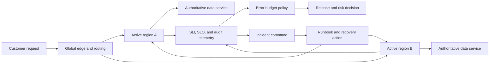
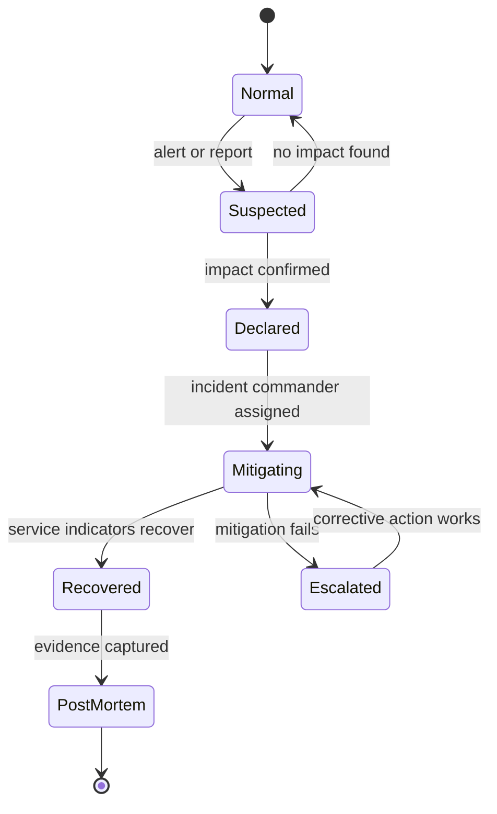

## What it is

**Site reliability engineering** applies software engineering practices to operating a service reliably within business constraints. Incident engineering adds runbooks, severity coordination, blameless post-mortems, and tested recovery procedures; multi-region disaster recovery and active-active failover extend those practices across independent failure domains.

## How it works

Reliability management begins with an **SLI**, a measured indicator such as successful payment authorization rate or request latency. An **SLO** sets a target over a window, and an **SLA** is the external commitment made to customers. The difference between them prevents a contractual promise from becoming the only internal reliability signal. The **error budget** is the allowed unreliability derived from the SLO; spending it rapidly should change release risk, not trigger an arbitrary shutdown.



Runbooks should contain a trigger, prerequisites, exact commands or control-plane actions, verification queries, abort conditions, escalation paths, and the owner of each step. Commands must use placeholders for environment, account, and transaction identifiers; production credentials do not belong in Markdown or chat history. Exercise runbooks during game days and record whether the recovery target was met.

```yaml
apiVersion: policy.example/v1
kind: ServiceLevelObjective
metadata:
  name: payment-authorization-availability
spec:
  service: payment-api
  indicator: successful_authorization_ratio
  objective: 99.95
  window: 30d
  errorBudgetPolicy:
    fastBurnThreshold: 2
    slowBurnThreshold: 1
    actions:
      - freeze_nonessential_releases
      - require_incident_review_before_full_rollout
  runbook: 04-sre-practices-incident-engineering.md
```

Incident response follows a predictable state machine: detect, declare, assess, mitigate, communicate, recover, and learn. The incident commander owns coordination rather than debugging every component. Assign communications, operations, and investigation roles, preserve a timestamped decision log, and use a blameless post-mortem to identify contributing conditions and durable actions. A post-mortem is complete when actions have owners, due dates, verification, and an explicit link back to the affected SLO.



For multi-region design, decide explicitly whether regions are active-active or active-passive, which data is authoritative, how writes are fenced, and how identity, key, DNS, and telemetry dependencies fail. Replication reduces availability risk only when clients can reach a healthy region and reconciliation is safe. RPO and RTO must be measured with restore drills, not inferred from infrastructure diagrams.

## Tradeoffs

- **Runbook-driven operations** — makes recovery repeatable and auditable, but stale instructions can cause the wrong action during time pressure.
- **Active-active regions** — reduces failover time and removes a single regional control point, but requires conflict resolution, data ownership, and careful routing.
- **Active-passive regions** — simplifies authoritative writes and recovery, but leaves capacity idle and extends failover time.
- **Blameless post-mortems** — improves learning and reporting, but require leaders to protect the evidence-seeking process and still assign accountable actions.

## When to use

- You need an operational definition of availability, latency, correctness, or recovery success.
- You operate an SLO and need an error-budget policy connected to release decisions.
- A customer-impacting failure can exceed a single team's knowledge or tool access.
- You need tested failover, restore, or regional evacuation procedures.
- You need post-incident learning that produces owned, verifiable engineering work.

## Alternatives

- **Manual escalation through chat** — works for a small team, but loses context, creates unsafe permissions, and is difficult to audit.
- **Policy-as-code recovery** — makes guardrails repeatable, but cannot replace judgment for ambiguous or destructive actions.
- **Backup and restore without drills** — provides artifacts, but does not demonstrate that a team can recover within the RTO.
- **Vendor-managed active-active** — reduces operational construction, but retains provider, routing, and contractual dependencies.

## Related

- [25.1 Testing Strategy: Unit/Integration/Contract/E2E, Chaos Engineering (Litmus, Chaos Mesh)](01-testing-strategy-chaos-engineering.md)
- [25.2 Feature Flags & Experimentation Infrastructure (A/B Test Deployment)](02-feature-flags-experimentation-infrastructure.md)
- [25.3 Privacy Tech & Privacy-Preserving ML: Differential Privacy, Federated Learning, Homomorphic Encryption](03-privacy-tech-privacy-preserving-ml.md)
