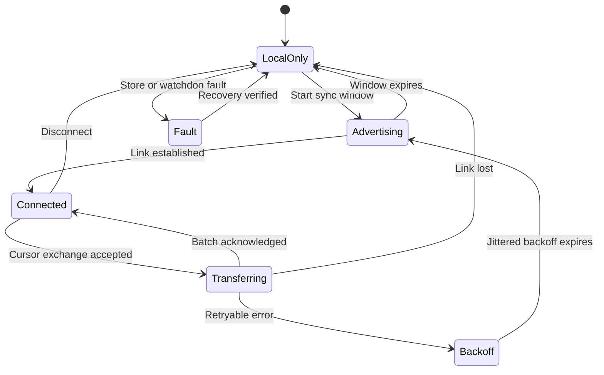
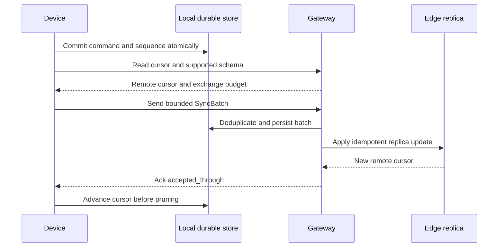

## What it is

**Embedded sync architecture** is the hardware, firmware, storage, radio, and gateway design that accepts user intent on a constrained device, preserves it locally, and exchanges bounded updates when connectivity permits. Its mental model is a small state machine: perform the safety-critical action locally, append an auditable intent, batch compact operations, resume from a durable cursor, and treat every link as delayed or absent.

## How it works

A microcontroller such as an ESP32-C6, nRF52840, or STM32-class Cortex-M device combines a processor, volatile RAM, nonvolatile flash, and one or more radios. The product workload competes for CPU cycles, RAM, flash endurance, battery energy, and radio time. A useful architecture therefore separates five responsibilities:

| Responsibility | Placement | Failure behavior |
| --- | --- | --- |
| Real-time sensing and safety | Firmware near the device | Continue locally or enter a defined fail-safe state |
| User-visible command | Device application | Validate, execute locally, then enqueue sync metadata |
| Durable replica | Flash-backed local store | Preserve committed intent and cursor across resets |
| Transport | BLE to a phone or edge gateway | Retry idempotently after disconnects and long outages |
| Reconciliation | Gateway or cloud replica | Merge deterministic state and surface semantic conflicts |

The partition matters because radio time, flash writes, and cloud availability do not belong on the control path. A door lock, meter reading, or safety interlock must not wait for a gateway. Sync is a background consequence of a local commit, not the condition that makes the local commit true.

BLE uses the GATT model: a central discovers services and characteristics on a peripheral, reads or writes values, and subscribes to notifications or indications. A device can expose a small service containing identity, sync status, and bounded application records. MTU negotiation determines the largest GATT payload, but application fragmentation remains necessary for larger records and must account for protocol overhead. Notifications are not confirmed GATT transactions, whereas indications require a confirmation at the ATT layer. A reconnecting session uses a sequence cursor to discover missing records instead of assuming that one packet equals one durable command.

A bounded protocol contract prevents application code from embedding transport assumptions:

```proto
syntax = "proto3";

message SyncBatch {
  string device_id = 1;
  uint64 after_sequence = 2;
  uint64 through_sequence = 3;
  bytes payload = 4;
  uint32 payload_crc32 = 5;
}

message SyncAck {
  uint64 accepted_through = 1;
  uint64 server_cursor = 2;
  uint32 status = 3;
}
```

The device sends only records above its acknowledged cursor. The gateway authenticates `device_id`, verifies the encoded batch, persists it before advancing `accepted_through`, and returns the cursor plus remote state. The device durably records the acknowledgment before deleting uploaded operations. A reset during either half leaves either safe work to retry or already durable work that the receiver deduplicates by `(device_id, sequence)`.

BLE connectivity is a state machine, not a binary connected flag:



Duty cycling reduces radio energy by allowing short connection or advertising windows separated by local execution and sleep. Actual wake sources, connection-interval limits, scheduler latency, and the gateway's availability determine whether a window succeeds:

```mermaid
gantt
    title Duty-cycled BLE synchronization
    dateFormat X
    axisFormat %s ms
    
    section Device
    Sample and commit : a1, 0, 2ms
    Local sleep       : a2, after a1, 8ms
    BLE window        : a3, after a2, 2ms
    Flush cursor      : a4, after a3, 1ms
    Local sleep       : a5, after a4, 7ms

    section Gateway
    Advertise and scan : g1, 2, 2ms
    Ingest             : g2, 10, 3ms
    Idle               : g3, after g2, 7ms
```



A connection sequence makes retry safety explicit:



Local state changes and the outgoing intent must commit atomically. A journal can append a compact operation and cursor in one power-loss-aware transaction, but frequent commits consume flash write cycles and can create long recovery scans. A write-back cache or snapshot-plus-log reduces rewrite volume, yet it needs version checks, reserved space, and a recovery path. The firmware budget should state fixed limits rather than hope that the heap absorbs sync work:

```yaml
firmware_budget:
  ram:
    radio_and_protocol_peak_kib: 24
    local_query_pool_kib: 8
    headroom_required: true
  flash:
    reserved_for_update_kib: 512
    reserved_for_recovery_kib: 128
    operation_log_compaction: size_and_age
  connectivity:
    sync_batch_target_bytes: 180
    maximum_attempts_per_window: 2
    backoff: exponential_with_jitter
```

Those values are an example contract, not universal device limits. Replace them with measured peak stack, heap, radio-driver, and flash usage under worst-case peer behavior. BLE range is affected by radio frequency, antenna matching, enclosure, interference, body placement, and gateway placement; an apparent connection is not proof of a reliable session. Link loss can occur during any exchange, so every remote action needs idempotency, bounded retries, and a visible backlog limit.

Security follows the identity lifecycle. Use hardware-backed device keys where available, LE Secure Connections for pairing and bonding, protected GATT access for sensitive values, and application-layer authorization for commands. A shared BLE link does not authorize a cloud-side mutation. Rotate long-lived credentials, reject stale sequence numbers, bind batches to a device identity, and expose queue age and failed-attempt state to operators. Provisioning must set the owner and authorized gateway before a device accepts production updates.

Watchdogs protect the real-time path from protocol faults, but they cannot prove that durable data is correct. Record monotonic progress, reset the watchdog only after required work, and boot into a minimal recovery mode that can replay an interrupted transaction. A restored cursor, reclaimed flash block, or authenticated firmware image must advance independently; never infer durability merely because a radio acknowledgment arrived.

## Tradeoffs

| Option | Gain | Cost |
| --- | --- | --- |
| Always-on BLE | Predictable availability and immediate exchange | Higher power use, radio interference, and thermal pressure |
| Duty-cycled BLE | Lower average energy and manageable connection opportunities | Delayed sync and failures when gateway and windows do not overlap |
| Notifications | Efficient unsolicited records over GATT | No end-to-end acknowledgement, so cursors and replay remain necessary |
| Indications | Link-level acknowledgement for important GATT writes | More connection events and slower transfer than notifications |
| Append-only operation log | Simple replay and auditability | Flash churn, compaction work, and metadata growth during outages |
| Snapshot plus log | Faster recovery and bounded startup work | More code for snapshot validity, torn-write recovery, and version migration |
| Direct device-to-gateway sync | Short path and gateway policy enforcement | Requires gateway reachability, secure onboarding, and gateway storage |
| Gateway-mediated cloud sync | Central authentication, aggregation, and remote repair | Additional availability boundary, latency, and cloud retention cost |
| Compact lossy telemetry | Predictable bandwidth and memory | Drops detail and cannot represent every auditable local intent |

## When to use

- You need a command, measurement, or safety state to remain usable without a phone, gateway, or cloud connection.
- You can assign fixed RAM, flash, energy, and radio budgets and measure behavior at those limits.
- You can express remote work as idempotent operations with durable device and receiver sequences.
- A gateway can cache, authenticate, reconcile, and forward traffic when the embedded device is offline.
- You can visibly expose backlog age, dropped telemetry, conflicts, and failed recovery rather than hiding them behind connection status.

## Alternatives

- **Wi-Fi or cellular** — wins when the device can sustain higher power and continuous network availability, but costs more energy, memory, and connectivity infrastructure.
- **Zigbee, Thread, or Matter** — wins for interoperable mesh building or device ecosystems, but requires a border router, provisioning model, and coordinated radio behavior.
- **MQTT or CoAP through a gateway** — simplifies application transport on higher-bandwidth links, but does not remove the need for local storage, idempotency, and offline reconciliation.
- **Cloud-only synchronization** — centralizes recovery and inspection, but makes network availability a prerequisite and can leave the physical device with no durable user-visible state.
- **Proprietary narrowband radio** — can optimize range, duty cycle, and certification for one deployment, at the cost of interoperability and a custom network stack.

## Related

- [26.2 Offline-First / Local-First Sync: Conflict Resolution, Conflict-Free Replicated Data Types (CRDT Deep Dive)](02-offline-first-local-first-sync.md)
- [Serverless, Edge & IoT Infrastructure: AWS Lambda, Cloudflare Workers, MQTT, CoAP, Microcontrollers (ESP32/ARM), Conflict-Free Replicated Data Types (CRDTs), and Local-First Sync](../../05-cloud-devops/01-cloud-primitives/04-serverless.md)
- [Chapter 26 References](03-references.md)
