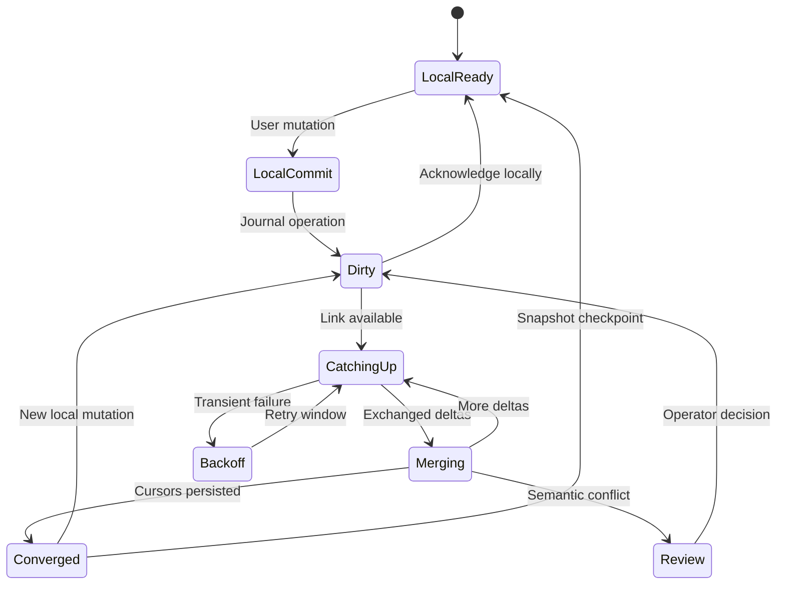
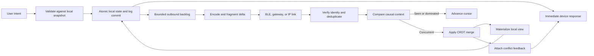
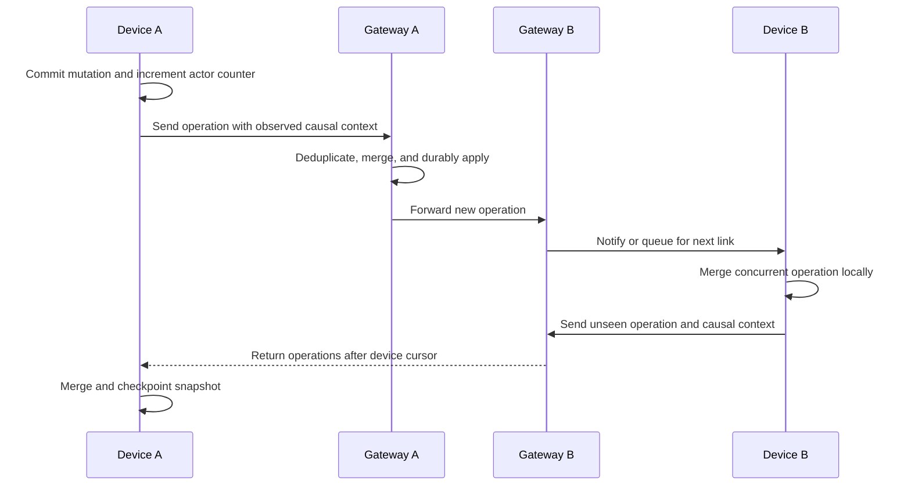

## What it is

**Local-first synchronization** is a replicated-state design in which devices read and write a durable local copy, exchange operations when a link exists, and merge without requiring the cloud to coordinate every write. **Offline-first** is the availability property that a user can complete the core task during disconnection; local-first additionally treats the local copy as the primary interaction and storage path rather than a temporary cache.

The mental model has two layers: durable intent and convergent state. A local commit records what the user did. Replication distributes that intent. The data type or application rule then decides how concurrent observations combine without a live coordinator, while server-only controls continue to govern identity, authorization, and irreversible effects.

## How it works

A local write first validates the command against device state, commits the visible result and an operation record atomically, and returns to the interface without waiting for the network. A later sync reads the device's durable cursor, exchanges bounded deltas, deduplicates operations, merges remote operations, and advances cursors only after durable receipt. The local database and operation log must agree after power loss; otherwise the UI can show a change that replication forgets or the log can contain a change the UI never committed.

The split becomes visible during partition and recovery:



A sync envelope carries identity, causality, payload, and transport bookkeeping separately:

```proto
syntax = "proto3";

message DeviceOperation {
  string operation_id = 1;
  string actor_id = 2;
  string aggregate_id = 3;
  uint64 actor_counter = 4;
  uint64 observed_version = 5;
  bytes payload = 6;
  uint32 checksum = 7;
}

message SyncRequest {
  string device_id = 1;
  bytes causal_context = 2;
  bytes operations = 3;
  uint32 schema_version = 4;
}

message SyncResponse {
  bytes causal_context = 1;
  repeated DeviceOperation operations = 2;
  repeated ConflictRecord conflicts = 3;
}

message ConflictRecord {
  string aggregate_id = 1;
  string field = 2;
  string resolution = 3;
  bytes evidence = 4;
}
```

`operation_id` makes redelivery safe. `actor_id` and `actor_counter` establish a compact logical history for that writer. `observed_version` or a version vector distinguishes an operation based on known state from one concurrent with another. A transport cursor is not enough for conflict detection because two replicas can both be caught up while holding incompatible concurrent operations.

The data path keeps local acceptance separate from convergence:



A **join semilattice** is the core CRDT abstraction: combining two replica states is commutative, associative, and idempotent. Those three properties allow an operation to arrive twice, in a different order, or after the receiver has already incorporated another concurrent operation while still converging when eventually exchanged. A CRDT does not make a protocol secure, durable, or instantly consistent; it only defines deterministic state combination.

A minimal operation payload can represent independent register updates without relying on wall-clock time:

```json
{
  "operation_id": "op_01K0J8B7P5M4N2Q6R8S0T2V4X6",
  "aggregate_id": "room_42",
  "field": "target_temperature_celsius",
  "actor_id": "device_8f31",
  "actor_counter": 184,
  "value": 21.5,
  "observed_version": {
    "device_8f31": 183,
    "gateway_02": 77
  }
}
```

The most common data types carry different conflict costs:

| Type | Merge rule | Strength | Cost or semantic limit |
| --- | --- | --- | --- |
| Last-writer-wins register | Keep the greatest version tuple; break ties deterministically | Compact and fast | Can discard a concurrent update; requires trustworthy ordering and an agreed tie-breaker |
| Grow-only set | Union all added identifiers | Add operations cannot conflict | No native removal; identifiers accumulate |
| Observed-remove set | Add unique tags and remove only observed tags | Concurrent add and remove survive distinctly | Tags and causal context grow; garbage collection needs stable knowledge |
| Positive-negative counter | Per-replica positive and negative counts; merge componentwise by maximum | Concurrent increments converge | Counts are algebraic, not automatically meaningful business events |
| Ordered sequence | Unique identifiers plus fractional positions or tree links | Concurrent insertion can retain multiple orderings | Tombstones and position metadata grow; intent ordering remains a product decision |
| Map and object CRDT | Apply the rule for each field, set, list, or counter | Different fields can use suitable semantics | Schema and per-field behavior require explicit design |

A last-writer-wins register works best when field updates are genuinely replace-only. Its version tuple can use a hybrid logical clock plus actor identifier, rather than assuming device clocks are synchronized. When a field is cumulative, such as an energy counter, a PN-counter is semantically safer than assigning one winning value. When set membership matters, an observed-remove set preserves the difference between “never observed” and “removed after being seen.” A sequence CRDT can preserve both concurrent insertions, but the order between them may carry no real-world meaning and should be presented as a deterministic merged order rather than a claim about user intent.

Conflict resolution follows a causal decision sequence:

1. Deduplicate by stable operation identity.
2. Advance a known operation if the receiver has already applied it.
3. Drop an operation only when the receiver's causal context proves that operation is already represented or dominated.
4. Treat operations from concurrent causal branches as candidates for the type's merge rule.
5. Materialize a deterministic view and attach feedback when a valid merge still loses user intent.
6. Ask the application or an authorized operator to resolve security, financial, safety, or other semantic conflicts.
7. Advance durable cursors only after state and conflict evidence are recorded.

Causal context grows with the number of active actors or history. A full version vector is simple but expensive; a dotted version vector separates actor identity from counters, while dotted version vectors support efficient causal trees. Stable storage and causal compaction can remove obsolete metadata only when every retained replica has acknowledged the necessary causal frontier. A device that stays offline for a long period may force the system to retain history longer than expected.

A normal exchange is an anti-entropy loop rather than a one-shot request:



Snapshot plus operation-log sync bounds startup and transfer time. A snapshot is an optimization only if it includes enough causal context to reject later operations that it already includes. Otherwise a late operation can be reapplied or incorrectly classified as concurrent. Checkpoint frequency should balance recovery work against flash writes and metadata size.

Local-first does not remove backend boundaries:

- **Security and authorization** — a stale device cache cannot grant permission that has been revoked. High-risk commands require fresh server policy, a challenge, and a narrowly scoped credential.
- **Financial meaning** — account balances, ledger postings, and transfers need invariant-preserving double-entry or transactional rules. A convergent register is not an accounting ledger unless its merge preserves every business invariant.
- **Physical safety** — merged settings can conflict with a safe operating envelope. Clamp locally, fail closed when policy data is unavailable, and make the physical device authoritative for immediate hazards.
- **Deletion and privacy** — tombstones, encrypted sync payloads, key rotation, and retention policies must be coordinated. Convergence can preserve deleted data longer than policy permits.
- **Schema evolution** — every payload needs a version and compatibility rule. Rejecting unknown required fields safely is better than interpreting a newer meaning incorrectly.

The embedded memory boundary limits which CRDTs are practical. Each operation consumes buffer space, durable-log space, causal metadata, and merge working memory; those costs rise differently across data types. During a long outage, bound the backlog by age and bytes, preserve safety-relevant intent, aggregate redundant telemetry, and expose dropped records. Never turn memory pressure into an unbounded heap allocation or silently discard queued commands.

Connectivity limits the sync unit. BLE requires fragmentation, retransmission, and cursor-aware reassembly. A gateway can coalesce compatible deltas, but it must not rewrite a device sequence without an authenticated receipt boundary. Batch by causal neighborhood and operation type, compress repeated state, and send a snapshot only when its size is smaller than the remaining history. A disconnected device remains correct only if its local commit path does not depend on replay completing first.

## Tradeoffs

| Option | Gain | Cost |
| --- | --- | --- |
| Last-writer-wins | Small payload and constant-state merge | Can erase concurrent intent and depends on deterministic version comparison |
| Operation-based CRDT | Tracks individual intent and supports precise causality | Requires stable operation IDs, causal metadata, and idempotent replay |
| State-based CRDT | Simple replicas exchange complete current state | More bandwidth and state growth when full snapshots are large |
| Observed-remove set | Distinguishes concurrent add from observed removal | Tombstone and causal-context growth complicates compaction |
| Deterministic app merge | Can preserve domain-specific meaning | Every replica needs the same versioned rule and upgrade path |
| Operator review | Handles ambiguous safety, financial, or legal intent | Adds latency, queue management, and recovery procedures |
| Snapshot plus log | Bounded catch-up and startup work | More code, flash writes, and snapshot/causal-context consistency requirements |

## When to use

- You need core user actions and device settings to work through disconnections and gateway outages.
- You can define deterministic merge behavior for every replicated field or collection.
- You can maintain stable actor identities, operation identifiers, and durable local cursors.
- You can separate convergent local state from authorization and irreversible server effects.
- You can measure metadata growth, backlog growth, flash use, and merge latency on the weakest supported device.

## Alternatives

- **Server-authoritative state** — centralizes validation and ordering, but the device may become unusable offline and writes wait for the server.
- **Operational transformation** — supports collaborative text with a shared transformation history, but requires complex transformation rules and a consistent ordering service.
- **Delta synchronization** — reduces transport and storage for ordered append-only streams, but concurrent edits still need a merge policy.
- **Append-only event log** — provides a durable audit trail and replay, but replaying every event can exceed device memory and energy budgets.
- **Manual last-write policy** — easy to explain for replace-only settings, but silently discards concurrent intent when clocks or version rules disagree.
- **Peer-to-peer gossip** — reduces central coordination and can spread updates opportunistically, but repair, authorization, and convergence time become harder to bound.

## Related

- [26.1 Embedded Architecture: Microcontroller Constraints, BLE Sync Patterns](01-embedded-architecture.md)
- [Database Replication & Data Synchronization: Leader-Follower, Multi-Leader, Leaderless (Dynamo-Style), Change Data Capture (CDC), Active-Active Multi-Region Sync, and Point-In-Time Recovery (PITR)](../../04-distributed-systems/02-databases/05-replication.md)
- [Scalable Real-Time Chat & Collaboration Systems Architecture](../../03-messaging/02-realtime/04-realtime-chat.md)
- [Chapter 26 References](03-references.md)
