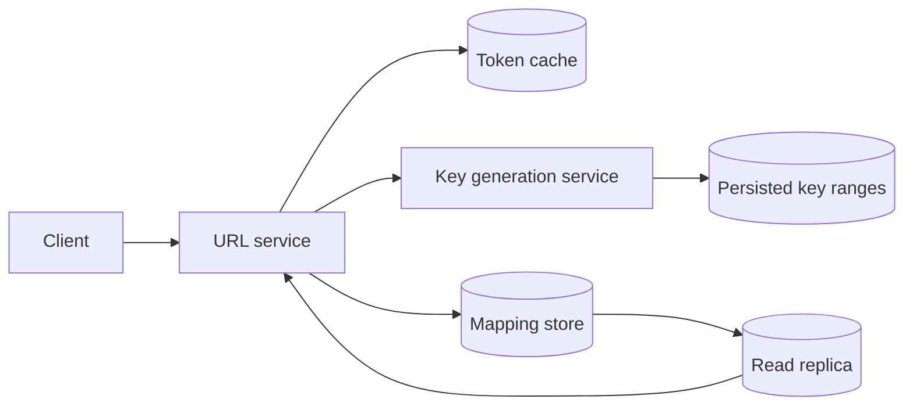
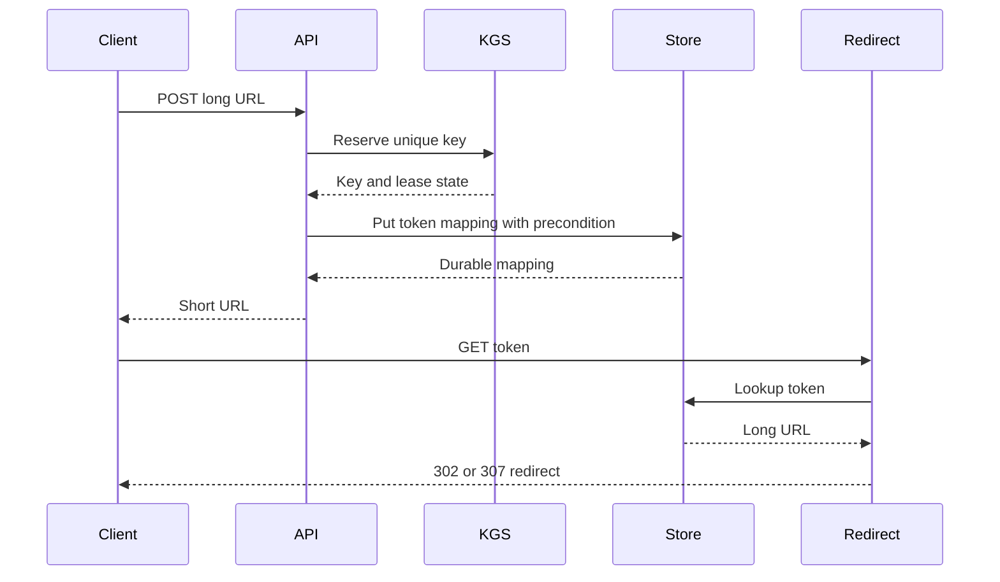

## What it is

A **distributed URL shortener** maps long URLs to compact, shareable tokens and resolves those tokens back to the original destination. Its mental model is a durable mapping service: allocate a unique numeric key, encode it into a short string, store the mapping, and route resolution with a cache in front of an authoritative key-value store.

## How it works

A write request validates the destination URL, asks a key-generation service (KGS) for a unique integer, converts that integer to Base62, and stores a record such as `token -> long URL`. The KGS must not hand out a key twice after a crash, a failover, or a network timeout. A database sequence is easier to reason about for a small system; a high-throughput KGS uses ranges reserved by application instances and persists the next range before use.

Base62 uses 62 URL-safe symbols, so an integer key can be rendered without separators or case-folding ambiguity. A zero-padded code can preserve a fixed display length, but it increases the space consumed by small values and does not make a token unpredictable. For an opaque random token, use cryptographically secure randomness rather than a visible sequential key.



A lookup can be a cache hit, a primary read, or a replica read. If the cache is unavailable, the service should degrade to the authoritative store rather than fail every request. Negative caching for unknown tokens is useful, but it must have a short bounded lifetime because a token can become valid after propagation. Redirects expose user data through referrers; offer an interstitial when the destination is untrusted and apply an explicit privacy policy.



The write response is successful only after the mapping is durable. If the client times out, it can retry only if the API supplies an idempotency key or the service can detect the same submitted URL and request identity. A database transaction cannot make a KGS reservation and a remote cache update atomic; model cache writes as derived state.

```yaml
shortener_contract:
  token_encoding: base62
  key_length: 8
  mapping_consistency: read_your_writes
  write_idempotency: request_key
  cache_ttl_seconds: 300
  negative_cache_ttl_seconds: 15
  redirect_status: 302
  max_destination_bytes: 8192
  rate_limit: per_tenant_and_ip
```

Hashing can help shard the mapping store by token prefix, but it does not replace a unique allocator. A hash of the long URL is not a good public token: identical destinations should not necessarily share a token if owners need separate analytics or revocation, and a predictable token permits enumeration. If a custom short code is required, store a reservation and uniqueness constraint for that code separately from the numeric KGS key.

A hot token can monopolize a cache shard. Use replication-aware caches, request coalescing, and a measured admission policy rather than an unbounded in-process cache. A key-value store should expose a replication factor and failure-domain placement; three replicas improve availability but do not make a multi-region active-active write path linearizable.

## Tradeoffs

| Option | Gain | Cost |
| --- | --- | --- |
| Database sequence | Simple uniqueness and transactional allocation | Centralized write contention and lower peak allocation throughput |
| KGS ranges | High write throughput and local batch allocation | Lost ranges create gaps; clock and failover logic must be explicit |
| Sequential Base62 token | Short, decodable, and easy to generate | Predictability enables enumeration and traffic analysis |
| Random opaque token | Harder to guess and no allocator dependency | Longer tokens and a need to handle random collisions |
| Redirect cache | Low read latency and origin protection | Stale or poisoned mappings until invalidation or TTL |
| Read replica | Higher read capacity | Stale reads after a write unless tokens or routing provide read-your-writes |
| Custom vanity code | Brandable and memorable | Contention, reservation complexity, and squatting risk |

## When to use

- You need a compact public identifier for long URLs or other opaque records.
- Write traffic is high enough that a database sequence would create a hotspot, but uniqueness and recovery are still required.
- Redirects can tolerate a controlled stale-read window or use a token-aware consistency strategy.
- You can rate-limit writes, validate destinations, and monitor cache hit rate, error rate, and key-range exhaustion.
- Revocation, ownership, retention, and abuse response are product requirements rather than afterthoughts.

## Alternatives

- **Human-readable slugs** — improve memorability, but reserve names globally and accept collision and dispute handling.
- **QR codes** — move part of the identifier into a visual channel, but still need a backend mapping and error recovery.
- **Short links from a managed platform** — reduce operational work, with limits on custom domains, analytics, retention, and portability.
- **Deep links** — avoid a redirect for applications that can resolve a route locally, but cannot encode arbitrary web destinations.
- **Signed content URLs** — protect direct resources temporarily, but create token lifecycle and verification responsibilities.

## Related

- [27.2 System Design: Distributed Unique ID Generator (Snowflake ID, ULID, UUIDv4 vs UUIDv7)](02-distributed-unique-id-generator.md)
- [28.1 System Design: Web Crawler at Scale (Robots.txt Parsing, Politeness Policy, URL Frontier, Deduplication)](../02-content-ingestion-search-storage/01-web-crawler-at-scale.md)
- [Chapter 27 References](03-references.md)
