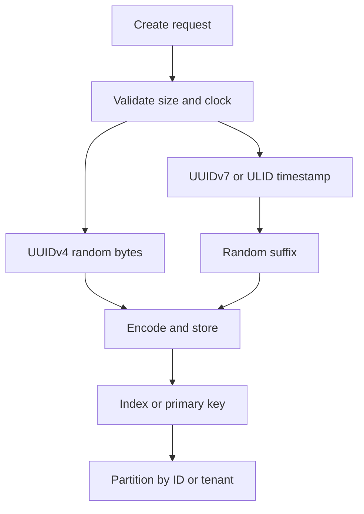
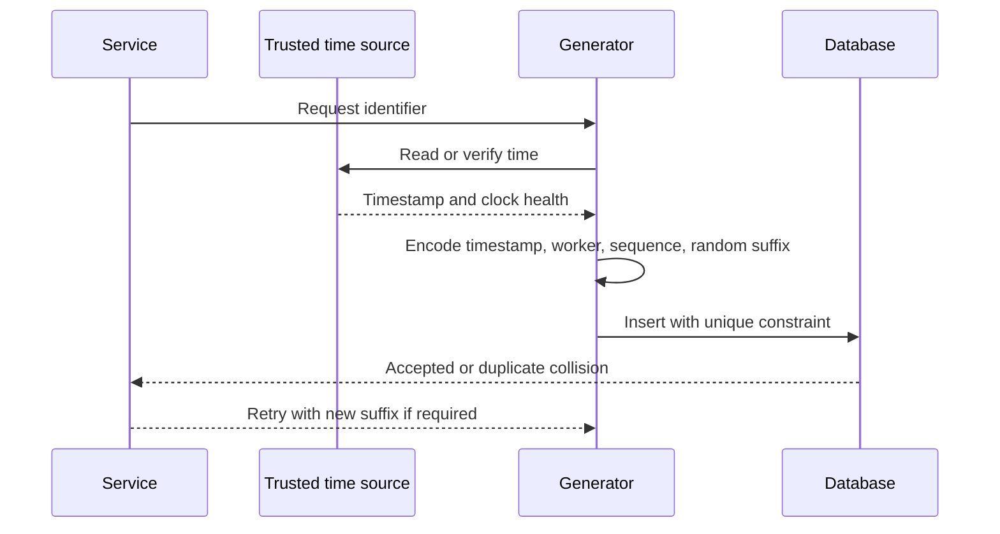

## What it is

A **distributed unique ID generator** produces identifiers that remain unique across processes, machines, regions, and time without requiring every caller to coordinate through one central counter. Its design choices trade ordering, collision resistance, privacy, coordinate precision, and dependence on trusted infrastructure.

## How it works

A Snowflake-style identifier divides bits among a timestamp, a machine or worker identifier, and a per-worker sequence. The generator waits when the sequence is exhausted within a millisecond, rejects an invalid worker configuration, and refuses a clock rollback or handles it explicitly. A 64-bit value is compact and sortable, but it exposes creation-time information and can be reverse-engineered.

```text
| 1 unused | 41 timestamp bits | 10 worker bits | 12 sequence bits |
```

ULID and UUIDv7 use a 128-bit representation with a timestamp prefix and random or sequence-derived suffix. UUIDv7 supports time ordering while retaining broad UUID interoperability. UUIDv4 is random, has no embedded creation time, and does not depend on a clock, but random values create larger indexes and offer no natural sort order. A random ID can be a better privacy boundary when time and machine details are not acceptable.



A generator is only half the design. Database indexes, key distribution, API exposure, and ordering semantics determine the cost of the ID. A monotonically increasing ID concentrates writes on a B-tree's rightmost pages; a random ID spreads inserts but increases page splits and random I/O. Sharding by a tenant prefix can keep a tenant's data together, but the prefix must be included in the encoding and must not become a security boundary.



Clock handling is part of correctness, not an operational footnote. A generator should use a monotonic high-resolution source, detect a backward step, and avoid issuing a duplicate sequence after a process restart. Persist worker identity where duplicate worker IDs could otherwise overlap. If a region moves or a virtual machine is cloned, allocate a new worker identity before serving traffic.

A compact configuration makes the assumptions visible:

```yaml
id_policy:
  format: uuidv7
  time_source: synchronized_monotonic
  random_bits: 74
  index_strategy: local_uuid
  database_unique_constraint: true
  expose_timestamp: false
  worker_identity: durable_registration
  clock_rollback: reject_and_alert
  retry_policy: fresh_random_suffix
```

A unique constraint is the final safety net. Generate a candidate, insert it, and retry only a bounded number of times if a collision or transient serialization failure occurs. Never treat a successful application response as proof that a database accepted the ID, especially when a queue, cache, or downstream service can observe an event before the transaction commits.

## Tradeoffs

| Option | Gain | Cost |
| --- | --- | --- |
| Snowflake | Compact, sortable, and cheap for high write rates | Exposes time, depends on clock discipline, and needs worker-ID safety |
| ULID | Human-readable, sortable, and collision resistant at a practical scale | Longer text representation and timestamp exposure |
| UUIDv7 | Sortable UUID with standard ecosystem support | Still creates index locality and carries timestamp information |
| UUIDv4 | Random, stateless, and no timestamp leakage | Larger index keys, random insertion patterns, and no natural ordering |
| Counter allocation | Simple and compact | Central coordination or a range allocator with a recovery procedure |
| Database-generated ID | Central uniqueness and transactional correctness | Database dependency and possible write hotspot |

## When to use

- You need a globally unique, low-latency identifier for events, records, jobs, or public resources.
- You can define whether creation-time ordering and metadata leakage are acceptable.
- You can keep clocks synchronized or use a random format that does not depend on time.
- You can protect uniqueness with a database constraint or an equivalent downstream deduplication mechanism.
- You can test clock rollback, worker restart, region movement, collision, and duplicate request behavior.

## Alternatives

- **Database sequences** — simplify uniqueness and transactional ordering, at the cost of a centralized allocator or range coordination.
- **Hash-based IDs** — produce opaque-looking identifiers from business fields, but leak correlation and can require a collision-resolving salt.
- **Composite keys** — model identity precisely without encoding it, but consume storage and complicate joins and external APIs.
- **Central ID service** — centralize policy and auditability, with an extra network hop and availability dependency.
- **Client-generated UUIDs** — remove server round trips, but move validation, collision policy, and abuse controls to clients.

## Related

- [27.1 System Design: Distributed URL Shortener (TinyURL Architecture, Hashing, Base62 Encoding, KGS)](01-distributed-url-shortener.md)
- [28.3 System Design: Distributed Message Queue (Kafka-Like Log-Centric Engine, Partitioning, Replication, Consumer Groups)](../02-content-ingestion-search-storage/03-distributed-message-queue.md)
- [Chapter 27 References](03-references.md)
