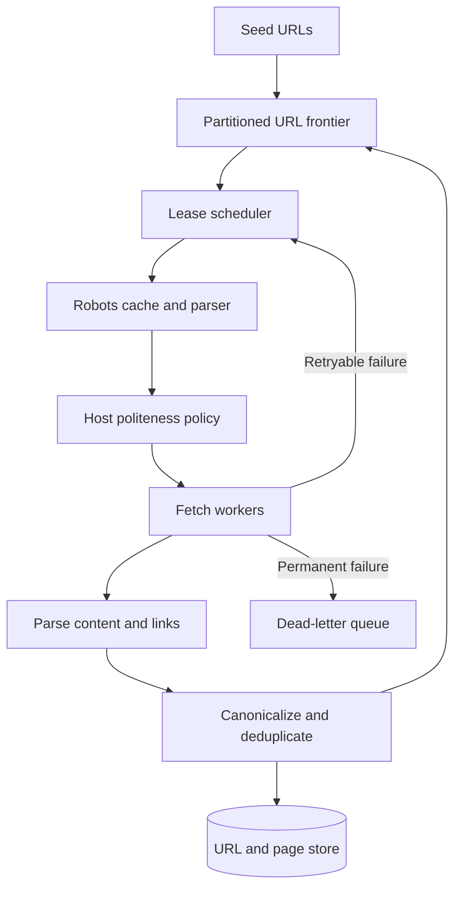
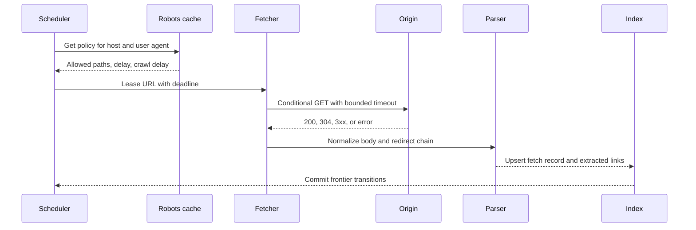

## What it is

A **web crawler at scale** is a distributed system that discovers URLs, applies crawl policy, fetches pages, extracts links, and records a durable frontier without overwhelming a site or collapsing its own state. Its mental model is a controlled data pipeline: seed URLs enter a scheduler, robots and politeness rules constrain fetches, content and extracted links flow to storage, and deduplication keeps each canonical resource from growing the frontier without bound.

## How it works

A production crawler separates discovery from fetching. Seed and previously discovered URLs enter a partitioned frontier. A scheduler leases URLs to fetch workers, records host-level rate limits, and retries transient failures with exponential backoff and jitter. The lease expires if a worker dies, allowing another worker to retry without a global coordinator owning every request.

Before fetching, the crawler retrieves and parses `robots.txt`, including group selection by user agent, wildcard rules, and the most specific matching path. A politeness policy combines robots directives with host-specific concurrency, minimum inter-request delay, circuit breakers, and a global crawl budget. Robots policy is a crawl contract, not a security boundary; robots data can be stale, malformed, or unavailable, so the parser must fail safely and never turn a parse error into unrestricted crawling.



Canonicalization defines identity before deduplication. Normalize schemes and host casing, remove the default port, resolve redirects, apply a site-specific query policy, and decide whether fragments matter to the resource. A cryptographic digest of the canonical URL is a practical storage key, but the original URL and canonical URL remain available for audit and reprocessing. Do not treat a digest as a collision-free identity forever; detect collisions and retain the full key.

The frontier is a durable work queue with per-partition ordering, not an in-memory list. A practical record carries the normalized URL, crawl depth, priority, host, discovery time, retry count, and lease state:

```yaml
frontier_record:
  url: https://example.com/catalog
  canonical_digest: sha256:7f3d...
  host: example.com
  depth: 2
  priority: 0.7
  attempts: 0
  lease_until: 2026-09-24T22:00:00Z
  state: ready
```

Fetch workers record status, response size, content type, `Last-Modified`, `ETag`, redirect chain, and fetch timestamp. Conditional requests reduce transfer but do not prove that a page is unchanged globally. Content-addressed storage can deduplicate bodies while a URL index preserves the many-to-one relationship between URLs and content.



A crawler must distinguish `not modified`, `temporary failure`, `permanent failure`, and `blocked by policy`. Retrying a 404 indefinitely wastes capacity, while retrying a timeout too aggressively can violate politeness. Store a reason code and next-attempt time, cap retries, and expose frontier age, host latency, blocked URL counts, and crawl throughput.

## Tradeoffs

| Option | Gain | Cost |
| --- | --- | --- |
| Central scheduler | Simple ordering and easy global policy | Becomes a coordination bottleneck and failure domain |
| Partitioned frontier | Independent workers, scale, and resumable progress | Requires careful leasing, rebalancing, and duplicate suppression |
| Crawl everything aggressively | Fast freshness and broad coverage | Increases origin load, abuse risk, and wasted bandwidth |
| Conservative politeness | Protects origins and improves trust | Slower freshness and lower coverage |
| URL digest only | Compact deduplication and fast equality checks | Requires collision detection and loses provenance |
| Store every response body | Rich historical analysis | Increases storage, lifecycle, privacy, and deletion cost |
| Crawl-delay only | Simple per-host rate control | Does not model network congestion or origin-specific behavior |

## When to use

- You need to discover and revisit a large, changing web graph with bounded requests per origin.
- You can define canonical URL rules, robots handling, retry policy, and crawl budgets.
- You can durably checkpoint frontier leases so worker failure does not lose discovered URLs.
- You can separate URL identity from content identity for deduplication and provenance.
- You need freshness, coverage, blocked URLs, and origin pressure to be observable metrics.

## Alternatives

- **Search-engine APIs** — provide licensed or hosted discovery, but limit crawl control and introduce dependency on another index.
- **Web archives** — preserve historical evidence, but answer retrieval and replay rather than fresh origin crawling.
- **Event-driven change detection** — combines sitemaps, feeds, and webhooks with crawling to improve freshness at lower request volume.
- **Focused crawler** — explores a bounded domain or topic, trading broad coverage for precise relevance and predictable traffic.
- **Browser automation** — executes client-rendered pages, but costs substantially more compute and complicates politeness and safety.

## Related

- [27.2 System Design: Distributed Unique ID Generator (Snowflake ID, ULID, UUIDv4 vs UUIDv7)](../01-fundamental-distributed-utilities/02-distributed-unique-id-generator.md)
- [28.2 System Design: Distributed Search Engine & Google PageRank (Inverted Index Sharding, Web Indexer, Link Graph Analysis)](../02-content-ingestion-search-storage/02-distributed-search-engine-pagerank.md)
- [28.4 System Design: Distributed S3-Like Object Storage (Metadata Cluster, Chunk Servers, Erasure Coding, Multipart Uploads)](../02-content-ingestion-search-storage/04-distributed-s3-like-object-storage.md)
- [Chapter 27 References](../01-fundamental-distributed-utilities/03-references.md)
