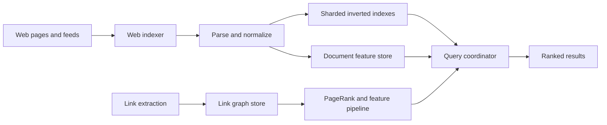
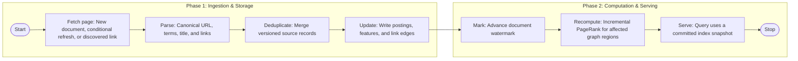
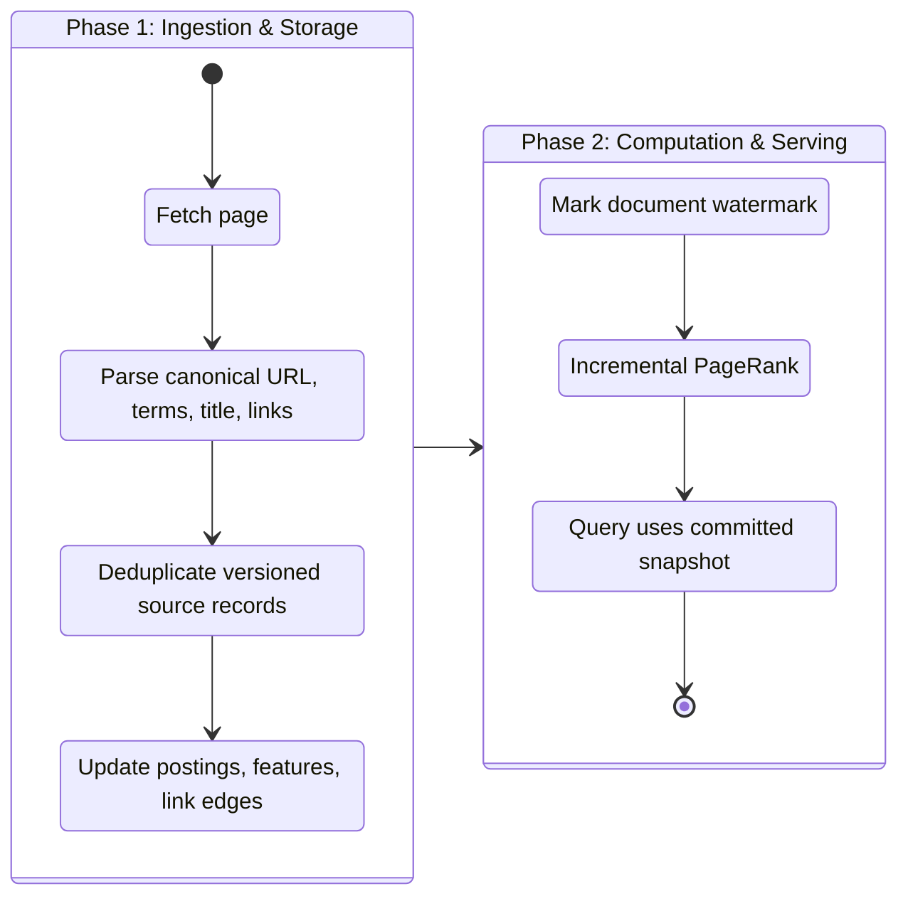

## What it is

A **distributed search engine** is a pipeline that transforms documents and links into a queryable inverted index, then ranks and serves relevant results under a defined freshness and consistency contract. Google PageRank adds a link-analysis signal: a page contributes authority through outgoing links, so the system must update both document terms and graph structure without recomputing the whole web synchronously.

## How it works

The web indexer fetches and parses documents, normalizes text, extracts title and link metadata, and emits versioned postings. An **inverted index** maps terms to compressed lists of document IDs with positions and optional field weights. A query planner expands terms, executes postings intersections, scores matches, and retrieves document features from a feature store. Sharding is usually by term dictionary range or document ID, but a query fan-out must remain bounded.



A document can be versioned independently in the feature store and postings. Search results therefore need a `document_version` or equivalent freshness marker. If a term is available in one shard before its companion features are available, the coordinator must choose a consistent document version, degrade gracefully, or mark the result as stale. Inverted-index commits are commonly atomic per shard, but a multi-shard query sees a set of shard offsets rather than one global snapshot unless the system builds one.

A compact index segment can expose the deployment contract:

```json
{
  "segment_id": "web-2026-09-24-0007",
  "term_range": ["intl", "latency"],
  "documents": 1200000,
  "average_postings_per_term": 24,
  "built_at": "2026-09-24T21:00:00Z",
  "source_watermark": "2026-09-24T20:58:00Z"
}
```

PageRank treats a directed link graph as a matrix of votes. In practice, systems use iterative, incremental, or locality-aware methods rather than a synchronous global solve. Link extraction must handle redirects, canonical pages, nofollow and robots policy, spam links, and pages that are deleted. A link edge needs provenance and a timestamp so a ranking change can be explained or rolled back.





The query path should separate candidate generation from detailed ranking. Retrieve postings with a timeout and result cap, apply cheap filters, fetch document features in batches, and run a more expensive ranker only for the surviving candidates. Cache query results at the edge with an explicit freshness budget, but avoid caching user-specific or authorization-dependent responses in a shared key space.

## Tradeoffs

| Option | Gain | Cost |
| --- | --- | --- |
| Term-range shards | Predictable segment ownership and compact dictionaries | Cross-term queries fan out and require coordination |
| Document-ID shards | Simple document partitioning | Every term query must touch more shards and merge postings |
| Fully rebuilt index | Simple recovery and consistent local artifacts | High compute and delayed visibility for large corpora |
| Incremental segment merge | Faster freshness and lower rebuild cost | More segment metadata, merge work, and query planning complexity |
| Exact global snapshot | Deterministic multi-shard results | Higher coordination and storage overhead during ingestion |
| Recompute PageRank globally | Clear batch semantics | Expensive and unsuitable for continuous crawling |
| Incremental PageRank | Lower recompute latency and bandwidth | Propagates errors and needs damping, freshness, and quality controls |

## When to use

- You need full-text retrieval over a corpus too large for one machine's memory or disk.
- You can define document versioning, index watermarks, ranking signals, and acceptable freshness.
- Query fan-out, postings size, and segment merge cost fit an explicit latency and cost budget.
- Link-derived authority is useful and you can track edge provenance and spam signals.
- You can serve a degraded or slightly stale result when a shard, feature store, or ranker is unavailable.

## Alternatives

- **Relational full-text search** — simplifies transactional indexing for smaller or tightly coupled datasets, but constrains independent scale.
- **Commercial managed search** — supplies ranking and operations expertise, at the cost of vendor limits, export constraints, and pricing.
- **Vector search** — retrieves semantically similar content, but complements rather than replaces exact term, phrase, and filter matching.
- **Log analytics and warehouse search** — fits event and business data, with different freshness and indexing characteristics from public-web search.
- **Federated search** — queries independent source indexes, but inherits each source's latency, ranking, and availability limits.

## Related

- [28.1 System Design: Web Crawler at Scale (Robots.txt Parsing, Politeness Policy, URL Frontier, Deduplication)](01-web-crawler-at-scale.md)
- [28.3 System Design: Distributed Message Queue (Kafka-Like Log-Centric Engine, Partitioning, Replication, Consumer Groups)](03-distributed-message-queue.md)
- [27.1 System Design: Distributed URL Shortener (TinyURL Architecture, Hashing, Base62 Encoding, KGS)](../01-fundamental-distributed-utilities/01-distributed-url-shortener.md)
- [Chapter 28 References](05-references.md)
