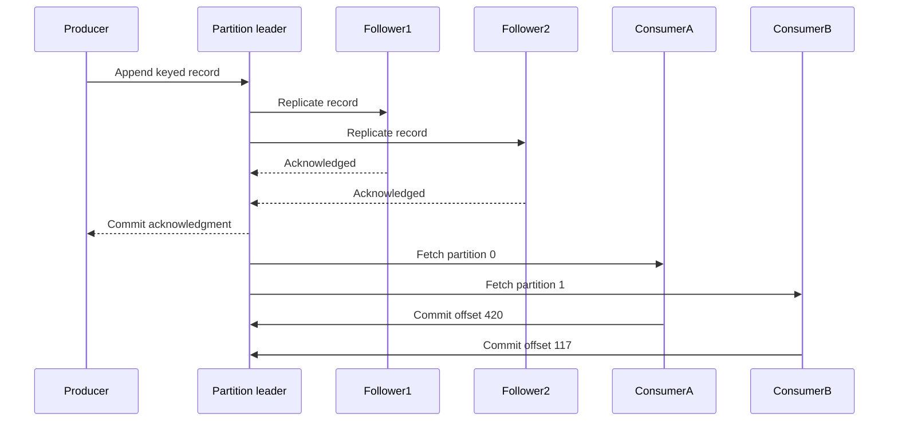
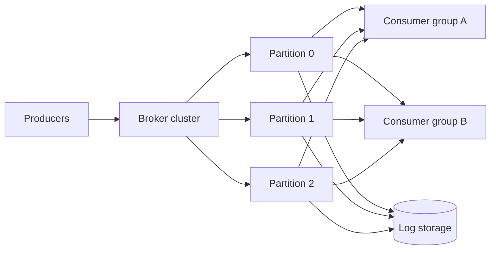

## What it is

A **distributed message queue** is a durable, ordered log between producers and consumers that absorbs bursts, decouples services, and provides replayable delivery. A Kafka-like engine partitions records by key, replicates each partition across brokers, and exposes offsets so a consumer group can divide partitions while each group independently tracks its progress.

## How it works

Producers serialize an event, choose a topic and key, and send the record to the partition leader. A broker appends the record to a replicated log and acknowledges it according to the required durability level. Consumers fetch batches, process them, and commit offsets. The key controls affinity: events for one aggregate stay ordered in one partition, but a hot key can overload that partition.

Partition count fixes the maximum parallelism available to a consumer group and affects rebalance cost. Increasing it later is an operational change, not a transparent scale operation. Use a retention policy based on replay requirements, and keep records small enough that one oversized message does not monopolize a broker.



A log-centric engine separates durable retention from online delivery. A consumer can replay from an earlier offset, but a new group may create a large fan-out of storage reads. Compaction helps for key-based state changes by retaining the latest value under a key, yet it is inappropriate for an audit log where every event matters.

```yaml
topic_policy:
  name: order.events
  partitions: 24
  replication_factor: 3
  min_insync_replicas: 2
  cleanup_policy: delete
  retention_ms: 604800000
  key_schema: order_id
  value_schema: order_event_v2
  delivery_contract: at_least_once
```

At-least-once delivery is the practical default because a consumer can crash after processing an event and before committing its offset. Make handlers idempotent with a deduplication key, record processing outcomes, and design poison messages for a bounded retry and dead-letter path. A consumer group is not a transaction boundary: offset commit and business side effects require an idempotent or transactional application design.



Leadership changes, broker failures, network partitions, and consumer rebalances are normal operating events. Replication protects records, not correctness of consumers. Producers choose whether to wait for all in-sync replicas, risk losing a minority-written record, or use an idempotent retry that can create duplicates. Consumer lag is the key freshness signal; record age and failed retries are more actionable than a green broker count.

## Tradeoffs

| Option | Gain | Cost |
| --- | --- | --- |
| One partition per key | Strong per-key order and simple affinity | Hot keys cap throughput and spread unevenly |
| More partitions | More consumer parallelism | Rebalances, metadata, and ordering across partition changes become harder |
| At-least-once delivery | Preserves records through consumer crashes | Requires idempotency and duplicate-tolerant processing |
| Exactly-once claims | Simplifies some stream semantics | Needs scoped transactions, deterministic state, and careful producer configuration |
| Long retention | Enables replay and new consumers | Increases storage, compaction, and retention-governance work |
| Log compaction | Efficient current-state reads | Removes history needed for audit or exact replay |
| Synchronous replication | Stronger acknowledged durability | Higher latency and reduced write availability during failures |

## When to use

- Producers and consumers need to scale independently or absorb bursts without direct coupling.
- Events can be partitioned by a key and replayed from a durable offset.
- Consumers can implement idempotent handling or transactional coordination with side effects.
- Retention, replication, lag, poison-message handling, and rebalancing are measurable operational concerns.
- Different consumer groups need independent progress over the same retained records.

## Alternatives

- **Amazon SQS** — provides managed queues and dead-letter flows, with less control over log retention and partition-level replay.
- **RabbitMQ** — fits flexible routing and work queues, with a different operational model from a replicated log.
- **Cloud Pub/Sub** — suits fan-out integration and managed delivery, while hiding broker and partition internals.
- **Change data capture** — propagates database changes to downstream consumers, but couples event shape to schema and transaction history.
- **Batch ETL** — reduces infrastructure complexity for large scheduled transformations, at the cost of freshness.

## Related

- [28.2 System Design: Distributed Search Engine & Google PageRank (Inverted Index Sharding, Web Indexer, Link Graph Analysis)](02-distributed-search-engine-pagerank.md)
- [28.4 System Design: Distributed S3-Like Object Storage (Metadata Cluster, Chunk Servers, Erasure Coding, Multipart Uploads)](04-distributed-s3-like-object-storage.md)
- [Chapter 7: Asynchronous Messaging & Pub/Sub Systems](../../03-messaging/01-messaging/)
- [Chapter 28 References](05-references.md)
