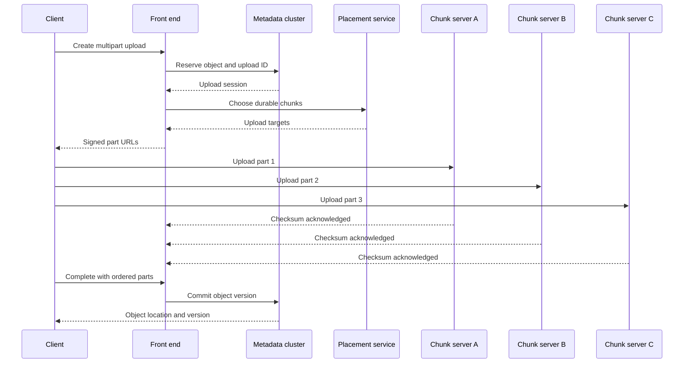
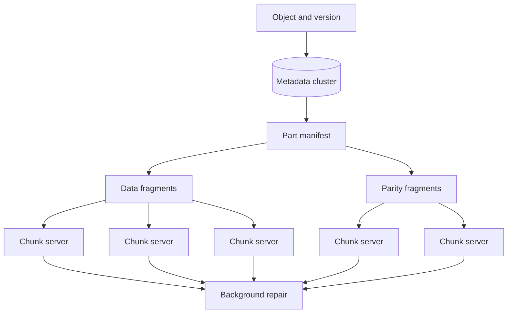

## What it is

A **distributed S3-like object storage engine** stores opaque objects behind a flat namespace, separating metadata coordination from durable chunk placement. Its mental model is a write path that turns a large object into independently durable chunks and a read path that reconstructs those chunks from surviving replicas or coding fragments.

## How it works

A client authenticates through an endpoint and sends a create or multipart request to a front-end node. The metadata cluster assigns an object version, selects a placement policy, and returns signed upload instructions. Chunk servers store data locally or on larger drives; a placement service chooses failure-domain-separated nodes. The front end never makes a successful response depend on one chunk server.

A multipart upload is a state machine: create, upload parts, list parts, complete, or abort. Part numbers and offsets are metadata in the metadata cluster, while bytes and checksums live in chunk storage. Completion can be idempotent using an upload ID and a completed-object token. If the client disappears, an expiration worker eventually removes unreferenced parts.



Replication stores each chunk on several independent nodes and is straightforward to repair. Erasure coding splits data into fragments and stores additional parity fragments. It reduces raw storage overhead for large objects, but reconstruction reads from multiple nodes and consumes network and CPU. Choose the strategy by object size, repair frequency, read amplification, and durability requirements.



Metadata is the consistency challenge. A single logical object can have concurrent writers, but an object key usually exposes one current version and older versions remain addressable only when versioning is enabled. A compare-and-swap precondition or generation token prevents a stale client from overwriting a newer version. Metadata commits must be durable before the client receives success; the inverse order can create an acknowledged object with missing bytes.

```json
{
  "object_id": "obj_01J2EXAMPLE",
  "version_id": "v7",
  "upload_id": "upl_01J2",
  "part_count": 4,
  "total_bytes": 5368709120,
  "checksum_algorithm": "crc32c",
  "state": "complete",
  "retention_until": "2026-12-24T22:00:00Z"
}
```

A read verifies the object version, retrieves the manifest, fetches chunks or fragments, verifies checksums, and streams the result. Range reads should avoid reconstructing an entire object when only a part is requested. Garbage collection must distinguish live versions, in-progress multipart parts, replication, and failed repair work; deleting by object name alone is unsafe.

## Tradeoffs

| Option | Gain | Cost |
| --- | --- | --- |
| Three-way replication | Simple reads, writes, and repair | Higher storage overhead and one-third data amplification |
| Erasure coding | Lower durable storage overhead for large objects | More read fragments, reconstruction work, and repair complexity |
| Metadata in one consensus cluster | Linearizable namespace and version checks | A major metadata dependency and a latency boundary |
| Metadata in regional clusters | Regional independence and larger scale | Cross-region visibility, conflict resolution, and routing complexity |
| Multipart uploads | Resumable large writes and independent part retries | Extra lifecycle state, manifest reconciliation, and cleanup work |
| Immutable object versions | Reproducible reads and safe overwrite | Higher metadata and storage growth |
| Delete markers | Hide versions without immediate byte deletion | Retention still requires explicit lifecycle enforcement |

## When to use

- Objects are large, immutable or versioned, and accessed through a key-based API rather than complex queries.
- Clients need resumable uploads, checksums, conditional writes, and explicit object versions.
- You can separate metadata consistency from data durability and define a repair/rebuild objective.
- Chunk placement can spread across independent failure domains and be rebuilt from parity or replicas.
- Lifecycle, retention, deletion, and unreferenced multipart cleanup are auditable policies.

## Alternatives

- **Replicated block storage** — simplifies low-level volume semantics, but exposes a device-oriented interface rather than object keys and multipart parts.
- **Distributed file systems** — provide a POSIX-like namespace and strong cache coherence, with more coordination on every metadata operation.
- **Cloud object storage** — supplies durable global endpoints and managed integrations, with provider limits, pricing, and portability tradeoffs.
- **Database-backed blobs** — make transactional metadata convenient, but couple object lifecycle and scale to database design.
- **Peer-to-peer storage** — reduces centralized hardware cost, but makes availability, repair, and access control dependent on participant incentives and network reachability.

## Related

- [28.3 System Design: Distributed Message Queue (Kafka-Like Log-Centric Engine, Partitioning, Replication, Consumer Groups)](03-distributed-message-queue.md)
- [28.1 System Design: Web Crawler at Scale (Robots.txt Parsing, Politeness Policy, URL Frontier, Deduplication)](01-web-crawler-at-scale.md)
- [Chapter 10: Database Engineering, Replication & Scaling](../../04-distributed-systems/02-databases/)
- [Chapter 28 References](05-references.md)
