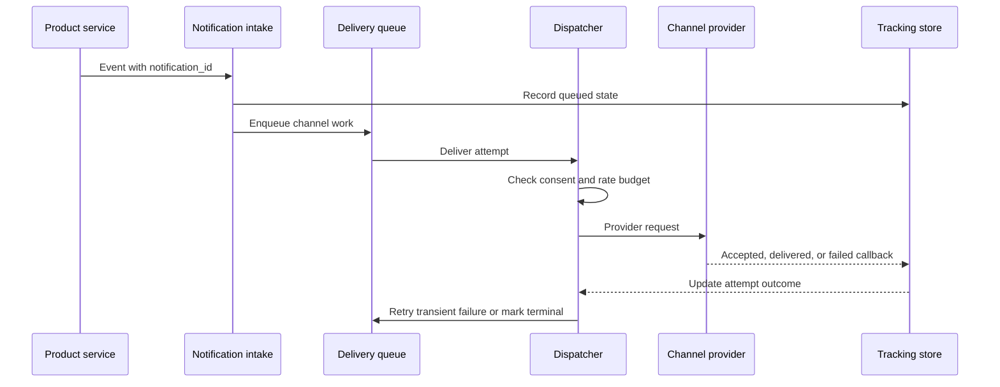

## What it is

A multi-channel notification system turns a product event into controlled deliveries through push, email, SMS, and webhooks. It centralizes consent, channel selection, rate limiting, provider retries, delivery tracking, and fallback so feature services do not duplicate user-facing delivery policy.

## How it works

A producer publishes a stable event identifier and recipient identifier. Intake validates the event, checks the user's consent and quiet-hours policy, and writes an immutable notification record before putting channel work on a durable queue. A dispatcher partitions work by recipient, applies a token-bucket budget, chooses a channel fallback chain, and creates an attempt with a unique idempotency key.

The delivery sequence separates acceptance from provider outcome:



A normalized envelope keeps product meaning separate from provider payloads:

```json
{
  "notification_id": "ntf_01JZ8A2",
  "recipient_id": "user_142",
  "event_type": "comment.replied",
  "template_id": "comment_reply_v4",
  "channels": ["push", "email"],
  "priority": 70,
  "dedupe_key": "user_142:comment.replied:comment_981",
  "expires_at": "2026-09-24T18:00:00Z"
}
```

The dispatcher reads the recipient's channel registrations, locale, consent, and per-channel rate budget. It renders a small provider payload, records `queued`, `accepted`, `delivered`, or `failed`, and stores provider message identifiers. A callback can arrive after a timeout, so the tracking store updates state by attempt identity rather than by arrival time.

```yaml
rate_limit:
  key: recipient_id
  algorithm: token_bucket
  capacity: 20
  refill_per_minute: 5
  burst_handling: defer_until_available
  channel_overrides:
    sms:
      capacity: 2
      refill_per_minute: 1
```

A database constraint prevents duplicate logical delivery within the retention window:

```sql
CREATE UNIQUE INDEX notification_attempt_once
ON notification_attempts (notification_id, channel, destination_id);

CREATE TABLE notification_attempts (
  attempt_id TEXT PRIMARY KEY,
  notification_id TEXT NOT NULL,
  channel TEXT NOT NULL,
  destination_id TEXT NOT NULL,
  state TEXT NOT NULL,
  provider_message_id TEXT,
  next_attempt_at TEXT,
  updated_at TEXT NOT NULL
);
```

Transient network errors and provider throttles use exponential backoff with jitter. Invalid addresses, revoked device tokens, suppressed consent, and expired events are terminal. Exhausted work moves to a dead-letter queue for inspection or controlled replay. Provider acceptance is not proof that a person read the message; the system should treat open and click events as separate interaction signals.

## Tradeoffs

| Choice | Gain | Cost or risk |
| --- | --- | --- |
| Queue before provider delivery | Absorbs provider bursts and protects product services | Adds delivery delay, queue operations, and replay state |
| Per-recipient rate limiting | Protects attention and provider quotas during bursts | A shared limiter can delay urgent or high-value messages |
| Idempotent attempts | Limits duplicate sends across retries and callbacks | Requires durable deduplication keys and retention management |
| Independent channels | Improves throughput and isolates one provider failure | A user can receive channels in a different order |
| Strict cross-channel ordering | Makes escalation and user experience predictable | Serializes independent channels and reduces availability |
| Central preference evaluation | Applies consent consistently across products | A privacy-sensitive dependency can block all channels |
| Full delivery history | Supports debugging, replay, and user-facing history | Stores sensitive content and metadata longer than needed |
| Store payload references instead of copies | Reduces replicated personal data | Tracking may require access to a source that has expired |
| Provider callbacks as status | Captures downstream delivery evidence | Callbacks can be delayed, duplicated, or forged without verification |

## When to use

- You need one product event to reach recipients through more than one channel.
- Consent, quiet hours, localization, fallback, and provider credentials must be centrally enforced.
- Retries and callbacks require stable notification identifiers and duplicate suppression.
- You need delivery evidence for operations without treating it as proof of human attention.

## Alternatives

- **Direct provider SDKs in feature services** — reduce initial platform work, but duplicate consent, token management, retries, and provider observability.
- **A managed notification platform** — accelerates provider integration, but adds vendor cost and limits control over routing and data retention.
- **A single asynchronous job queue** — provides durable dispatch, but needs a separate policy and tracking layer for channels, fallbacks, and callbacks.

## Related

- [29.2 System Design: High-Scale Newsfeed System (Fan-Out on Write vs Fan-Out on Read, Aggregation from Multiple Sources)](02-high-scale-newsfeed-system.md)
- [29.3 System Design: Global Real-Time Chat System (WebSocket Clusters, Message Sync, Room Routing, Presence Tracking)](03-global-real-time-chat-system.md)
- [Chapter 29 References](05-references.md)
