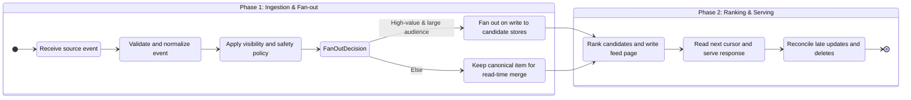

## What it is

A high-scale newsfeed system collects events from many producers, ranks them for each reader, and serves a stable, paginated view. **Fan-out on write** precomputes a recipient's candidates when an item is created, while **fan-out on read** merges ranked sources when the reader opens the feed and keeps less derived state.

## How it works

A feed starts with an event pipeline that accepts posts, likes, follows, edits, and deletes. The pipeline normalizes each event with a stable source identifier, applies visibility and safety rules, and writes a canonical item store. A ranker combines recency, source quality, author affinity, and product policy into a score with a versioned feature set.

The generation path is a bounded workflow:



A common hybrid uses fan-out on write for celebrities, live events, and high-engagement creators because those items have a predictable large audience. It uses fan-out on read for long-tail authors and low-volume items, where multiplying writes would cost more than the read-time merge. The decision is recorded with the item version so later reads do not mix incompatible policies.

A feed item carries the ranking and source context needed to merge projections:

```json
{
  "item_id": "post_8742",
  "author_id": "creator_19",
  "source": "social_graph",
  "source_event_id": "like:8742:user_7",
  "published_at": "2026-09-24T17:30:00Z",
  "score": 0.918,
  "ranker_version": "feed-v7",
  "visibility": "followers"
}
```

A read-time merge uses a k-way merge over already ranked source cursors. The service checks the user's block list, followed-set changes, feed version, and content tombstones before returning candidates. A materialized feed page stores only the top candidates and next cursor, not every possible ranking feature, so deletions and privacy changes can be enforced at read time.

```yaml
feed_policy:
  default_strategy: hybrid
  write_fanout:
    audience: high_reach_or_live
    max_write_multiplier: 250
  read_fanout:
    source_limit: 12
    candidate_limit: 200
  consistency:
    feed_version_check: true
    delete_tombstone_check: true
  privacy:
    block_list_check: required
    source_visibility_check: required
```

The ranking cache should be versioned by audience and policy version. New events can be inserted with a bounded delay, but a privacy withdrawal or deletion must be applied before serving an item already present in a cached page. Pagination uses a cursor tied to the feed version, not a mutable page number, so concurrent inserts do not create duplicates or skipped items.

## Tradeoffs

| Choice | Gain | Cost or risk |
| --- | --- | --- |
| Fan out on write | Low read latency and predictable first-page cost | Multiplies writes for large audiences and delays feed updates |
| Fan out on read | Avoids unused per-recipient storage and reflects new followers | Slower reads, higher source traffic, and more complicated ranking |
| Hybrid strategy | Matches cost to audience reach and item value | Requires stable policy decisions and operational segmentation |
| Materialized top-N cache | Fast reads and predictable cursor paging | Uses memory and needs invalidation for edits, deletes, and blocks |
| Read-time source merge | Fresh blocks, follows, and visibility decisions | Increases read latency and can overload source services during spikes |
| Versioned ranker | Reproducible ordering and controlled experimentation | Old scores and features consume storage and delay rollouts |
| Stable cursor | Consistent traversal under concurrent writes | A new feed version requires a new cursor and may repeat items |
| Cache item bodies | Fewer source reads per request | Replicated content increases exposure and deletion work |
| Aggregate only metadata | Reduces private content replication | More source lookups can reveal access patterns through logs |
| Batch ranking updates | Lower compute and database load | A newly followed author may wait for the next batch |

## When to use

- You need a personalized feed assembled from several event sources and ranking signals.
- You must balance audience size, read latency, and the cost of per-recipient writes.
- Deletions, blocks, visibility changes, or consent changes must affect already cached results.
- You can accept a documented short ranking delay for ordinary feed items.

## Alternatives

- **Chronological fan-out on write** — simple and easy to explain, but high-reach posts create write amplification and ranking quality is limited.
- **Database queries over source tables** — avoids derived feed state, but makes large multi-source reads and ranking difficult.
- **A managed feed or recommendation platform** — accelerates experimentation and ranking, but adds cost, data sharing, and vendor dependency.

## Related

- [29.1 System Design: Multi-Channel Notification System (Rate Limiting, Dispatchers, Delivery Tracking)](01-multi-channel-notification-system.md)
- [29.4 System Design: Search Autocomplete System (Trie Indexing, Frequency Ranking, Real-Time Cache Update)](04-search-autocomplete-system.md)
- [Chapter 29 References](05-references.md)
