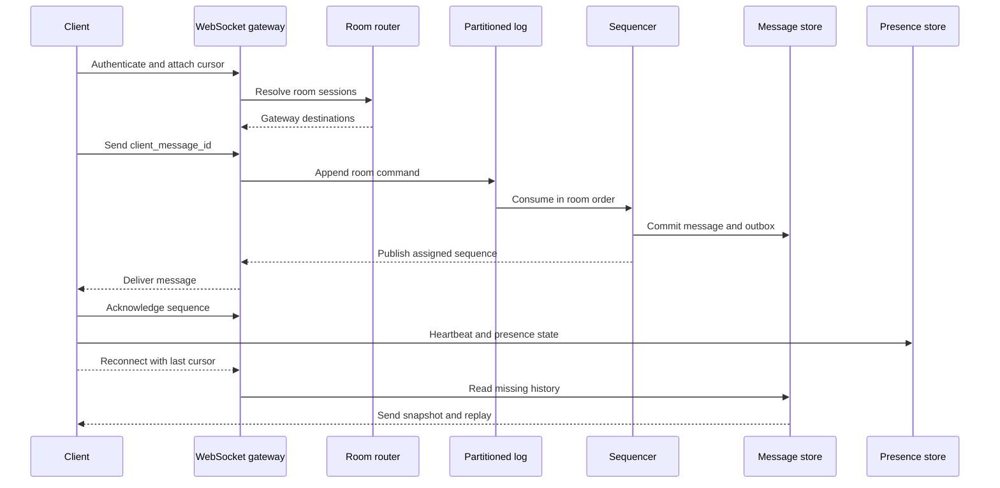

## What it is

A global real-time chat system accepts concurrent messages, assigns a durable order within each room, routes live updates to connected participants, and restores missed state after disconnects. WebSocket clusters provide low-latency transport, while partitioned logs, room routing, and presence tracking coordinate clients across regions.

## How it works

An authenticated WebSocket gateway establishes a session and maps it to a user, device set, and current region. The client subscribes to rooms through a room-routing table rather than accepting arbitrary fan-out from every gateway. A room command enters a partitioned log keyed by `room_id`; a sequencer allocates a room sequence, persists the message, and publishes the assigned event for gateway delivery.

A reconnect uses the last acknowledged sequence, not a wall-clock timestamp:



The server assigns state that clients cannot forge:

```json
{
  "message_id": "msg_01JZ9B1",
  "client_message_id": "mobile-7f31",
  "room_id": "room_842",
  "sender_id": "user_142",
  "sequence": 91847,
  "body": "The rollout is complete.",
  "created_at": "2026-09-24T17:42:16Z"
}
```

The database enforces a unique `(room_id, sender_id, client_message_id)` constraint. The sequencer writes the message and an outbox record in one transaction, so a relay can publish a duplicate after a crash without creating a second logical message. Consumers deduplicate by `message_id`; rooms receive ordering only within their partition, not a global order across all rooms.

A gateway fan-out service reads the room-routing table and publishes to gateways holding local sockets. A room with many connected members can use a shared subscription so gateways receive one room event rather than one broker message per member. Slow clients are isolated with per-connection queues and bounded buffers. When a buffer is full, the gateway stops live delivery for that connection and sends a resync instruction instead of allowing memory growth.

Presence is ephemeral and separate from chat history. A heartbeat service stores user state with a short expiration, and a presence stream invalidates the entry after missed heartbeats. A user can have multiple devices; the product must define whether presence means any device, a mobile device, or an active session. A privacy-conscious presence policy can expose coarse status or hide invisible users rather than publishing a precise online timeline.

## Tradeoffs

| Choice | Gain | Cost or risk |
| --- | --- | --- |
| Partition by room | Natural message ordering and independent room throughput | One hot room can saturate a partition |
| Per-room sequence | Clear ordering and efficient gap detection | A central sequencer can limit a single room's throughput |
| Durable log before fan-out | Replay, recovery, and isolated projections | Adds storage, offsets, and duplicate-consumption handling |
| WebSocket cluster with room routing | Low latency and horizontal connection scaling | Requires routing metadata, rebalancing, and slow-client handling |
| Shared room subscription | Fewer broker messages for large rooms | One slow consumer can affect the room's delivery progress |
| Per-member fan-out | Independent delivery progress and backpressure | Increases broker and gateway traffic for large rooms |
| Snapshot plus bounded replay | Fast recovery after a long outage | Requires durable history and a precise cursor contract |
| Eventual presence updates | Low coordination cost and natural expiry | Users may see stale online state and uncertain device identity |
| Rich room history | Supports search, moderation, and recovery | Increases storage and privacy obligations for private conversations |
| Delete on user request | Clear retention semantics | Tombstones, backups, indexes, and caches need coordinated removal |

## When to use

- Users need low-latency messages, typing signals, read state, and presence in the same product.
- Conversations need retry-safe writes, room-level ordering, and offline catch-up.
- Gateway capacity must scale independently from message storage and ranking workloads.
- The product must define multi-device presence and the privacy of room metadata.

## Alternatives

- **HTTP polling** — works with ordinary request infrastructure, but adds latency and load for every update.
- **A managed real-time chat SDK** — provides presence and multi-device features quickly, but adds provider cost and constrains large-scale architecture.
- **WebRTC data channels** — move suitable media or data toward peers, but signaling, NAT traversal, and fallback relays do not replace durable server state.

## Related

- [29.1 System Design: Multi-Channel Notification System (Rate Limiting, Dispatchers, Delivery Tracking)](01-multi-channel-notification-system.md)
- [29.2 System Design: High-Scale Newsfeed System (Fan-Out on Write vs Fan-Out on Read, Aggregation from Multiple Sources)](02-high-scale-newsfeed-system.md)
- [Chapter 29 References](05-references.md)
