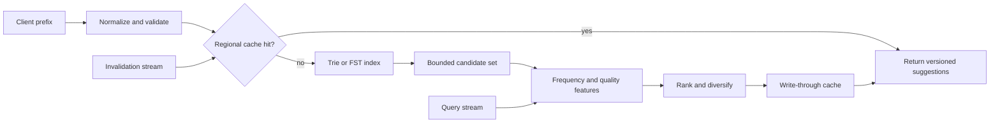

## What it is

A search autocomplete system turns a partial query into ranked suggestions with low latency. A trie or finite-state index narrows the candidate prefix, a frequency and relevance model ranks the candidates, and edge or regional caches absorb repeated queries while streaming updates keep popular terms current.

## How it works

A query service normalizes casing and Unicode, removes unsafe control characters, and applies a short input limit. It checks a regional cache, then traverses a prefix index to collect a bounded candidate set. The ranker combines corpus frequency, recent query frequency, popularity, language, geography, and product quality. The response returns a versioned token set rather than arbitrary user input, and the service records only the minimum query telemetry required for ranking and abuse prevention.

The lookup path is a data-flow pipeline:



A trie node stores a child map, a terminal term, and aggregate counts. An FST compresses transitions for a large read-only vocabulary, while a separate ranking store handles changing weights. A typical index update increments counters for the normalized term and its prefixes, updates a recency bucket, and publishes a versioned cache event. The event does not need to be globally ordered because suggestions are approximate, but a stale term must not resurrect a term removed by policy.

```yaml
autocomplete_policy:
  prefix_normalization: unicode_nfkc
  max_prefix_length: 32
  candidate_limit: 50
  returned_limit: 10
  cache:
    locality: region
    ttl_seconds: 30
    negative_ttl_seconds: 5
  ranking:
    features: [query_frequency, recent_frequency, quality, language]
  privacy:
    raw_query_retention: aggregate_only
    account_specific_suggestions: explicit_opt_in
```

A candidate response carries the query version used to build it:

```json
{
  "prefix": "new yo",
  "suggestions": [
    {"text": "new york", "score": 0.98},
    {"text": "new york times", "score": 0.91},
    {"text": "new year's eve", "score": 0.84}
  ],
  "index_version": "autocomplete-2026-09-24.3",
  "expires_in_ms": 30000
}
```

For account-specific suggestions, the ranking service reads an opt-in profile and applies a visibility filter before returning results. Shared cache keys must not accidentally mix personalized and non-personalized responses. Deletion and takedown events invalidate the term, its prefixes, and affected regional cache entries; merely reducing a counter is insufficient for sensitive content.

## Tradeoffs

| Choice | Gain | Cost or risk |
| --- | --- | --- |
| Trie traversal | Predictable prefix search without scanning the full vocabulary | Large vocabularies need compression or sharding |
| Finite-state transducer | Compact read-only prefix index and fast traversal | Dynamic updates require rebuilds or a layered index |
| Frequency ranking | Simple, fast, and easy to explain | Popularity can reinforce bias and hide new or niche terms |
| Learning-to-rank features | Better quality across languages and contexts | Adds training, feature freshness, and privacy governance |
| Regional cache | Low latency and reduced origin traffic | Invalidation is regional and can leave stale suggestions temporarily |
| Short cache TTL | Bounded staleness and simpler operations | More origin traffic and a lower hit rate during bursts |
| Event-driven updates | Fresh counters without waiting for batch jobs | Duplicate or reordered events require idempotent updates |
| Raw query logging | Useful ranking and debugging data | Can reveal sensitive intent and user behavior |
| Aggregate-only telemetry | Reduces personal data exposure | Limits per-user ranking and makes abuse analysis harder |
| Personalized suggestions | Better relevance for opted-in users | Increases cache fragmentation and privacy risk |

## When to use

- Users type partial queries and need suggestions within a strict latency budget.
- Query volume is spiky enough that repeated origin lookups are wasteful.
- Ranking must respond to changing trends without rebuilding the complete search corpus.
- You can define a privacy policy for raw query logs, account-specific suggestions, and takedown events.

## Alternatives

- **A hosted search engine prefix completion** — provides mature relevance and infrastructure, but adds vendor cost and limits control over update semantics.
- **A sorted n-gram index** — is simple to build for moderate vocabularies, but uses more memory and produces broader candidates than a prefix trie.
- **A full search service with an autocomplete endpoint** — reuses search infrastructure, but can make prefix queries more expensive than a purpose-built index.

## Related

- [29.2 System Design: High-Scale Newsfeed System (Fan-Out on Write vs Fan-Out on Read, Aggregation from Multiple Sources)](02-high-scale-newsfeed-system.md)
- [29.3 System Design: Global Real-Time Chat System (WebSocket Clusters, Message Sync, Room Routing, Presence Tracking)](03-global-real-time-chat-system.md)
- [Chapter 29 References](05-references.md)
