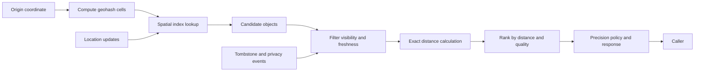

## What it is

A proximity service answers which places, vehicles, or other indexed objects are near a coordinate. It combines a spatial index, a coarse geohash grid, and exact distance calculation so a broad search can reject distant candidates before performing more expensive nearest-neighbor work.

## How it works

A location write validates latitude and longitude, attaches a precision and timestamp, and indexes the object in a spatial structure such as an R-tree, S2 cell, or geohash bucket. A query converts the origin into one or more cells, retrieves candidates, removes invalid or stale entries, and calculates exact distance for the bounded result set. The result policy applies visibility, opening hours, tenant boundaries, and precision limits before returning data.

A proximity query narrows the search space before ranking:



A geohash grid is a practical cache-friendly partition, not a precise distance algorithm. Adjacent cells around the origin are selected according to the desired radius, and boundary cells are included so points near a cell edge are not missed. The service then uses a haversine or approved geographic formula for final distance and a spatial index for large datasets. A radius query should cap both cells inspected and candidates returned.

```yaml
proximity_query:
  origin: {latitude: 40.7128, longitude: -74.0060}
  radius_meters: 2000
  cell_precision: 6
  candidate_limit: 500
  result_limit: 20
  distance_filter: haversine
  max_precision_exponent: 7
```

A spatial-store query can use a bounding box for an index prefilter and exact distance for the final ordering:

```sql
SELECT id, latitude, longitude, category
FROM places
WHERE latitude BETWEEN :min_latitude AND :max_latitude
  AND longitude BETWEEN :min_longitude AND :max_longitude
  AND visibility = 'public'
  AND updated_at >= :freshness_cutoff
ORDER BY (latitude - :latitude) * (latitude - :latitude)
       + (longitude - :longitude) * (longitude - :longitude)
LIMIT :result_limit;
```

Production implementations should use the database's spatial operator or an R-tree rather than relying on the simplified expression above at large scale. Updates are versioned, and a privacy withdrawal writes a tombstone before deleting cached or replicated coordinates. A service that returns an exact address to an unauthorized caller violates the same boundary that a database ACL protects.

## Tradeoffs

| Choice | Gain | Cost or risk |
| --- | --- | --- |
| Geohash grid | Simple, cacheable partition and fast broad rejection | Cell boundaries distort search and precision changes multiply shards |
| R-tree or S2 index | Efficient range and nearest-neighbor queries | Requires careful tuning, updates, and operational tooling |
| Bounding-box prefilter | Uses ordinary indexes and limits exact calculations | Incorrect bounds can miss points; broad boxes waste candidates |
| Exact distance ranking | Correct ordering for a fixed coordinate system | More CPU than cell distance and can expose precise results |
| Approximate distance | Faster and useful for ranking previews | Can produce ties or incorrect ordering near boundaries |
| Asynchronous index updates | Keeps writes fast and tolerates regional lag | Newly updated objects may be briefly absent or appear at the old position |
| Read-time policy filter | Applies deletion and visibility before response | Adds work to every query and depends on policy freshness |
| Store exact coordinates | Supports accurate routing and proximity | Creates a high-value privacy and retention target |
| Coarsen public coordinates | Reduces location disclosure | Breaks exact distance and can frustrate users who need precision |
| Cache popular cells | Lowers index and database load | Cached coordinates need strict expiry, access control, and invalidation |

## When to use

- You need to find objects within a radius or the closest objects to a coordinate.
- Coordinates arrive continuously and an exact database scan cannot meet latency targets.
- A public result and a private, exact result require different disclosure levels.
- Index updates, deletions, and precision changes need bounded operational behavior.

## Alternatives

- **A managed spatial database** — provides spatial operators and operations support, but adds cost and vendor-specific query semantics.
- **PostgreSQL with PostGIS** — keeps geospatial queries near relational data, but capacity planning and index tuning remain application responsibilities.
- **A full linear scan with a bounding-box filter** — is simple for small datasets, but degrades as locations, objects, and concurrent queries grow.

## Related

- [30.2 System Design: Nearby Friends Service (Location Tracking, Pub/Sub Mesh, Cell-Based WebSocket Routing)](02-nearby-friends-service.md)
- [30.3 System Design: Google Maps Infrastructure (Tile Rendering Graph Processing, Routing Engine, A* Pathfinding at Scale)](03-google-maps-infrastructure.md)
- [Chapter 30 References](04-references.md)
