## What it is

A nearby-friends service lets opted-in users discover relevant people or places without continuously exposing their exact location. It combines coarse location tracking, a pub/sub mesh for regional updates, and cell-based WebSocket routing so clients receive nearby changes only when their privacy policy permits them.

## How it works

A device reports a location with a sampling interval, accuracy, source, and visibility mode. The ingestion service converts precise coordinates into a coarse cell, applies per-user retention and consent rules, and writes a short-lived presence record. A publisher emits an event to cells or neighboring cells rather than broadcasting every location to all subscribers.

The event path is intentionally bounded and privacy-aware:

```mermaid
stateDiagram-v2
    direction LR

    state "Phase 1: Ingestion & Privacy" as Col1 {
        [*] --> Receive
        Receive: Receive device location sample
        Receive --> Validate
        Validate: Validate accuracy and consent
        Validate --> Coarsen
        Coarsen: Coarsen coordinate to cell
        Coarsen --> Store
        Store: Store expiring presence record
    }

    state "Phase 2: Publishing & Lifecycle" as Col2 {
        Publish: Publish to opted-in cell subscribers
        Publish --> Deliver
        Deliver: Deliver eligible nearby event
        Deliver --> Wait
        Wait: Wait or receive next sample
        Wait --> Expire
        Expire: Expire presence and disconnect session
        Expire --> [*]
    }

    Store --> Publish
```



A pub/sub mesh lets regions exchange small presence deltas without making one global broker a permanent dependency. A gateway subscribes to the cells containing its connected clients and maintains a local subscription cache. When a user moves, the gateway unsubscribes from the old cell and subscribes to the new one after the coarse location is accepted. A user can appear in several neighboring cells when the accuracy radius crosses a boundary, but the service should prefer one stable cell unless the product explicitly needs boundary accuracy.

```yaml
presence_policy:
  location_sample_interval_seconds: 60
  cell_size_meters: 500
  maximum_accuracy_meters: 200
  retention_minutes: 15
  visibility_modes: [invisible, approximate, exact]
  discovery_requires_opt_in: true
  broadcast: neighboring_cells_only
  reconnect: fetch_fresh_presence
```

A location event contains a coarse cell and a policy-scoped result, not an unrestricted raw coordinate:

```json
{
  "presence_event_id": "presence_01JZ8C4",
  "user_id": "user_142",
  "cell_id": "cell_7b2f",
  "accuracy_bucket": "200m",
  "visibility": "approximate",
  "observed_at": "2026-09-24T18:03:00Z",
  "expires_at": "2026-09-24T18:18:00Z"
}
```

The discovery API applies the viewer and target's mutual visibility, block list, distance threshold, and product-specific safety rules. It returns a short-lived, coarse distance band such as `100-500m` when exact coordinates are not necessary. A user who disables discovery receives a tombstone that removes cached presence and causes gateways to stop sending their events. Backfills use a fresh presence query instead of replaying a long history of old locations.

## Tradeoffs

| Choice | Gain | Cost or risk |
| --- | --- | --- |
| Coarse cells | Small updates and a practical privacy boundary | Boundary effects and less precise discovery |
| Exact coordinates | Better matching and routing | Continuous high-value personal data and wider breach impact |
| Frequent sampling | Fresh nearby results and smoother movement | More battery use, network traffic, and retention obligations |
| Infrequent sampling | Lower device and backend cost | Stale presence and missed short visits |
| Neighboring-cell pub/sub | Scales delivery and limits broadcast | More subscriptions, duplicate handling, and regional complexity |
| Global topic broadcast | Simple event distribution | Leaks activity patterns and creates a hot producer path |
| WebSocket cell routing | Low-latency live updates | Requires connection state, rebalancing, and backpressure |
| Request-response discovery | Strong read-time policy control | Adds latency and loses the live update experience |
| Short retention | Limits historical exposure | Offline catch-up requires a fresh request and may miss events |
| Approximate distance bands | Reduces disclosure and replay value | Less useful for precise meetups or safety decisions |

## When to use

- Users opt in to discovering nearby people and need updates without a continuous exact-location feed.
- Device battery and network budgets limit how often location can be reported.
- Nearby events need low latency but must respect mutual visibility and deletion.
- A regional pub/sub mesh can exchange small deltas while WebSocket gateways serve local clients.

## Alternatives

- **Direct polling against a location API** — gives request-time control, but adds latency, repeated reads, and predictable polling load.
- **A single global WebSocket broadcast** — is simple, but exposes more activity and creates a global hot path.
- **Device-to-device location exchange** — reduces server visibility, but requires trust, synchronization, and reliable discovery.

## Related

- [30.1 System Design: Proximity Service (Spatial Indexing, Geohash Grid Searching, Nearest Neighbor Queries)](01-proximity-service.md)
- [30.3 System Design: Google Maps Infrastructure (Tile Rendering Graph Processing, Routing Engine, A* Pathfinding at Scale)](03-google-maps-infrastructure.md)
- [Chapter 30 References](04-references.md)
