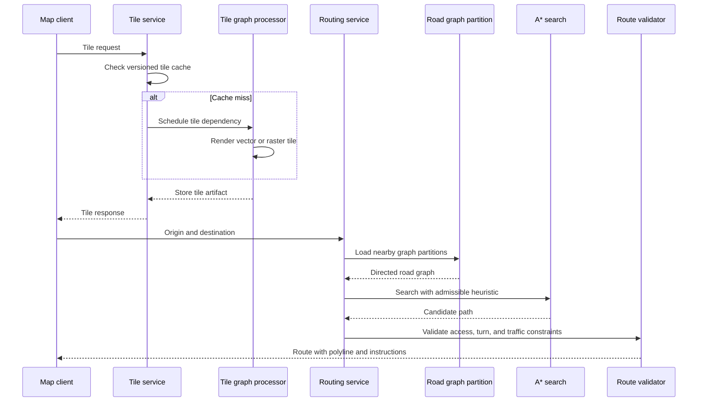

## What it is

A maps infrastructure serves map tiles, computes routes, and scales pathfinding over a large road graph. Tile rendering can be expressed as a graph-processing pipeline over zoom, style, and geographic dependencies, while a routing engine combines a road graph with a cost function and a heuristic such as A*.

## How it works

A map request identifies a tile coordinate, zoom level, style, and acceptable data version. The tile service checks a content-addressed cache, then schedules work for a renderer or vector-tile builder. Graph processing builds parent and child tile dependencies so a changed source feature invalidates the smallest useful set of tiles rather than rebuilding the entire world.

Routing follows a separate request path:



A road graph stores directed edges with distance, travel time, turn restrictions, access rules, and a versioned geometry reference. A* uses a priority queue ordered by the cost so far plus an admissible lower-bound estimate of remaining travel cost. The heuristic must never overestimate the best remaining cost, or the search can return a suboptimal route. A* reduces the explored graph compared with uniform-cost search when the estimate is useful, but worst-case behavior can still approach a full graph search.

```yaml
routing_service:
  graph_version: 2026_09_24_17
  partition_strategy: geographic_plus_major_corridors
  search: astar
  heuristic: admissible_lower_bound
  max_expanded_nodes: 250000
  fallback: hierarchical_contraction
  response:
    include_geometry: true
    include_instructions: true
    include_traffic_timestamp: true
```

The routing service snaps input coordinates to walkable or drivable edges, checks that the origin and destination are reachable under current restrictions, and then searches the loaded partitions. It may expand neighboring partitions around a corridor to handle a route crossing a partition boundary. A validator rejects impossible turns, ferries, closures, and stale geometry. Traffic is a time-dependent edge cost with an explicit timestamp, not a silent replacement of the static road graph.

Tile artifacts are immutable under a content-addressed key such as `style,zoom,x,y,data_version`. A build system stores the tile, its dependency versions, and the rendering status. If a style or road-data change affects a parent tile, graph processing can fan out only to valid descendants. The delivery layer serves cached tiles near users and signs or authorizes private tiles separately from public map tiles.

## Tradeoffs

| Choice | Gain | Cost or risk |
| --- | --- | --- |
| A* with admissible heuristic | Focused search and good route quality | Requires a valid lower bound and can still expand many nodes |
| Dijkstra or uniform-cost search | Simpler correctness and no heuristic constraint | More graph exploration and higher routing latency |
| Hierarchical graph | Faster long-distance searches | Graph maintenance and abstraction can hide local restrictions |
| Exact road geometry | Accurate visual routes and instructions | Larger graph storage and more expensive rendering |
| Simplified geometry | Faster storage and transfer | Visual or instructional mismatch near curves and intersections |
| Time-dependent traffic | More realistic current estimates | Results change with time and need clear freshness labels |
| Pre-rendered immutable tiles | Strong caching and predictable delivery | Updates wait for dependency-aware invalidation and build time |
| On-demand tile rendering | Fresh data and lower storage for unused areas | Variable latency and a cold-cache request storm |
| Global data retention | Reliable historical debugging and replay | Expensive storage and a larger privacy and licensing surface |
| User-specific route history | Personalization and incident analysis | Requires deletion, purpose limitation, and access controls |
| Global route graph | Consistent cross-region routing | Cross-border restrictions and update pipelines become complex |

## When to use

- You need to render reusable map tiles at multiple zoom levels and styles.
- Routing queries must respect current road restrictions and return usable instructions.
- The road graph is too large to keep in one process or one memory-resident index.
- Data versions, traffic timestamps, and privacy policies must be visible to clients.

## Alternatives

- **A hosted maps and routing API** — provides maps, tiles, and routes quickly, but adds provider cost, rate limits, and data-governance constraints.
- **A vector tile pipeline with precomputed routing** — improves delivery and predictable responses, but increases build and update complexity.
- **A graph database for all map operations** — offers flexible traversal, but road-network search often benefits from specialized spatial structures and compact graph formats.

## Related

- [30.1 System Design: Proximity Service (Spatial Indexing, Geohash Grid Searching, Nearest Neighbor Queries)](01-proximity-service.md)
- [30.2 System Design: Nearby Friends Service (Location Tracking, Pub/Sub Mesh, Cell-Based WebSocket Routing)](02-nearby-friends-service.md)
- [Chapter 30 References](04-references.md)
