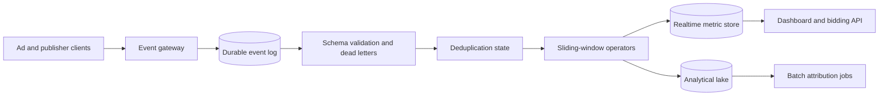

## What it is

An **ad click event aggregation pipeline** is a stream-processing system that accepts click and impression facts, removes repeated deliveries, and produces campaign metrics over continuously updated time windows. The mental model is a durable event log feeding idempotent operators and queryable aggregates.

## How it works

The producer writes an event with a stable event ID, campaign ID, advertiser ID, event type, event time, and ingestion time. A Kafka or Pulsar topic provides durable buffering and consumer-group scaling. The pipeline treats delivery as **at least once**: a consumer can receive the same event again after a crash, so the event ID is part of the correctness contract rather than an optional diagnostic field.

A normalization service validates the schema and rejects malformed records to a dead-letter topic. The deduplicator uses a state store with a retention window longer than the maximum producer retry and consumer replay horizon. Redis can provide a fast recent-event index, while a durable store or compacted event state protects the long replay boundary. The aggregator applies the event to campaign, creative, and geography partitions.



The window state contains buckets keyed by `(campaign_id, metric, window_size)`. Each bucket tracks a start timestamp, event count, spend, and last-updated time. Late events can be accepted into a grace period, but an event older than the permitted lateness must go to a correction path rather than silently changing a finalized result.

A practical event contract is:

```json
{
  "event_id": "clk_01J2R7K9Q4M8V6W3N5T0X1Y2Z3",
  "event_type": "ad_click",
  "event_time": "2026-09-24T12:00:04.125Z",
  "campaign_id": "cmp_82a1",
  "creative_id": "crv_19",
  "advertiser_id": "adv_07",
  "geo": "US-CA",
  "device": "mobile"
}
```

The consumer stores a fingerprint for the event ID and rejects a repeat with the same fingerprint. It also stores the event's schema version so a replay can be interpreted with the original contract. The final aggregate is derived from facts, while a periodically rebuilt aggregate provides a recovery path and exposes drift.

## Tradeoffs

- **At-least-once delivery plus deduplication** — avoids lost clicks during retries, but requires durable identity state and a defined retention horizon.
- **Watermark-based windows** — produce predictable results under bounded lateness, but require a correction policy for events beyond the watermark.
- **Incremental dashboards** — serve near-real-time metrics, but can temporarily disagree with the analytical lake and need freshness indicators.
- **Partition by campaign** — keeps a campaign's updates ordered, but creates hot-key pressure for large campaigns and limits parallel processing.
- **Idempotent replay from the log** — makes recovery repeatable, but increases storage, consumer startup time, and state-rebuild cost.
- **Approximate unique counts** — reduce state and improve throughput, but trade exact deduplication semantics for bounded accuracy.

## When to use

- You need campaign, creative, or publisher metrics without waiting for a batch job.
- Producers and consumers retry events, so duplicate suppression must be explicit.
- You need bounded late-event corrections and auditable event-time processing.
- Dashboards and bidding decisions share a consistent event contract.
- You need to recover aggregate state by replaying a durable log.

## Alternatives

- **Batch warehouse processing** — provides simple, repeatable reporting, but delays operational metrics and cannot serve fresh bidding decisions.
- **Request-path synchronous updates** — produces immediate counters, but couples the advertiser response to analytics availability and risks partial updates.
- **Change-data-capture pipelines** — capture database changes reliably, but reconstruct business events only when source rows contain complete event context.
- **Managed stream analytics** — reduces broker and state-management work, but limits portability and can increase cost for long replay horizons.

## Related
- [31.2 System Design: Real-Time Gaming Leaderboard (Redis Sorted Sets, Distributed Rank Partitioning)](02-real-time-gaming-leaderboard.md)
- [31.3 System Design: Distributed Gaming Server Bots & State Orchestration (State Machine Synchronization, Bot AI Pool Management)](03-distributed-gaming-server-bots.md)
- [Chapter 31 References](04-references.md)
