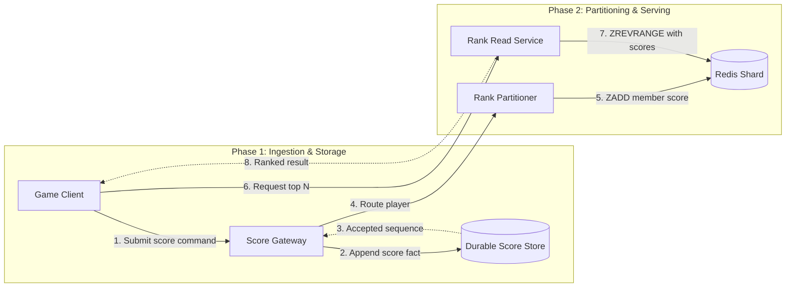

## What it is

A **real-time gaming leaderboard** is a sharded, ordered projection of player scores that supports score updates and top-rank queries while players are active. Redis sorted sets provide an efficient in-memory ranking primitive, but the system still needs a durable score authority and explicit partition ownership.

## How it works

The game session emits a score command with a match ID, player ID, score, version, and event time. An ingestion service accepts the command, verifies the match and monotonic version, and writes a score-change record to a durable log or database. The leaderboard updater applies each accepted change to the player's shard and records the resulting version.

Each shard owns a partition of player IDs. A consistent-hash or fixed-vocabulary partitioner maps a player to one writer, avoiding concurrent updates from multiple owners. Redis sorted sets store players as members and scores as the ordering value; a companion hash stores the accepted score version, match ID, and update time. Redis is a fast projection, not the only durable copy.



A rank response should be explicitly ordered. Equal scores use a documented tie-breaker, such as the earlier achievement timestamp followed by player ID. A player moving between shards requires a migration protocol: pause writes, copy the projection and version, verify the latest state, switch ownership, and resume updates. A score update from an old shard after migration is rejected by version rather than applied out of order.

The read service can fan out to all shards, merge their top candidates, and return the global result. A precomputed page cache handles common top-N requests, while direct shard reads serve personalized rank lookups. The service publishes a version with each response so clients can distinguish a current projection from a stale cached result.

```text
ZADD leaderboard:{shard} {score} {player_id}
HGET player-state:{shard}:{player_id} version
ZRANGE leaderboard:{shard} 0 99 REV WITHSCORES
```

## Tradeoffs

- **Redis sorted sets** — provide fast ordered reads and updates, but in-memory data needs rebuilds, persistence settings, and a durable source of truth.
- **One writer per player** — prevent concurrent rank corruption, but make a failed partition owner temporarily unavailable and require failover procedures.
- **Top-N fan-out** — returns globally correct results, but increases read work with shard count and exposes slow shards to the request.
- **Redis-only leaderboard** — minimizes infrastructure, but risks lost progress when a node or failover event loses accepted state.
- **Per-player partitioning** — distributes popular players, but complicates range queries and migration when a player changes shards.
- **Client-side ranking** — reduces read load, but exposes an untrusted projection and makes authoritative anti-cheat checks harder.

## When to use

- Players need rank feedback during or immediately after a match.
- Scores arrive as versioned events and must survive a cache restart.
- The game has more players and shards than a single Redis instance can serve reliably.
- Equal scores need a stable, documented tie-breaker.
- Clients tolerate ranking projection lag while authoritative scores remain durable.

## Alternatives

- **Relational leaderboard tables** — simplify recovery and reporting, but make large ordered updates and top-N reads more expensive.
- **A stream processor with a materialized view** — naturally follows score events, but adds state-store and replay dependencies.
- **A single Redis instance** — is simple for a small game, but creates a throughput and availability bottleneck.
- **External ranking service** — reduces implementation work, but adds latency, cost, and a second source of truth.

## Related
- [31.1 System Design: Ad Click Event Aggregation Pipeline (At-Least-Once Streaming, Deduplication, Sliding Window Aggregations)](01-ad-click-event-aggregation-pipeline.md)
- [31.3 System Design: Distributed Gaming Server Bots & State Orchestration (State Machine Synchronization, Bot AI Pool Management)](03-distributed-gaming-server-bots.md)
- [Chapter 31 References](04-references.md)
