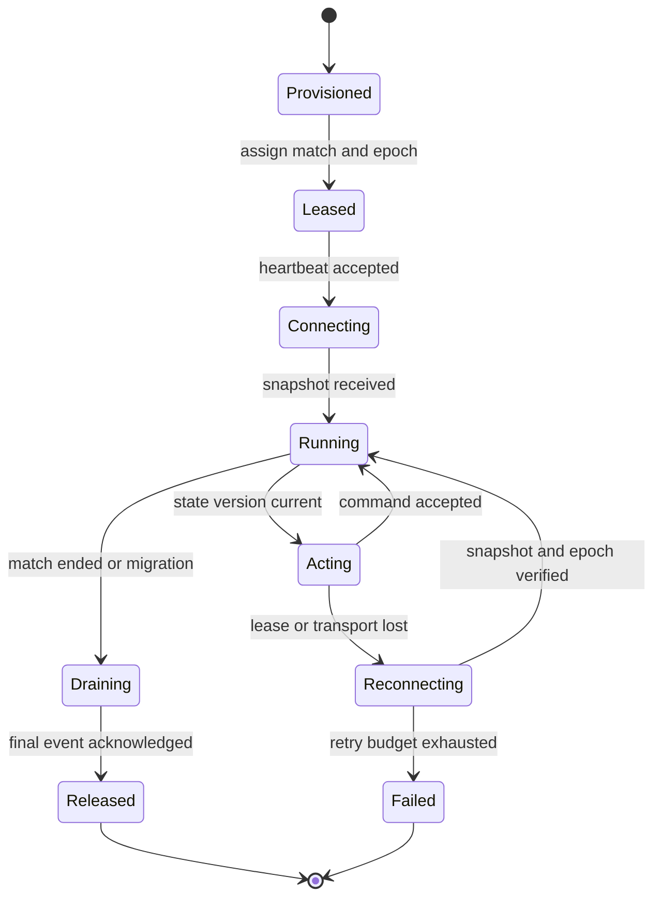

## What it is

A **distributed gaming server bot system** runs AI-controlled players across a fleet of game servers while keeping their state synchronized with authoritative simulation rules. The central idea is a state machine whose transitions are ordered, versioned, and safe to retry even when a bot process moves or fails.

## How it works

A match coordinator assigns a bot instance to a game-server partition. The coordinator owns a lease with an epoch, server identity, heartbeat, and bot state version. A bot process can be scheduled near the game server, but it never becomes authoritative merely because it received the latest message. The server simulation remains the source of truth for positions, health, inventory, and effects.

The bot state machine emits commands such as move, target, attack, collect, and wait. Each command carries the bot ID, match ID, expected state version, and command sequence. The game server accepts only a command whose lease and version are current, then returns an authoritative event. The bot pool can be replaced or rescheduled without advancing the simulation state twice.



The orchestrator stores a monotonic command log and a compact state snapshot. It uses compare-and-set updates so two bot processes cannot both advance the same state version. A lease expiry does not prove that the old process stopped; fencing tokens prevent an expired process from submitting accepted commands.

A practical bot-pool configuration is:

```yaml
bot_pool:
  assignment: match_partition
  lease_ttl: 5s
  heartbeat_interval: 1s
  fencing: monotonic_epoch
  snapshot_interval: 250ms
  reconnect_backoff: [100ms, 250ms, 1s, 5s]
  capacity:
    cpu: 1
    memory_mib: 512
  safety:
    max_commands_per_tick: 8
    reject_stale_versions: true
    require_server_ack: true
```

The bot AI computes intent from the latest snapshot, but command acceptance is governed by the server. A deterministic seed, simulation tick, and command budget make tests repeatable. A pool scheduler places bots where latency and CPU capacity meet the match's requirements, while a global admission controller prevents a large event from starving real players.

## Tradeoffs

- **Authoritative game server state** — prevents bots from inventing effects, but adds command and acknowledgment round trips.
- **Lease and fencing tokens** — stop stale writers, but require clock, heartbeat, and split-brain procedures.
- **Stateless bot workers** — make replacement and scaling easy, but require snapshot transfer before a worker can act.
- **Per-match bot ownership** — simplifies ordering and lifecycle, but limits rebalancing while a match is active.
- **Event-driven AI decisions** — decouples perception from simulation, but introduces decision lag and harder timing analysis.
- **Deterministic fixed-tick bots** — improve replay and testability, but require careful performance budgeting under load.

## When to use

- A game needs simulated opponents, testers, or training agents across many servers.
- Bot processes can fail, migrate, or be replaced during a live match.
- Game state must remain authoritative even when an AI client is compromised or delayed.
- Operators need a bounded bot pool with per-match admission control.
- Replays and incident analysis must reproduce the same command sequence.

## Alternatives

- **In-process scripted bots** — reduce network and scheduling overhead, but limit independent scaling and isolation.
- **A single centralized bot service** — centralizes logic, but creates latency and a large availability dependency.
- **Human-operated players** — model behavior directly, but are expensive and unsuitable for continuous load generation.
- **Replay-only simulation** — is deterministic and safe for testing, but cannot provide live opponents.

## Related
- [31.1 System Design: Ad Click Event Aggregation Pipeline (At-Least-Once Streaming, Deduplication, Sliding Window Aggregations)](01-ad-click-event-aggregation-pipeline.md)
- [31.2 System Design: Real-Time Gaming Leaderboard (Redis Sorted Sets, Distributed Rank Partitioning)](02-real-time-gaming-leaderboard.md)
- [Chapter 31 References](04-references.md)
