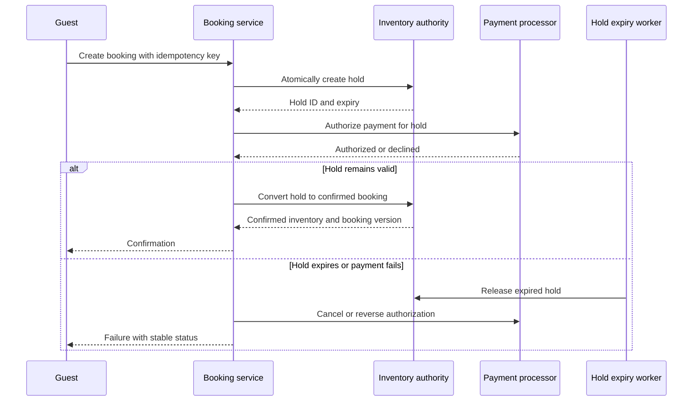

## What it is

A **distributed hotel reservation system** coordinates room inventory, temporary holds, payment, and final confirmation across properties and channels. **Inventory locking** reserves sellable capacity without pretending that a booking is final, while a two-phase hold prevents a payment success from silently outranking confirmed inventory.

## How it works

A search request reads an availability projection, but the booking command writes to an inventory authority. The authority stores room type, stay dates, total sellable units, committed units, active holds, and a version. A hold is a short-lived reservation with a unique hold ID, guest, price, expiry, and idempotency key.

The first phase creates the hold atomically. The service checks calendar overlap, decrements available capacity for the hold, records the payment intent, and returns a client secret. A timer publishes an expiry event. A late payment callback can confirm only an active hold whose version and external reference still match. After payment succeeds, the second phase converts the hold into a confirmed booking; if confirmation fails, the hold is released and the payment state follows an explicit compensation or manual-review path.



A hold record should never be inferred from a client timer. The authoritative expiry is a database or event-scheduled transition, and a reconciler compares holds with property calendars, payment intents, and booking records. Overbooking prevention depends on serializing changes for the same property, room type, and date range, rather than relying on an eventually consistent read.

A practical hold contract is:

```sql
CREATE TABLE room_holds (
  hold_id UUID PRIMARY KEY,
  booking_key VARCHAR(128) NOT NULL UNIQUE,
  property_id BIGINT NOT NULL,
  room_type_id BIGINT NOT NULL,
  stay_start DATE NOT NULL,
  stay_end DATE NOT NULL,
  units INTEGER NOT NULL,
  state VARCHAR(24) NOT NULL,
  expires_at TIMESTAMP NOT NULL,
  payment_id VARCHAR(128),
  version BIGINT NOT NULL
);
```

The booking transaction locks or conditionally updates the relevant inventory rows, verifies all requested nights, inserts the hold, and records an outbox event in one durable transaction. A service retry uses the same booking key and returns the existing hold or conflict if the request fingerprint differs.

## Tradeoffs

- **Database row or calendar locks** — make capacity decisions clear, but serialize contention for popular properties and date ranges.
- **Optimistic versioning** — improves concurrent throughput, but retries conflicts and requires deterministic error handling.
- **Short holds** — reduce blocked inventory, but increase the risk of payment completion after expiry.
- **Long holds** — improve conversion, but strand inventory when a guest abandons checkout.
- **Synchronous inventory confirmation** — gives immediate certainty, but couples booking latency to the inventory service.
- **Asynchronous confirmation** — improves availability during outages, but needs pending states and careful client messaging.

## When to use

- Multiple channels compete for the same room inventory.
- A guest must hold inventory while payment is authorized.
- Payment callbacks can arrive after a client timeout or hold expiry.
- Overbooking has financial, operational, or regulatory consequences.
- The system must explain every hold, release, and confirmed booking.

## Alternatives

- **Centralized booking database** — provides straightforward consistency, but concentrates traffic and availability.
- **Optimistic inventory counters** — reduce lock contention, but require safe retry and drift detection.
- **Queue-based hold workers** — absorb bursts, but make the booking result asynchronous and operationally visible.
- **Provider or channel-managed inventory** — reduces integration work, but limits control over cross-channel holds and policy.

## Related
- [32.2 System Design: High-Scale Payment Processing System (Payment Gateway Integration, Idempotent Processing, Ledger Reconciliation)](02-high-scale-payment-processing-system.md)
- [32.3 System Design: Digital Wallet Architecture (Double-Entry Ledger Engine, Multi-Currency Balance Tracking, Zero-Loss Durability)](03-digital-wallet-architecture.md)
- [Chapter 32 References](05-references.md)
