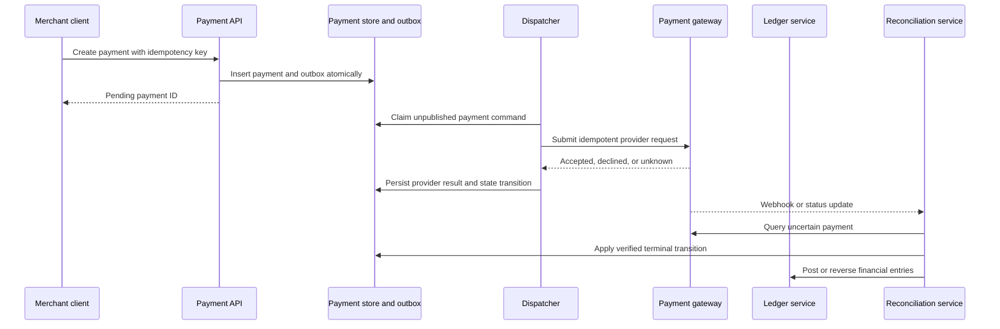

## What it is

A **high-scale payment processing system** accepts payment commands, coordinates external gateways, records immutable financial facts, and reconciles outcomes with banks and payment networks. Its core invariant is that a retry, timeout, or duplicate event never creates a second economic effect.

## How it works

The API authenticates the merchant, validates amount and currency, and records an idempotency key with a canonical request fingerprint. The payment service creates a durable payment record in a `pending` state and an outbox event in the same database transaction. A dispatcher sends the command to a gateway adapter. Each adapter maps the internal payment state to a specific rail such as card, bank transfer, or real-time account-to-account payment.

A gateway response is not assumed to be final. The system stores the provider reference, response code, raw status evidence, and next reconciliation action. A webhook or polling worker uses the provider reference to transition the payment. Unknown timeout outcomes become `unknown`, not `failed`; a reconciliation service later queries the provider or bank and chooses a final, compensating, or manual-review path.



The internal state machine distinguishes `created`, `dispatched`, `authorized`, `captured`, `settled`, `reversed`, `declined`, and `unknown`. A state transition uses a compare-and-set version and an append-only transition history. The ledger receives a posting request keyed by the payment ID and posting type; retries return the existing posting rather than creating another entry.

A gateway request includes a stable internal reference and a request fingerprint:

```http
POST /v1/payments HTTP/1.1
Idempotency-Key: pay_01J2R7K9Q4M8V6W3N5T0X1Y2Z3
Content-Type: application/json

{
  "merchant_id": "mrc_8f12",
  "amount_minor": 4999,
  "currency": "USD",
  "payment_method_token": "pm_tok_01",
  "description": "Order 1842"
}
```

The same key and fingerprint return the original result. The same key with a different fingerprint returns a conflict. Store keys for the entire documented retry window, and never use a client-generated key as a substitute for an internal payment ID.

## Tradeoffs

- **Idempotency at the API boundary** — makes client retries safe, but does not protect against duplicate internal jobs or provider-side ambiguity.
- **Durable state machine** — records uncertainty and recovery, but adds transitions, operators, and delayed resolution.
- **Synchronous gateway calls** — provide immediate responses, but expose the payment service to gateway latency and outages.
- **Outbox dispatch** — prevents lost work between database and broker, but requires retry, ordering, and replay tooling.
- **Automatic retries** — recover from transient faults, but can amplify provider load and must avoid retrying non-idempotent calls.
- **Manual review for unknown outcomes** — prevents unsafe guesses, but increases operational work during prolonged provider failures.

## When to use

- Payments pass through multiple gateways, fraud checks, and internal services.
- Merchants and providers retry requests after timeouts.
- You must separate authorization, capture, settlement, reversal, and return.
- Bank or network records can arrive after the internal response.
- Auditors need an immutable link between provider evidence and ledger postings.

## Alternatives

- **Gateway-hosted checkout** — reduces integration work, but leaves the business system dependent on provider semantics.
- **One synchronous ledger service** — is simple for closed-loop payments, but does not model external uncertainty by itself.
- **Queue-first processing** — absorbs bursts, but requires an explicit client-facing pending status.
- **Provider reconciliation as the primary recovery path** — uses external truth, but can make customer status slower.

## Related
- [32.1 System Design: Distributed Hotel Reservation & Booking System (Inventory Locking, Overbooking Prevention, Two-Phase Holds)](01-distributed-hotel-reservation-booking-system.md)
- [32.3 System Design: Digital Wallet Architecture (Double-Entry Ledger Engine, Multi-Currency Balance Tracking, Zero-Loss Durability)](03-digital-wallet-architecture.md)
- [32.4 System Design: Ultra-Low Latency Stock Exchange Engine (Order Book Matching, Deterministic Sequencing, Multicast Broadcast)](04-ultra-low-latency-stock-exchange-engine.md)
- [Chapter 32 References](05-references.md)
