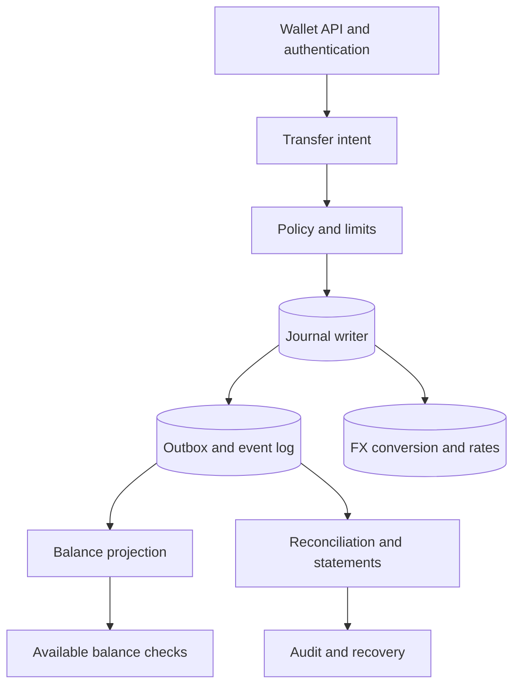

## What it is

A **digital wallet architecture** stores balances and movements as a double-entry financial ledger rather than as mutable counters alone. Every transaction has balanced debit and credit postings, an explicit currency, a business reason, and an audit trail that can reconstruct ownership and total value.

## How it works

The wallet service owns customer accounts, currency accounts, transaction intent, and authorization policy. A posting service accepts a transfer command with a transfer ID, source account, destination account, amount, currency, and business reference. It validates account status, available balance, limits, and currency before appending a journal entry.

Each journal entry has two or more postings. In the simplest wallet transfer, the customer liability account is debited and the wallet operator's liability or settlement account is credited. The ledger stores postings in an append-only journal and maintains account totals in a projection. A posting is never overwritten; corrections are new reversing or compensating entries linked to the original transaction.

Multi-currency accounts are separate ledgers, not a single untyped amount. An FX conversion creates two linked entries, one in the source currency and one in the destination currency, tied by a conversion ID, rates, spread, and effective timestamp. A wallet may display a converted total, but the available balance calculation must preserve the source-currency constraint.



A posting command is idempotent by transfer ID and posting purpose. The journal writer first reserves or locks the affected account ranges, verifies the current balance, and appends the journal and outbox records atomically. A crash before commit creates no financial effect; a crash after commit leaves a durable record for projection and notification workers.

A practical posting contract is:

```json
{
  "transfer_id": "trf_01J2R7K9Q4M8V6W3N5T0X1Y2Z3",
  "source_account": "wallet_user_17:USD",
  "destination_account": "wallet_user_18:USD",
  "amount_minor": 1250,
  "currency": "USD",
  "purpose": "merchant_payout",
  "expected_version": 42
}
```

Zero-loss durability depends on more than synchronous disk writes. Use durable replication, quorum acknowledgement, backup snapshots, tested restore procedures, and a write-ahead log. Projections can be rebuilt from the journal. The journal itself is periodically archived to immutable storage with checksums and retention controls, while availability checks use a conservative projection rather than a stale optimistic balance.

## Tradeoffs

- **Append-only journal** — provides auditability and repair, but increases storage and makes balance views projections that can lag.
- **Synchronous quorum writes** — protect acknowledged entries, but increase latency and reduce availability during a quorum failure.
- **Asynchronous replication** — improves local write latency, but requires explicit recovery-point and potential-loss analysis.
- **Per-currency ledgers** — prevent invalid currency mixing, but require FX valuation and linked settlement entries.
- **Real-time balance projection** — supports instant authorization, but must be rebuilt and reconciled against the journal.
- **Immutable storage and archives** — strengthen recovery and evidence, but increase retention cost and operational complexity.

## When to use

- Funds, credits, rewards, or settlement balances must be auditable.
- A customer can hold multiple currencies or receive an FX conversion.
- Retries and retries after uncertain network outcomes must not double-spend.
- Balances need strong invariants while read-heavy views need low latency.
- Regulators, auditors, or operators require a complete posting history.

## Alternatives

- **Mutable balance counters** — are fast and simple, but are difficult to repair and explain after corruption.
- **External payment provider balance** — reduces custody work, but limits product control and creates provider dependency.
- **Event-sourced wallet with eventual projections** — improves recovery, but requires projection lag and operational monitoring.
- **Database isolation with a single account row** — simplifies atomicity, but concentrates contention and limits multi-currency flexibility.

## Related
- [32.1 System Design: Distributed Hotel Reservation & Booking System (Inventory Locking, Overbooking Prevention, Two-Phase Holds)](01-distributed-hotel-reservation-booking-system.md)
- [32.2 System Design: High-Scale Payment Processing System (Payment Gateway Integration, Idempotent Processing, Ledger Reconciliation)](02-high-scale-payment-processing-system.md)
- [32.4 System Design: Ultra-Low Latency Stock Exchange Engine (Order Book Matching, Deterministic Sequencing, Multicast Broadcast)](04-ultra-low-latency-stock-exchange-engine.md)
- [Chapter 32 References](05-references.md)
