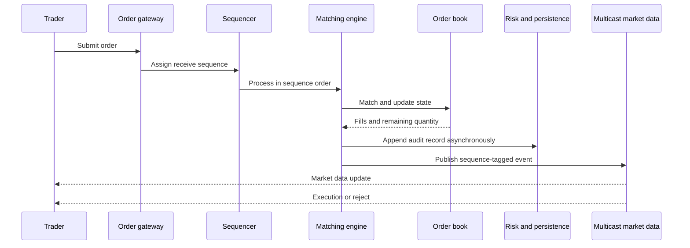

## What it is

An **ultra-low latency stock exchange engine** accepts orders, matches them against a price-time priority order book, assigns deterministic sequence numbers, and publishes market events to subscribers. The engine separates a small, deterministic critical path from slower persistence, risk, and network distribution.

## How it works

A gateway authenticates a session, validates the order, and forwards a normalized order command to a partition for the instrument. The sequencer assigns a monotonically increasing sequence number and a receive timestamp. The matching engine processes commands in sequence order. It accepts, rejects, partially fills, or fully fills each order and emits immutable execution and order-book events.

The order book stores bids and asks by price level, with FIFO queues of orders at the same price. A buy order consumes the lowest asks until its quantity is exhausted or a price limit is crossed. A sell order consumes the highest bids. The matching algorithm is deterministic: the same ordered input and initial book state produces the same fills and sequence events.



The exchange uses a deterministic input order, but publishes an acknowledgement only after the event is durably recorded according to the venue's recovery policy. Risk checks such as position and buying power can be inline, while a secondary fraud or compliance service handles slower controls without changing matching semantics. Recovery replays the input log into a fresh order book and compares the resulting state and event sequence with the checkpoint.

A practical engine configuration is:

```yaml
exchange:
  matching:
    price_time_priority: true
    input_order: sequencer_sequence
    tick_size: 0.01
    partial_fills: true
  durability:
    input_log: replicated_append
    checkpoint_interval: 100ms
  feed:
    transport: multicast
    sequence_gap_policy: request_snapshot
  risk:
    inline_checks: [price, quantity, funds, position]
    slow_checks: [account_freeze, sanctions_refresh]
```

A feed subscriber detects missing sequence numbers. It can request a snapshot, replay the gap, or reconnect to a nearby publication node. Multicast reduces fan-out cost, but it does not guarantee that every receiver processed an event, so sequence gaps and recovery metadata are part of the protocol.

## Tradeoffs

- **Price-time priority** — produces familiar, auditable matching, but can favor earlier arrival rather than the best business outcome.
- **Inline risk checks** — reject invalid orders before matching, but place the risk dependency on the critical path.
- **Asynchronous persistence** — reduces order latency, but requires a precise recovery-point policy and replay testing.
- **Multicast publication** — scales market-data fan-out, but introduces packet loss, receiver configuration, and gap recovery.
- **One sequencer per instrument** — gives deterministic order, but can become a throughput or availability limit.
- **Shared global sequencer** — simplifies cross-instrument ordering, but increases contention and latency for unrelated instruments.

## When to use

- Orders need deterministic matching and an explainable sequence.
- Market data must reach many subscribers without a per-subscriber publication loop.
- Recovery must reconstruct the book and execution history exactly.
- Latency budgets require separating matching, persistence, risk, and distribution.
- Feed consumers can detect sequence loss and request a consistent snapshot.

## Alternatives

- **Centralized matching with asynchronous market data** — simplifies publication, but can make public data lag behind matching.
- **Sharded order book** — scales symbols, but prevents a single global order book unless cross-shard coordination is added.
- **Third-party exchange or venue API** — reduces operational burden, but changes latency, economics, and control.
- **Optimistic matching with later risk** — improves throughput, but risks accepting an order that should have been rejected.

## Related
- [32.1 System Design: Distributed Hotel Reservation & Booking System (Inventory Locking, Overbooking Prevention, Two-Phase Holds)](01-distributed-hotel-reservation-booking-system.md)
- [32.2 System Design: High-Scale Payment Processing System (Payment Gateway Integration, Idempotent Processing, Ledger Reconciliation)](02-high-scale-payment-processing-system.md)
- [32.3 System Design: Digital Wallet Architecture (Double-Entry Ledger Engine, Multi-Currency Balance Tracking, Zero-Loss Durability)](03-digital-wallet-architecture.md)
- [Chapter 32 References](05-references.md)
