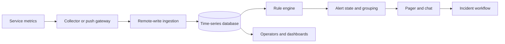
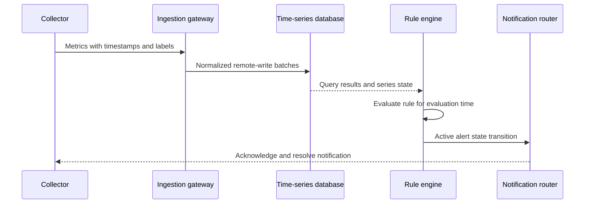

## What it is

A **metrics monitoring and alerting system** is a control plane that collects measurements from services, stores their history, evaluates rules against that history, and notifies responders when a system violates an operational objective. The mental model is a pipeline of collection, time-series storage, rule evaluation, notification, and incident ownership.

## How it works

A deployment exposes counters, gauges, and histograms through a metrics endpoint. A discovery service records the target, and collectors pull samples from targets or accept push writes from short-lived components. The ingestion gateway authenticates and normalizes samples before forwarding them to a horizontally partitioned time-series database. A rule engine evaluates recording, alert, and routing rules against both recent samples and historical data. Notification services then deduplicate, group, and route firing alerts to on-call destinations.



For pull-based collection, a Prometheus-compatible scraper uses service discovery and a bounded concurrency budget. Pull mode gives the monitoring system a regular view of target reachability and makes scrape failures visible. Push mode is useful for batch jobs, edge agents, and workloads that disappear between polls. A push gateway can become a temporary bottleneck or an unbounded buffer, so producers should batch, timestamp, and apply backpressure.

```yaml
scrape_configs:
  - job_name: checkout-api
    metrics_path: /metrics
    scheme: https
    scrape_interval: 15s
    static_configs:
      - targets: [checkout-api:8443]
        labels:
          service: checkout
          environment: production
```

A time-series database commonly stores a series as a stream of `(timestamp, value)` samples indexed by metric name and labels. Prometheus uses a time-series model with remote write and rule evaluation; Thanos, Cortex, and Mimir add multi-tenant or globally replicated query layers. High-cardinality labels such as raw user IDs or request paths multiply series count and memory pressure. The storage layer should therefore enforce label policies, retention tiers, and tenant quotas.

Rules should separate symptoms from causes. Recording rules reduce repeated query work, while alerting rules can use PromQL expressions such as an error ratio rather than an isolated error count. Grouping uses stable labels to collapse many related series into one notification, while inhibition suppresses a downstream symptom when an upstream alert is already firing. Every alert needs an owner, a runbook, a severity, and a clear recovery condition.

```prometheus
groups:
  - name: checkout
    interval: 30s
    rules:
      - record: job:checkout_requests:rate5m
        expr: sum(rate(http_requests_total{job="checkout-api"}[5m]))
      - alert: CheckoutErrorBudgetBurn
        expr: job:checkout_requests:rate5m > 0 and (sum(rate(http_requests_total{job="checkout-api",status=~"5.."}[5m])) / job:checkout_requests:rate5m) > 0.02
        for: 10m
        labels:
          severity: page
          service: checkout
```

A production deployment also needs a read path. Dashboards and ad hoc queries should have bounded time ranges, query timeouts, result limits, and a separate path from alert evaluation. Cardinality and retention dashboards make it possible to identify a noisy instrument before it exhausts a database node.



## Tradeoffs

- **Pull collection** — discovers targets and exposes missing telemetry naturally, but requires stable network reachability and can overload targets when scrape intervals are too aggressive.
- **Push ingestion** — supports ephemeral jobs and edge networks, but shifts buffering, authentication, and backpressure responsibility to the gateway and producer.
- **Single-region database** — keeps queries simple and local, but makes the monitoring plane dependent on one failure domain.
- **Remote or sharded storage** — adds replication and routing complexity while improving query and ingestion scale; stale shards can still make a healthy-looking system look down.
- **High-cardinality labels** — make debugging precise, but increase series count, index memory, query cost, and accidental privacy exposure.
- **Immediate notifications** — shorten response time, but increase alert fatigue; delayed, multi-window rules are safer for noisy or transient signals.
- **Long raw retention** — supports investigations, but costs storage and may retain sensitive attributes; metadata-only or sampled retention reduces exposure at the cost of detail.
- **Centralized logs and traces** — improve correlation, but require access controls, redaction, regional retention policies, and a documented break-glass path.

## When to use

You need a metrics pipeline when a service failure can be detected faster and more consistently by machines than by users.

You need remote write when jobs or edge devices are too short-lived for reliable polling.

You need recording rules when the same multi-series expression is queried by dashboards and alert evaluators.

You need alert grouping when one dependency failure can otherwise generate hundreds of pages.

You need retention and redaction policies when metric labels can contain customer, tenant, or request data.

## Alternatives

**Statsd or simple metrics API** — works for low-volume process metrics, but does not provide a complete multi-tenant query and alert control plane.

**Managed monitoring service** — reduces operational work, but requires careful data residency, egress, query, and vendor-lock-in review.

**OpenTelemetry metrics pipeline** — standardizes collection when traces and metrics share context, but still needs a durable time-series backend and alert policy layer.

**Log-based monitoring** — preserves detailed event text, but is more expensive to aggregate and less predictable for latency and saturation signals.

## Related

- [Chapter 33: Enterprise Operations & Monitoring Infrastructure](_index.md)
- [12.5 Observability Platforms & Low-Level Profiling](../../05-cloud-devops/02-containers-cicd/05-observability.md)
- [7.3 Message Delivery Guarantees: At-Most-Once, At-Least-Once, and Exactly-Once (Idempotency Patterns)](../../03-messaging/01-messaging/03-delivery-guarantees.md)
- [7.4 Backpressure, Dead Letter Queues (DLQ), and Event Replay Frameworks](../../03-messaging/01-messaging/04-backpressure-dlq.md)
