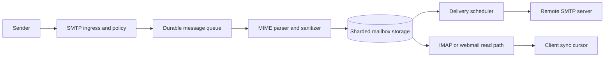
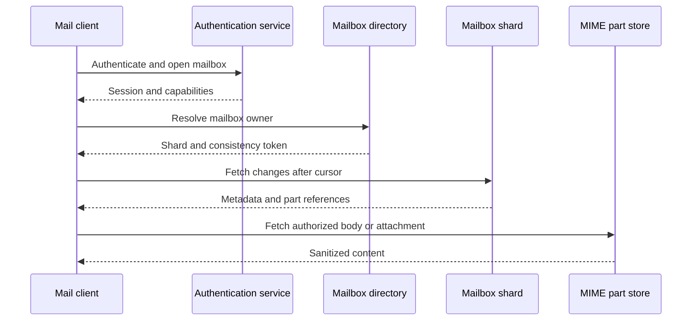

## What it is

A **distributed email system** accepts messages over SMTP, validates and stores their content, and delivers or exposes them through IMAP, webmail, and APIs. Its mental model is a durable message pipeline with separate control planes for routing, reputation, mailbox state, and user access.

## How it works

A load balancer accepts SMTP connections and applies connection limits, protocol version negotiation, and rate limits. The ingestion service checks envelope recipients, authentication results, size limits, and malware policy before handing a message to the queue. A MIME parser decodes headers and bodies, identifies attachments, normalizes the message into a canonical representation, and rejects ambiguous or dangerous encodings. The delivery scheduler performs recipient lookup, retries, bounce processing, and destination throttling.



Mailbox ownership is a sharding decision. A mailbox is assigned to a shard using a stable directory, a consistent-hash ring, or a directory service. The shard owns message indexes and blobs, while a global directory maps an address and tenant to its current shard. A rebalance transfers a mailbox or a time-bounded set of shards; it must not split one message transaction across unrelated owners without a recovery record.

MIME is a recursive format: a message can contain multipart containers, nested multiparts, encoded words, inline images, and attachments. The parser should enforce depth, part-count, decoded-size, and nesting limits before expanding content. Sanitization differs from parsing. A webmail renderer should remove active content, isolate remote references, validate filenames, and never execute an attachment as part of message display.

```http
POST /v1/messages HTTP/1.1
Host: mail.example.net
Content-Type: message/rfc822
Authorization: Bearer <token>
X-Request-Id: 01J2EXAMPLE

From: sender@example.com
To: recipient@example.net
Subject: Delivery status

Message body
```

A practical webmail sync service uses a stable cursor over mailbox changes. The client asks for changes after its last cursor, receives message metadata and references to immutable message parts, and applies them idempotently. A full resync is a separate operation that reconciles local state from a mailbox snapshot instead of replaying an unbounded event log.



Delivery reliability requires idempotency at the queue, scheduler, and remote-server interaction boundaries. A scheduler records its attempt state before contacting the destination, then commits the result using a compare-and-set version. Temporary failures use bounded backoff; permanent failures become bounce events. The message queue is not the source of truth for mailbox state, because a consumer crash after delivery must not make the operator resend blindly.

## Tradeoffs

- **Queue-based ingestion** — absorbs bursts and isolates SMTP parsing, but requires duplicate detection, retention, and dead-letter handling.
- **Direct synchronous parsing** — lowers infrastructure count, but lets expensive MIME input consume request resources and lets sender traffic determine mailbox availability.
- **Shard-per-mailbox** — makes ownership and migrations explicit, but creates hot mailboxes and requires directory lookups for every access.
- **Shard-per-tenant** — simplifies isolation and compliance boundaries, but creates uneven load for tenants with very different sizes.
- **Store MIME as received** — preserves forensic fidelity, but makes search, rendering, and migration harder because every client must understand the original encoding.
- **Store a normalized representation plus original** — improves search and safe rendering, but doubles storage work and creates consistency obligations between the two copies.
- **Webmail polling** — works through restrictive networks, but adds latency and repeated metadata requests; change streams reduce work but need reconnect and cursor recovery.
- **Broad message retention** — supports investigations and compliance, but increases breach impact; envelope-level redaction and configurable retention reduce it at the cost of evidence.
- **Centralized processing** — simplifies patching and policy, but creates a high-value target and a data-residency conflict for regional mail systems.
- **Per-tenant encryption keys** — improves isolation, but complicates operator recovery, search, and key rotation; shared keys reduce operational load but widen the compromise boundary.

## When to use

You need a distributed email system when message volume, recipient locality, or tenant isolation exceeds one mail host's operational envelope.

You need a durable queue when SMTP sender bursts must not directly overwhelm MIME parsing or storage.

You need mailbox sharding when a single mailbox or tenant cannot safely share a storage node with the whole deployment.

You need idempotent delivery state when retries can cross process restarts and remote servers can return ambiguous results.

You need a webmail sync cursor when clients work offline and must recover from partial synchronization.

## Alternatives

**Managed email service** — supplies deliverability and abuse controls quickly, but adds provider dependency, data-processing agreements, and migration constraints.

**SMTP relay only** — is appropriate for outbound application mail, but does not solve mailbox storage, MIME search, or webmail synchronization.

**Object storage with a relational index** — simplifies durable message blobs, but still needs a mailbox directory, authorization layer, and migration-aware event cursor.

**Event-sourced mailbox service** — gives a precise change history, but requires compaction, snapshot management, and protection against replaying stale tenant data.

## Related

- [Chapter 33: Enterprise Operations & Monitoring Infrastructure](_index.md)
- [8.1 Multi-Channel Notification Dispatchers: Push (APNs, FCM), SMS, Email, and Webhook Architecture](../../03-messaging/02-realtime/01-notification-dispatchers.md)
- [7.3 Message Delivery Guarantees: At-Most-Once, At-Least-Once, and Exactly-Once (Idempotency Patterns)](../../03-messaging/01-messaging/03-delivery-guarantees.md)
- [10.6 Partitioning & Sharding Strategies: Range, Hash, List, and Directory-Based Sharding](../../04-distributed-systems/02-databases/06-sharding.md)
