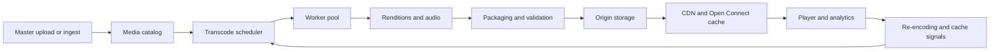
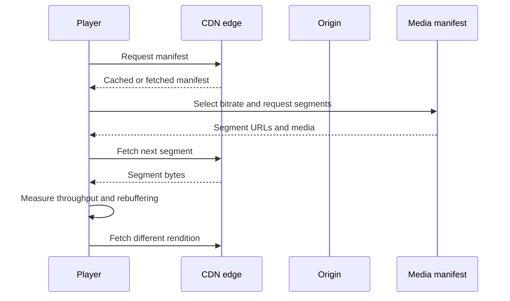

## What it is

A **video streaming platform** transforms uploaded or ingested media into a set of playable representations, packages them for adaptive delivery, and places them on a CDN that serves the best representation for each viewer and network. The mental model is a media supply chain: ingest, transcode, package, publish, cache, and measure.

## How it works

An ingest service authenticates the source, stores an immutable master, and publishes a media event. A transcoding scheduler creates isolated jobs that decode the master, normalize frame rate and resolution, encode several bitrate-rendition ladders, capture thumbnails, and emit audio and subtitle artifacts. Job state belongs in a durable control plane so a worker crash does not lose the entire pipeline. The output is stored in object storage and a catalog records codecs, bitrates, dimensions, checksums, and rights constraints.



Per-title encoding treats each title as its own encoding problem. Instead of applying one fixed ladder to every source, the encoder analyzes motion, complexity, brightness, and audio characteristics, then chooses renditions that meet a target quality and bitrate. This reduces wasted bitrate on simple footage while protecting difficult footage from quality collapse. A title's renditions remain a coherent set so the player can switch without an unplanned format gap.

```yaml
title_id: video-1842
master:
  uri: s3://masters/video-1842/proRes.mov
renditions:
  - name: 1080p
    width: 1920
    height: 1080
    video_bitrate_kbps: 5000
    audio_bitrate_kbps: 128
  - name: 720p
    width: 1280
    height: 720
    video_bitrate_kbps: 2800
    audio_bitrate_kbps: 96
  - name: 360p
    width: 640
    height: 360
    video_bitrate_kbps: 800
    audio_bitrate_kbps: 64
package:
  format: dash
  segment_seconds: 6
```

HLS and DASH package renditions as a manifest plus media segments. HLS commonly uses `.m3u8` playlists, while MPEG-DASH uses an XML or JSON-formatted manifest. The player selects a starting bitrate from device capability and network conditions, measures throughput and rebuffering, and moves to a neighboring representation. Segment duration controls switching latency and cache efficiency; it is a product and network tradeoff rather than a free encoder parameter.



Open Connect places storage and serving appliances inside or near ISP networks. The origin remains authoritative, while edge appliances serve popular segments locally and synchronize or fetch misses on demand. Cache keys must include only the representation and encoding parameters that affect bytes, not user identity. Signed URLs can restrict access, but they also complicate cache reuse, refresh, and logs. A platform should measure cache hit ratio, startup time, rebuffering, rendition switches, and origin egress rather than optimizing only for storage cost.

## Tradeoffs

- **On-demand transcoding** — minimizes unused compute for niche titles, but increases the time between upload and first playback.
- **Precomputed per-title ladders** — improves quality and bandwidth efficiency, but requires analysis, more rendition-management logic, and re-encoding when the original changes.
- **Short segments** — improve switching and cache granularity, but increase manifest requests, storage overhead, and player scheduling work.
- **Long segments** — reduce request overhead, but make a poor network decision persist longer and waste more bytes on a switch.
- **Origin-only delivery** — simplifies cache operations, but exposes the origin to traffic spikes and long-haul egress costs.
- **Open Connect and regional caches** — reduce latency and origin load, but add appliance deployment, stale cache handling, and a second operational failure surface.
- **HLS or DASH as the primary package** — gives broad device support, but requires manifests to describe every rendition accurately and browsers or players to handle updates consistently.
- **Low-bitrate fallback renditions** — improve reach on constrained networks, but increase encoder storage and can expose a visibly degraded experience.
- **Signed media URLs** — limit sharing and unauthorized downloads, but reduce cache hit opportunities and complicate CDN key design.
- **Global retention of masters and renditions** — supports re-encoding and future formats, but increases storage, rights-management, and deletion obligations.

## When to use

You need a transcode pipeline when one uploaded master must play across screen sizes, codecs, and network conditions.

You need per-title encoding when a fixed ladder wastes bandwidth on simple video or fails to protect complex scenes.

You need HLS or DASH packaging when clients must switch bitrate without restarting the entire viewing session.

You need an origin plus CDN tier when media requests are larger and more repetitive than ordinary application responses.

You need edge appliances when origin distance, egress cost, or peak concurrency cannot be handled by a single origin region.

## Alternatives

**Progressive HTTP download** — is simple to implement, but does not adapt cleanly to changing bandwidth or storage segment boundaries.

**Single adaptive representation** — reduces encoding and catalog complexity, but cannot trade resolution for frame rate or audio quality as network conditions change.

**Peer-to-peer delivery** — can reduce origin cost for popular titles, but introduces client trust, availability, and privacy concerns.

**Live streaming without on-demand packaging** — lowers packaging work for real-time events, but does not provide the same seek and restart semantics as a video catalog.

## Related

- [Chapter 34: Media Streaming & Cloud Storage Systems](_index.md)
- [6.3 Content Delivery Networks (CDNs), Edge Computing, Edge Runtimes (Wasm at Edge, eBPF), and Static/Dynamic Content Acceleration](../../02-system-design/02-caching/03-cdns-edge.md)
- [11.2 Storage Primitives: Block Storage, Object Storage (S3), and Network File Systems](../../05-cloud-devops/01-cloud-primitives/02-storage-primitives.md)
- [7A.2 Data Architecture & Lakehouse Engines: ETL vs ELT, Data Lake vs Data Warehouse vs Data Lakehouse (Apache Iceberg, Delta Lake, Apache Hudi)](../../03-messaging/03-data-engineering-stream-processing/02-lakehouse-architectures.md)
