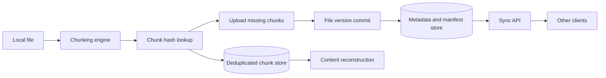
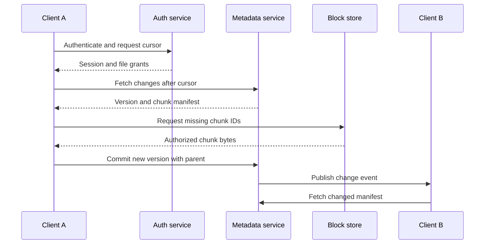

## What it is

A **cloud sync architecture** keeps a local copy of a user's files aligned with a remote file service while minimizing transferred bytes and making concurrent edits understandable. Its mental model is a content-addressed block store, a metadata catalog, and a cursor-based synchronization protocol.

## How it works

A client splits a file into content-defined or fixed-size chunks and hashes each chunk. The chunking engine uploads chunks that the service does not already have, then commits a new file version that references the ordered chunk identifiers. The metadata service stores names, ownership, timestamps, permissions, content type, and a pointer to the version manifest. A file update creates a new manifest rather than mutating immutable chunks, so readers can continue using a consistent version.



Content-defined chunking aligns boundaries with nearby content changes, so inserting a byte does not require shifting every later chunk. A rolling hash and minimum, average, and maximum chunk size control boundary placement. The service still has to defend against a malicious client claiming ownership of chunks it did not upload; encryption, authorization, and tenant-scoped lookup must be separated carefully.

File delta sync compares the client manifest with the server manifest. The client first asks for a compact change feed, then downloads only chunk identifiers it lacks. A server-side delta endpoint can return a new manifest containing reused chunk IDs and a small set of new chunks. The commit uses compare-and-swap against the prior file version so two clients cannot silently overwrite each other.

```json
{
  "file_id": "file-8f2",
  "parent_version": 41,
  "operation": "update",
  "chunks": [
    {"id": "sha256:0a7c", "size": 262144},
    {"id": "sha256:91be", "size": 131072},
    {"id": "sha256:4d22", "size": 393216}
  ],
  "metadata": {"mime_type": "application/pdf", "size": 786432}
}
```

Metadata is a high-value consistency surface. A relational catalog supports transactional permission and file-version changes, while a distributed key-value or wide-column store can partition by file or tenant. Search indexes are derived from metadata and are eventually consistent. A file can be uploaded before its search document appears or become inaccessible after a permission update, so the client must treat metadata authorization as authoritative.



Offline operation is a product and security decision. A client can keep a local encrypted cache, but a lost device may still contain sensitive files. Remote wipe invalidates future token use but cannot erase a copy that a user already exported. Retention and deletion need explicit semantics for shared files, legal holds, backups, deduplicated chunks, and search indexes. A block may be shared by many files, so reference tracking must prevent accidental global deletion.

## Tradeoffs

- **Fixed-size chunks** — simplify implementation and make offsets predictable, but a local insertion can invalidate every following chunk.
- **Content-defined chunks** — improve incremental sync, but require deterministic chunking rules and more CPU on both client and server.
- **Reference counting for deduplication** — reduce physical storage, but create a deletion dependency that needs transactional updates and repair.
- **Ephemeral or garbage-collection scans** — tolerate missing reference counts, but reclaim storage later and complicate deterministic deletion guarantees.
- **Immutable manifests** — make readers stable and recovery straightforward, but consume metadata and require garbage collection for old versions.
- **Mutable file records** — reduce metadata churn, but make concurrent readers and conflict resolution harder.
- **Delta manifests** — reduce sync payloads, but add a protocol that must tolerate missing chunks, stale clients, and partial uploads.
- **Full-file uploads** — simplify server validation, but waste bandwidth and make small edits expensive.
- **Per-tenant encryption keys** — improve isolation, but complicate search, sharing, and key rotation across files and users.
- **Local caching** — make offline work responsive, but increase device storage, exposure of local files, and invalidation complexity.
- **Centralized metadata** — simplify authorization, but makes the catalog a high-value availability and data-residency dependency.

## When to use

You need content-defined chunking when small edits should not resend an entire large file.

You need block deduplication when many users or revisions share common content and the storage saving exceeds reference-tracking cost.

You need immutable manifests when readers must use a stable version while another client is editing.

You need a cursor-based change feed when offline clients need incremental synchronization without polling every file.

You need explicit deletion and encryption policies when files can be shared across tenants, devices, and retention classes.

## Alternatives

**Whole-object versioning** — provides simple restore and audit semantics, but transfers and stores duplicate bytes for small edits.

**Synchronous folder replication** — makes shared files resemble a network filesystem, but needs stronger locking, conflict handling, and availability guarantees.

**Object storage without client chunking** — provides durable blobs, but loses some incremental-sync and cross-file deduplication opportunities.

**CRDT or operation-based document sync** — helps collaborative text editing, but requires more semantic cooperation than opaque file chunk synchronization.

## Related

- [Chapter 34: Media Streaming & Cloud Storage Systems](_index.md)
- [10.5 Database Replication & Data Synchronization: Leader-Follower, Multi-Leader, Leaderless (Dynamo-Style), Change Data Capture (CDC), Active-Active Multi-Region Sync, and Point-In-Time Recovery (PITR)](../../04-distributed-systems/02-databases/05-replication.md)
- [11.2 Storage Primitives: Block Storage, Object Storage (S3), and Network File Systems](../../05-cloud-devops/01-cloud-primitives/02-storage-primitives.md)
- [7.3 Message Delivery Guarantees: At-Most-Once, At-Least-Once, and Exactly-Once (Idempotency Patterns)](../../03-messaging/01-messaging/03-delivery-guarantees.md)
