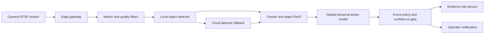

## What it is

A **real-time CCTV video analytics and theft detection engine** converts live camera streams into privacy-aware detections, tracked identities, spatial-temporal events, and reviewable evidence. Its mental model is a filter cascade: cheap motion gates reduce work, models produce observations, tracking and action recognition establish context, and an evidence service preserves only justified clips.

## How it works

RTSP or another camera protocol provides a live media stream to an edge gateway. The gateway authenticates the camera, normalizes timestamps, drops malformed frames, and maintains bounded per-camera queues. A motion filter or scene-change detector removes static footage before expensive inference. Selected frames go to a detector, and detections enter a tracker that assigns short-lived object identities across nearby frames.



The edge-cloud split follows latency, bandwidth, and privacy. Edge inference handles motion filters and a compact detector when the camera link is intermittent or the scene is privacy-sensitive. The cloud receives selected crops, embeddings, or events for larger models, cross-camera re-identification, and fleet-wide model management. Uploads should carry only the data needed for the next decision, and the policy should record whether a frame was processed locally or remotely.

```mermaid
sequenceDiagram
    participant C as Camera
    participant E as Edge gateway
    participant M as Motion filter
    participant D as Detector
    participant T as Tracker and ReID
    participant A as Action recognizer
    participant V as Evidence service
    C->>E: RTSP frames with timestamps
    E->>M: Sampled frames
    M-->>E: Candidate frames only
    E->>D: Local or remote detection request
    D-->>T: Boxes, classes, scores
    T->>A: Tracked identities and motion tracklets
    A-->>V: Event, confidence, camera references
    V-->>E: Clip retention acknowledgement
```



Re-identification, or **ReID**, matches an observation to a tracklet across cameras or time gaps. Appearance embeddings can help, but lighting, occlusion, uniforms, and similar-looking people create false matches. A spatial-temporal action recognizer combines a person track, a region, and a time interval to distinguish a suspicious action from ordinary movement. Its output is evidence for a policy engine, not proof by itself; thresholds, calibration, human review, and an audit trail matter.

Evidence archival should be selective. The service can retain a rolling buffer at the edge, fetch a pre-event window and post-event window after a confirmed event, encrypt the clip, and attach a manifest with camera, time, model version, policy version, and evidence hash. Access is time-bound and role-scoped. A privacy-preserving deployment masks faces for routine review and keeps an unmasked derivative only when an authorized investigation requires it.

```yaml
retention:
  rolling_buffer: 30s
  pre_event_window: 15s
  post_event_window: 45s
  event_clip: 90d
  access_log: 2y
privacy:
  face_masking: routine_review
  unmasked_export: investigation_role
  regions_excluded: [lobby_restroom]
```

## Tradeoffs

- **Always-on recording** — preserves evidence, but raises storage, privacy, and review costs even when no event occurs.
- **Event-triggered recording** — reduces retained data, but may miss context if the trigger runs late or the camera drops frames.
- **Edge-only inference** — reduces bandwidth and keeps more processing local, but limits model size, fleet updates, and cross-camera context.
- **Cloud inference** — provides stronger models and fleet-wide coordination, but increases bandwidth exposure, latency, and data-residency obligations.
- **Motion filtering first** — reduces inference cost, but motion can be caused by lighting or weather while a theft can occur in a low-motion region.
- **Higher-recall filtering** — catches more candidate events, but increases compute and false positives that can overwhelm operators.
- **Online tracking** — supports immediate alerts, but tracker resets and occlusion can fragment an identity.
- **ReID across cameras** — connects activity, but introduces privacy risk and false associations between similar people.
- **Fixed confidence threshold** — is easy to operate, but can behave differently across camera quality, weather, and site populations.
- **Human-reviewed escalation** — improves safety and accountability, but adds response time and requires trained operators.
- **Immutable evidence retention** — supports investigations, but conflicts with minimization, deletion, and regional privacy requirements unless retention is bounded.
- **Masked review media** — reduces bystander exposure, but can make evidence less useful for identification; unmasked access needs strong authorization and auditing.

## When to use

You need edge filtering when camera links cannot carry continuous full-resolution video to a cloud region.

You need event-triggered recording when retention policy prohibits or cannot justify storing every frame.

You need ReID when an investigation must connect a track across camera boundaries and the consent or legal basis permits it.

You need spatial-temporal action recognition when a single-frame object label is insufficient to explain an event.

You need evidence archival with audit logs when detections can affect a person, employee, or customer.

## Alternatives

**Cloud video management** — centralizes operations and retention, but depends on continuous connectivity and can move sensitive footage across regions.

**Edge recording appliance** — improves local availability and control, but requires field maintenance, storage sizing, and remote fleet management.

**Motion-only detection** — is inexpensive and easy to tune, but misses activity that does not create a large image difference.

**Manual review** — provides human context and avoids trusting a model alone, but does not scale continuously to many cameras.

**On-device biometric recognition** — can reduce round trips, but creates stronger consent, retention, and tamper-resistance requirements.

## Related

- [Chapter 34: Media Streaming & Cloud Storage Systems](_index.md)
- [13.4 Deep Learning Architectures: Convolutional Neural Networks (CNNs), Recurrent Neural Networks (RNNs/LSTMs/GRUs), Object Detection & Tracking (YOLO, ByteTrack, DeepSORT), Spatial-Temporal Action Recognition (3D-CNNs, Video Transformers), and Autoencoders](../../06-ml-ai/01-ml-foundations/04-deep-learning-architectures.md)
- [11.4 Serverless, Edge & IoT Infrastructure: AWS Lambda, Cloudflare Workers, MQTT, CoAP, Microcontrollers (ESP32/ARM), Conflict-Free Replicated Data Types (CRDTs), and Local-First Sync](../../05-cloud-devops/01-cloud-primitives/04-serverless.md)
- [5.7 AppSec & Threat Defense: OWASP Top 10, Threat Modeling, Secrets Management (HashiCorp Vault), and Supply-Chain Security](../../02-system-design/01-system-design-fundamentals/07-appsec-threat-defense.md)
