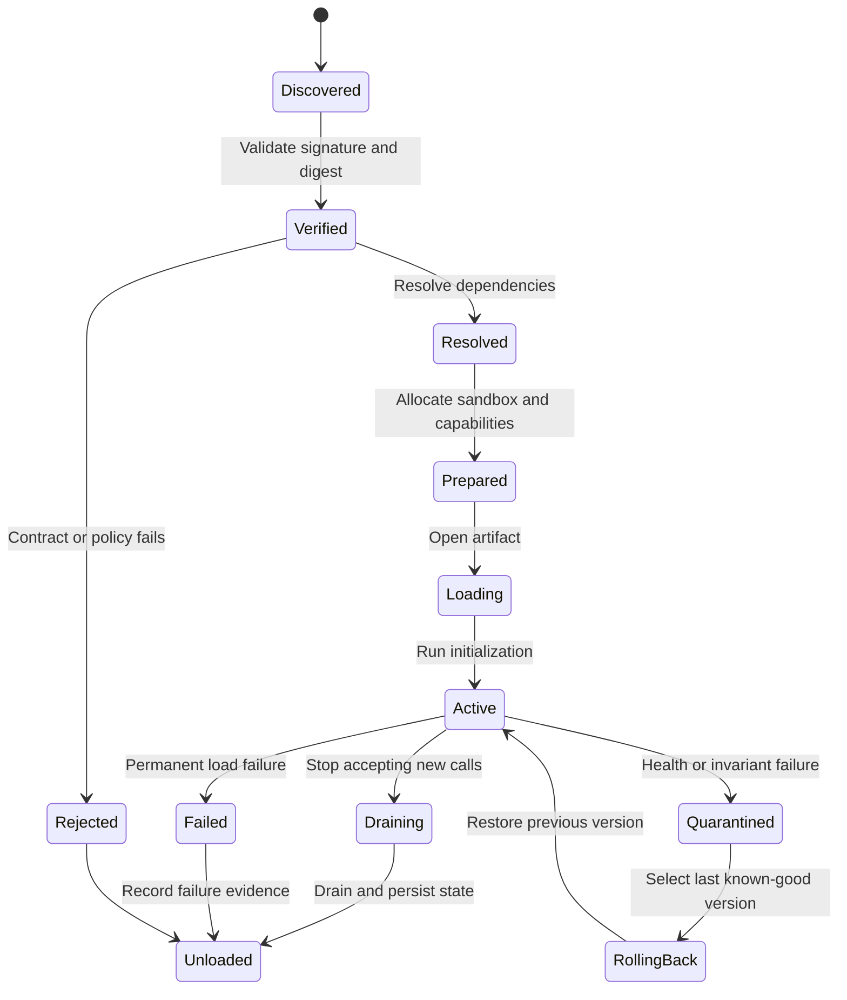
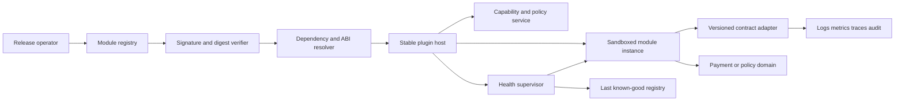
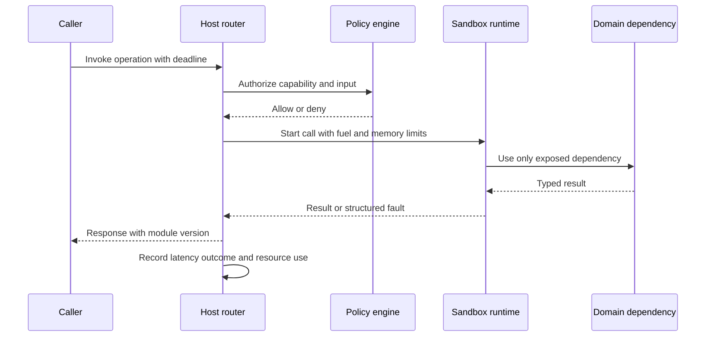

## What it is

**Dynamic multi-module loading** is a plugin architecture in which a host discovers modules, validates their compatibility, loads them into an isolated execution boundary, and routes calls through a stable contract instead of linking every capability into one immutable binary. The modules can be native shared objects, WebAssembly components, managed language extensions, or separate processes; the host treats each one as a replaceable unit with a declared capability set.

The mental model is a **host–contract–module** boundary. The host owns lifecycle, identity, policy, resources, and observability. A versioned contract owns the data and behavior exchanged across the boundary. A module owns implementation details and can evolve independently within the contract. Dynamic linking loads code into a process; process-based plugins load by IPC; WebAssembly components run inside a runtime sandbox. A hot swap changes the active module version while preserving the host contract and enough state to make the transition observable and reversible.

## How it works

A production loader separates discovery from activation. The host reads an inventory, verifies the publisher and artifact, resolves a compatible module set, prepares resources, and only then sends traffic. It must not treat a file appearing in a directory as permission to execute it.

A practical manifest separates the host contract from module capabilities and makes the release auditable:

```yaml
apiVersion: plugins.example.com/v1
kind: ModuleBundle
metadata:
  name: payment-router
  version: 3.4.1
spec:
  runtime: wasm-component
  entrypoint: router:exports
  contract: host-api/v4
  hostMin: 4.0.0
  hostMaxExcluding: 5.0.0
  capabilities:
    - payment.authorize
    - payment.capture
  limits:
    memory: 128Mi
    fuel: 50000000
    wallClock: 250ms
    network: deny
  signature:
    keyId: release-2026-01
    algorithm: ed25519
```

The manifest is a **compatibility declaration**, not a promise that the artifact is safe. The host still checks the signature, digest, contract version, capability set, resource limits, and dependency graph. A module should receive only the capabilities it needs. In a native plugin, the host can also configure a restricted symbol search path, a distinct allocator boundary, and process-level isolation when a library cannot be trusted to share a process safely.

Loading follows a state machine rather than a single call:



Initialization should be narrow. The module registers handlers, validates configuration, checks required capabilities, and returns a status. It should not perform an unbounded network crawl or start background work that outlives initialization. Activation becomes visible only after a health check and a smoke call succeed.

The host and module communicate through a narrow, versioned interface. A request carries a stable operation name, correlation identifier, capability token, deadline, and typed payload. A response carries a result or a structured error, plus status and optional diagnostics. Do not pass raw host pointers, file descriptors, or unbounded object graphs across an ABI boundary.

```proto
syntax = "proto3";

package plugins.v4;

message CallRequest {
  string operation = 1;
  string correlation_id = 2;
  string capability_token = 3;
  int64 deadline_unix_nanos = 4;
  bytes payload = 5;
  map<string, string> metadata = 6;
}

message CallResponse {
  bytes payload = 1;
  Error error = 2;
  string module_version = 3;
}

message Error {
  string code = 1;
  string message = 2;
  bool retryable = 3;
  uint32 details_version = 4;
  bytes details = 5;
}

service HostApi {
  rpc Invoke(CallRequest) returns (CallResponse);
}
```

The **ABI** is the binary calling convention and memory layout used by a native module. The **API** is the behavior a caller expects, while the **contract** includes schemas, lifecycle rules, error semantics, compatibility promises, and resource permissions. A module can preserve its public API while changing its internal implementation, but changing a struct layout, calling convention, ownership rule, or allocator boundary can break the ABI even when source-level names remain identical.

Versioning needs separate lanes. The host API version changes when a supported behavior changes. The module manifest version identifies an artifact release. A contract major version changes when compatibility cannot be preserved. A minor version can add backward-compatible fields, and a patch version changes implementation without changing the contract. A module should declare a supported host range and reject unknown required capabilities rather than guessing at their meaning.

For a WebAssembly component, the host supplies a restricted import set. The component receives a deterministic runtime, a memory ceiling, a fuel or instruction budget, and no ambient network access unless the host exposes a mediated capability. The host can instantiate separate component instances per tenant or request, and discard an instance after a timeout or fault. WebAssembly improves portability and isolation for untrusted extensions, but it does not automatically protect the host from denial of service through expensive computation, oversized data, or a capability leak.

The component view makes ownership explicit:



The host supplies a **capability** as the authority to perform a narrow action, not as a general-purpose object reference. A payment module may receive an authorization capability with amount, currency, and risk limits. It should not receive a database connection that can read unrelated accounts. Mediated capabilities make authorization testable and let the host revoke access without changing the module binary.

A call sequence should have explicit deadlines and ownership:



Hot swapping is a controlled state transition, not an in-place overwrite. The host stops routing new calls to the old instance, lets in-flight calls finish within their deadlines, persists a module checkpoint when the contract supports it, and starts a new instance. Readiness is checked before the router changes. If the new version fails readiness or violates an invariant, the host quarantines it and restores the last known-good version. A version switch is observable through the module version in every response and through a deployment audit event.

A practical rollout has four layers:

1. **Build contract** — generate schemas and compatibility checks from the host API, then reject breaking changes in CI.
2. **Verify artifact** — sign the immutable package, record its digest, and scan dependencies before registry admission.
3. **Stage activation** — load the module beside the current version, pass contract tests, and compare resource use with a bounded policy.
4. **Shift traffic** — canary by tenant or percentage, keep automatic rollback, and retain the previous artifact for diagnosis.

## Tradeoffs

Isolation, compatibility, and failure handling are separate decisions. A host can get strong process isolation at the cost of IPC latency, or low latency at the cost of a shared address space. A versioned contract can reduce coupling, but it also leaves the host responsible for supporting old semantics during migration.

| Concern | Gain | Cost or failure mode |
| --- | --- | --- |
| **Process or VM isolation** | A crash, memory leak, or hostile module is contained outside the host | IPC, serialization, startup, and debugging overhead increase; a shared external dependency can still create a correlated failure |
| **WebAssembly sandbox** | Portable runtime, restricted imports, deterministic fuel and memory limits | Boundary calls and data conversion add latency; bugs in the host, runtime, or exposed capability remain in the trust boundary |
| **Native dynamic linking** | Low call overhead and direct access to platform capabilities | ABI breaks, symbol collisions, allocator mismatches, and process-wide crashes are harder to contain |
| **Versioned API contract** | Modules can evolve independently and the host can reject unsupported combinations | Older contract versions must be maintained, tested, and sometimes run simultaneously during migration |
| **Stable C-style or RPC boundary** | Ownership and serialization rules are explicit across languages and runtimes | Data conversion loses in-process types and adds payload and latency cost |
| **Automatic rollback** | A bad module can be removed without restarting the whole service | State migration may not be reversible, and repeated rollback loops can conceal a persistent defect |
| **Capability-based permissions** | Least privilege can be reviewed and revoked independently of module code | Every capability needs an owner, expiry, policy, audit trail, and safe failure behavior |
| **Per-request isolation** | One request or tenant cannot retain another request's mutable state | Allocation and startup costs rise, and module initialization may dominate short requests |

The failure boundary should be narrower than the process boundary when possible. Classify errors as `retryable`, `permanent`, `cancelled`, or `quarantined`; attach a stable code and a safe diagnostic; and never expose a stack trace, secret, or raw pointer to a caller. A retry belongs at the host only when the operation is idempotent or carries an idempotency key. Repeating a non-idempotent payment or mutation after an unknown outcome is a correctness bug, not a resilience feature.

## When to use

- You need to add or replace capabilities without rebuilding and redeploying the entire host.
- Teams must ship independent components on different schedules and need explicit compatibility boundaries.
- Untrusted or semi-trusted code needs less access than a normal application thread or process.
- A bad module must be quarantined, rolled back, or removed without taking down unrelated capabilities.
- You can define a stable contract, enforce deadlines, observe every call, and test failure paths before activation.

## Alternatives

- **Monolith with in-process extension points** — wins when the build is unified and maximum in-process speed matters; it couples releases and lets a bad extension corrupt the host process.
- **Microservices over HTTP or gRPC** — wins when independent deployment and process isolation matter most; it adds network latency, operational complexity, and distributed failure modes.
- **Container or sidecar plugins** — wins when a plugin needs its own dependencies or OS environment; it adds image distribution, startup cost, and orchestration overhead.
- **WebAssembly components** — wins for portable, sandboxed extensions and language-neutral contracts; it adds boundary overhead and requires careful capability design.
- **Feature flags with a fixed binary** — wins when you need fast traffic control without runtime code loading; it does not provide independent binaries, isolation, or artifact-level rollback.
- **External worker service** — wins when workloads are independent, long-running, or naturally isolated; it requires network reliability, service discovery, and distributed tracing.

## Related

- [Chapter 35 References](02-references.md)
- [Chapter 12A: Operating Systems & Kernel Mechanics](../../05-cloud-devops/03-operating-systems-kernel-mechanics/_index.md)
- [Distributed Version Control Mechanics](../../05-cloud-devops/04-version-control-workflows/01-distributed-version-control.md)
- [AI Agent Systems: Tool-Calling Mechanics, Multi-Agent Orchestration, and State Management](../../06-ml-ai/03-genai/05-ai-agents.md)
