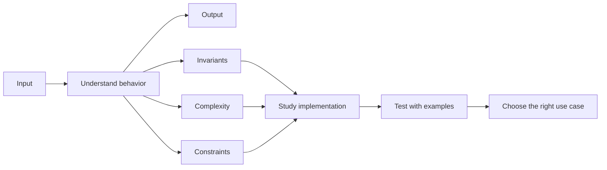

## How is this book organized?

Divided into Parts, Chapters, and Topics. Each topic presents algorithms, with graphics to help illustrate ideas better: what an algorithm is, how it should be used, its best use case, and its speed and complexity. An algorithm is also labeled advanced when it is. Source material references are included at the end of each chapter.

## How should this book be used?

The material is organized by dependencies: start with the prerequisites and fundamentals, then move on to data structures, complexity analysis, techniques, and finally the template patterns you should practice and commit to memory. It’s best to follow this sequence, but you’re free to skip the more advanced topics or algorithms if you wish.

The author demonstrates how an algorithm is applied, outlines its alternatives, and explains when each should be chosen. Implementation details are deliberately omitted, giving readers the freedom to investigate and work them out on their own time.

You can use this book as a reference too.

## Black Box learning method

Treat each algorithm like a black box. First, understand its input, output, invariants, complexity, and constraints. Then study the implementation, test it with examples, and practice recognizing when to use it in a real problem.

