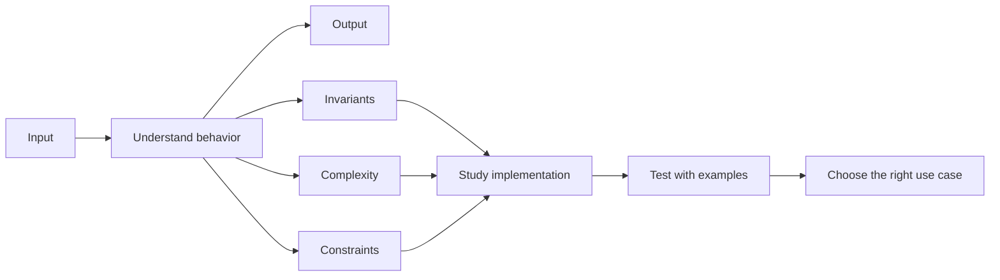

## How is this book organized?

Divided into Parts, Chapters, and Topics. Each topic presents algorithms, with graphics to help illustrate ideas better: what an algorithm is, how it should be used, its best use case, and its speed and complexity. An algorithm is also labeled advanced when it is. Source material references are included at the end of each chapter.

## How should this book be used?

The content follows a dependency order: start with the prerequisites and fundamentals, then work through data structures, complexity, techniques, and finally the templates you should practice and memorize.

It is preferable to do them in order. You can skip the advanced topics or algorithms.

You can use this book as a reference too.

## Black Box learning method

Treat each algorithm like a black box. First, understand its input, output, invariants, complexity, and constraints. Then study the implementation, test it with examples, and practice recognizing when to use it in a real problem.

